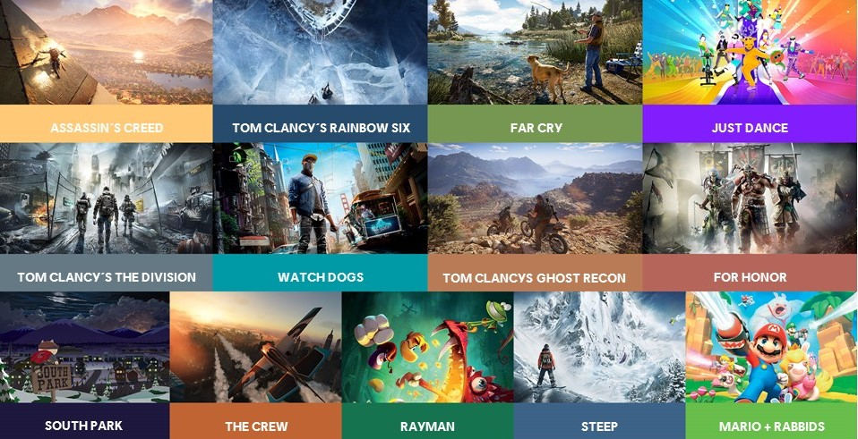
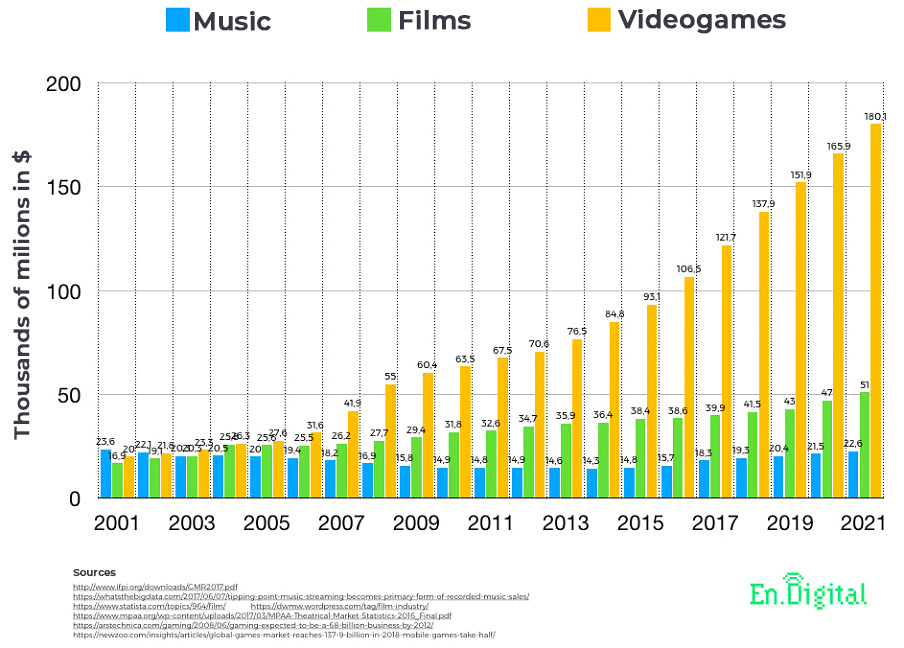
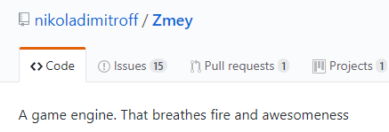
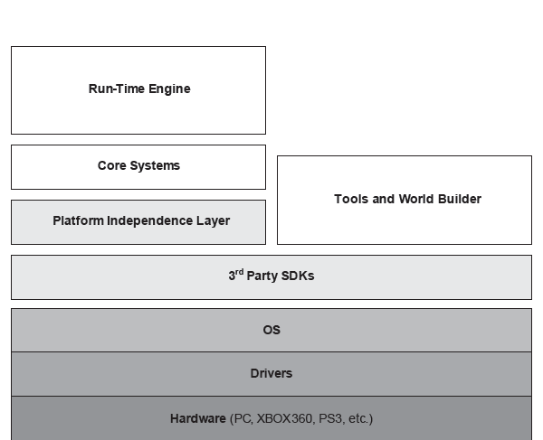

# Game Engine Architecture

## Introduction

---------------------
[Course Index](http://nikoladimitroff.github.io/Game-Engine-Architecture)

<table>
<tbody>
    <tr>
        <td>
            Nikola Dimitroff
        </td>
        <td>
            <a target="_blank" href="https://dimitroff.bg"><i class="fa fa-rss"></i></a>
            <a target="_blank" href="mailto:nikola@dimitroff.bg"><i class="fa fa-envelope-o"></i></a>
            <a target="_blank" href="https://github.com/nikoladimitroff"><i class="fa fa-github"></i></a>
            <a target="_blank" href="https://twitter.com/nikoladimitroff"><i class="fa fa-twitter"></i></a>
        </td>
    </tr>
    <tr>
        <td>
            Alexander Angelov
        </td>
        <td>
            <a target="_blank" href="mailto:aleksandar.angelovv@gmail.com"><i class="fa fa-envelope-o"></i></a>
            <a target="_blank" href="https://github.com/Alekssasho"><i class="fa fa-github"></i></a>
            <a target="_blank" href="https://twitter.com/Alekssasho"><i class="fa fa-twitter"></i></a>
        </td>
    </tr>
    <tr>
        <td>
            Viktor Ketipov
        </td>
        <td>
            <a target="_blank" href="mailto:viktor@kipiinteractive.com"><i class="fa fa-envelope-o"></i></a>
            <a target="_blank" href="https://github.com/k1p1"><i class="fa fa-github"></i></a>
            <a target="_blank" href="https://twitter.com/xk1p1x"><i class="fa fa-twitter"></i></a>

        </td>
    </tr>
</tbody>
</table>

 

--- NEXT SLIDE ---

# Sanity check

We are recording, aren't we?

--- NEXT SLIDE ---

# What's this course about?

--- VERTICAL SLIDE ---

## Game development

* What is a game?
* How does a game team look like?
* How does a commercially-successful game engine look like?
* Is Unreal Engine 4 *awesome*? (hint: yes, yes it is)
* How do you write code for games?

--- NEXT SLIDE ---

# Who should visit the course?

Programmers.
<!-- .element class="fragment" -->

--- VERTICAL SLIDE ---

* We'll focus on programming
* <!-- .element class="fragment" data-fragment-index="0" --> We'll only spend some itty-bitty time discussing game design and content creation (they deserve a course of their own!)
* <!-- .element class="fragment" data-fragment-index="1" --> But you'll get to see how awesome UE4 is
* <!-- .element class="fragment" data-fragment-index="2" --> We'll make it hard to you

--- VERTICAL SLIDE ---

## Required knowledge

* OOP with C++
  - We'll review and extend some C++ concepts
* Data structures
* First-year math - analytical geometry, linear algebra, basic calculus

--- VERTICAL SLIDE ---

## What to expect

* Getting the knowledge required to start a job
* Access to the ~~Sofia's~~ global game dev industry
* Some out-of-class surprises
* 3 guys trying to be funny but failing at it

--- NEXT SLIDE ---

# Why do we do it?

* We like torturing people
* We'd love to see more game developers
* We think you might like it

--- VERTICAL SLIDE ---

## Shameless advertisement time

--- VERTICAL SLIDE ---

Yours truly

<ul id="authors-overview">
    <li>
         
        Nikola Dimitroff 
        Senior Gameplay Programmer 
        Ubisoft Sofia
    </li>
    <li>
         
        Aleksandar Angelov 
        Senior GPU Programmer 
        Chaos Group
    </li>
    <li>
         
        Viktor Ketipov 
        CEO 
        Kipi Interactive
    </li>
</ul>

--- VERTICAL SLIDE ---

### Ubisoft

--- VERTICAL SLIDE ---

### Ubisoft

--- VERTICAL SLIDE ---

<!-- .slide: data-background-image="resources/01.intro/ac_origins_poster.jpg" data-background-repeat="no-repeat" data-background-size="cover" data-background-position="center center" class="high-contrast-text" -->

### Ubisoft Sofia

* Founded 2006
* 230+ employees
* All production teams on-site - programming to design to art
* Lead or associate studio for world-renown franchises like Assassin's Creed & Tom Clancy

--- VERTICAL SLIDE ---

### Kipi Interactive

--- VERTICAL SLIDE ---

<!-- .slide: data-background="url(resources/01.intro/cryowar_cover.png)" data-background-repeat="no-repeat" data-background-size="cover" data-background-position="center center" class="high-contrast-text" -->
### Kipi Interactive

* Independent Game Development Studio
* Founded by Viktor in 2014
* Working on [Cryowar](http://cryowar.com) - Multiplayer Arena Brawler
* Team of 10 Veterans from the industry
* Developing on Unreal Engine 4

--- NEXT SLIDE ---

# Course contents

--- VERTICAL SLIDE ---

## Preliminaries

1. Introduction to the course
1. Fundamentals of computer games
1. A little bit of math
1. Architecture of a game

--- VERTICAL SLIDE ---

## Low-level systems

1. Fundamental game engine systems
1. Tools for debugging
1. Rendering primitives and associated systems

--- VERTICAL SLIDE ---

## Advanced systems

1. High level rendering systems
1. Animation systems
1. Physics
1. UI
1. Audio
1. Gameplay
1. AI
1. Networking
1. Plugins for Unreal Engine 4

--- VERTICAL SLIDE ---

## Course structure

* 3 hours of theoretical game engine architecture
* 2 hours of Unreal Engine 4 goodness

--- VERTICAL SLIDE ---

## Grading

* 2 tests * 20% = 40%
  * 2 bonuses * 5% = 10%
* 1 homework/mini course project * 20% = 20%
* 1 course project * 40% = 40%
  * 1 bonus * 10% = 10%

--- VERTICAL SLIDE ---

* Absence from lectures will not be punished
* Presence in lectures will not be rewarded (grade-wise)
* LIMITED OFFER, ONLY IN THE NEXT 15 WEEKS - Cheat once,
be banned to the ethereal world until next September!

--- VERTICAL SLIDE ---

## Communication

* However you see fit (email, social, GitHub)
* All of us are open to talking - make use of it
  - (and we are VERY open to beer and whiskey)
* We make mistakes, do say when you spot one

--- VERTICAL SLIDE ---

## Communication

* Homepage: [http://nikoladimitroff.github.io/Game-Engine-Architecture](http://nikoladimitroff.github.io/Game-Engine-Architecture)
  * I know, I know, we need to buy a domain
* Facebook group: [https://www.facebook.com/groups/1682570168689369/](https://www.facebook.com/groups/1682570168689369/)

--- VERTICAL SLIDE ---

## Literature

* [Game Engine Architecture, Jason Gregory, Lead in Naughty Dog (Uncharted)](http://www.gameenginebook.com/)
* [Effective C++, Scott Meyers](http://shop.oreilly.com/product/0636920033707.do)
* [Game coding complete, Mike McShaffry & David Graham](http://www.amazon.com/Game-Coding-Complete-Fourth-Edition/dp/1133776574)
* [*Game Programming Gems* series](http://www.satori.org/game-programming-gems/)
* [Collection of Game Development books](https://miloyip.github.io/game-programmer/game-programmer.svg)

--- VERTICAL SLIDE ---

### Navigating these slides

* Hit the ? button to show help
* Use the mouse wheel, Space, arrow keys and Escape to navigate
* Use the navigation buttons on the bottom right
* *Home* brings you the index
* *Back* brings you the start of the current lecture

--- NEXT SLIDE ---

# Game development is

* ...damn fun
* ...incredibly rewarding
* ...an art form
* ...a great job to have
  * ...most of the time <!-- .element class="fragment" -->

--- VERTICAL SLIDE ---

* ...incredibly time-consuming

--- VERTICAL SLIDE ---

* ...harder than mainstream programming [(ask SpaceX)](http://www.fastcompany.com/3031512/why-spacex-and-other-non-gaming-companies-are-scouting-talent-at-e3)

--- NEXT SLIDE ---

# A game dev team

* Developers1
  - Game
  - Engine
  - Tools
* Designers (Game designers, level designers)
* Artists (Concept Artists, Modelers, Animators, Writers, Composers, Actors)
* Producers

1 Can be further specialized into subsystems.

--- NEXT SLIDE ---

# How is a game created?

--- VERTICAL SLIDE ---

Three phases:

* Pre-production
* Production
* Post-production

--- VERTICAL SLIDE ---

## Pre-production

* Idea - 'I wanna make a game MMO-fighter game!'
* Pitch - 'I can make this game make money because...'
* Concept & prototypes
  * 'This game will have...and the player will...and players will like it because...'
  * The birth of a game design document
  * Paper & pen to simple video game prototype

--- VERTICAL SLIDE ---

## Production

The actual development of the game. It is a continuous and iterative process.
Changes happen all the time.

--- VERTICAL SLIDE ---

### Design <--> Programming

* Creative directors decide the overall direction <!-- .element class="fragment" -->
* Game designers come up with mechanics <!-- .element class="fragment" -->
* Gameplay programmers program the mechanics <!-- .element class="fragment" -->
* Engine programmers program the platform for the mechanics <!-- .element class="fragment"" -->

 

* Level designers setup the environment <!-- .element class="fragment" -->
* Quest designers script missions <!-- .element class="fragment" -->
* Tool programmers program the instrumentarium for everyone <!-- .element class="fragment" -->

--- VERTICAL SLIDE ---

### (Visual) Art Production

* Art directors decide the overall direction <!-- .element class="fragment" -->
* Concept artists conceptualize the character / item / place <!-- .element class="fragment" -->
* Modelers build a 3D model <!-- .element class="fragment" -->
* Texturists / Lightning artists color it <!-- .element class="fragment" -->
* Animators and mocap team make it move <!-- .element class="fragment" -->

Repeat for other forms of art (sound, cinematics, storyline) <!-- .element class="fragment" -->

--- VERTICAL SLIDE ---

The game is constantly played, tested, changed

* don't break the build pls = waste of time for the entire studio

--- VERTICAL SLIDE ---

### Milestones

- First playable
- Alpha
- Beta
- Data freeze
- Gold master
- Day 0 patch?

--- VERTICAL SLIDE ---

## Post-production

- Maintenance
- DLCs
- Additional platforms

--- NEXT SLIDE ---

# Why make games as business?

Games do ~~not~~ earn a lot

--- VERTICAL SLIDE ---

Let's talk statistics.

* 2.5 billion gamers worldwide (console / mobile / PC)
* Games earn 3 times more than movies (~$150b)

 <!-- .element class="constrain-image-medium" -->

--- VERTICAL SLIDE ---

Games are played everywhere

--- VERTICAL SLIDE ---

<iframe src="https://e.infogram.com/5e47982f-acc5-45a7-a310-c86b5ba78dfb?src=embed" title="top countries by game revenue" width="750" height="683" scrolling="no" frameborder="0" style="border:none;" allowfullscreen="allowfullscreen"></iframe>

--- VERTICAL SLIDE ---

<iframe src="https://e.infogram.com/f6f8d00a-4334-4279-b1d5-dd86ece01936?src=embed" title="The Worldwide Revenue of Gaming Video Content in billion U.S. dollars (2016 to 2019)" width="750" height="671" scrolling="no" frameborder="0" style="border:none;" allowfullscreen="allowfullscreen"></iframe>

--- VERTICAL SLIDE ---

<iframe src="https://e.infogram.com/d5f6d744-b872-4aa7-9a12-1aeb81676822?src=embed" title="The Worldwide Revenue of eSports Market in Million U.S. Dollars (2012 to 2021)" width="750" height="671" scrolling="no" frameborder="0" style="border:none;" allowfullscreen="allowfullscreen"></iframe>

--- VERTICAL SLIDE ---

Some facts from the USA/Europe (2018)

* 70% of gamers are 18 or older, 11% are over 50
* Average age is 34 years and going up
* Women 33%
* Boys under 18 - 17%

--- VERTICAL SLIDE ---

The point

* Games are played everywhere
* Games are played by everyone
* The market keeps on growing with double digits

--- NEXT SLIDE ---

# What's a game?

* A game is a structured form of play, usually undertaken for enjoyment and sometimes used as an educational tool. <!-- .element class="fragment" -->
* <!-- .element class="fragment" --> 'A series of interesting choices' - Sid Meiers
* A  <!-- .element class="fragment" -->
  * **soft-realtime**,
  * **interactive**,
  * **agent-based**
  * **simulation**

--- VERTICAL SLIDE ---

## Soft-realtime

* It is important to draw at 60fps (90 / 120 for VR)
* Nobody dies if you miss a frame or have a bug
* And you can hardly [destroy hardware for millions](https://www.simscale.com/blog/2017/12/nasa-mars-climate-orbiter-metric/)

--- VERTICAL SLIDE ---

## Interactive

* Respond to player input immediately

--- VERTICAL SLIDE ---

## Agent-based

* Player(s) *Vs.* other entities *Vs.* the world

--- VERTICAL SLIDE ---

## Simulation

Believable...

* Graphics
* Audio
* Physics
* AI

--- NEXT SLIDE ---

# Game engines

* A game engine is a framework for creating games that provides
common reusable functionality
* Often genre-specific
* Writing a engine from a scratch is a huge effort - *don't* do it
* Seriously - don't <!-- .element class="fragment" -->

--- VERTICAL SLIDE ---

For real though, don't build your own engine, build a game! <!-- .element class="fragment" -->

 <!-- .element class="fragment" -->

--- NEXT SLIDE ---

# Game Engine requirements

* Vary between genres
  - compare open-world games vs fighting games

--- VERTICAL SLIDE ---

--- VERTICAL SLIDE ---

* Performance
  - Frames per second >= 60 --> you only have 16 ms!
  - *Very easy* to mess up
  - *Very hard* to get right

--- VERTICAL SLIDE ---

* Graphics

--- VERTICAL SLIDE ---

* Player input

--- VERTICAL SLIDE ---

* Target hardware
    - Build once, run everywhere
    - Desktop platforms, consoles, mobile
    - STL?

--- VERTICAL SLIDE ---

* Artists-and-designer-friendly
    - Non-programmers should also be able to use the engine
    - Designers need editors and scripting languages
    - Artists need a sensible asset pipeline
    - Users shouldn't have to wait an eternity to load a file

--- VERTICAL SLIDE ---

--- NEXT SLIDE ---

# Engine structure

[Click me](resources/01.intro/runtime_arch.jpg)

--- VERTICAL SLIDE ---

* Hardware, OS, drivers and compilers
  - All platforms have an SDK of their own
  - Different compilers are needed (or better optimized) for specific platforms (i.e. MSVC is better than clang and gcc on Windows)

--- VERTICAL SLIDE ---

* Third party middleware
  - Standard library
  - Low-level graphics API - DirectX, OpenGL, Metal, GLES
  - Physics simulation - Havok, PhysX, Bullet

--- VERTICAL SLIDE ---

* Platform-independence layer = Standard library++

--- VERTICAL SLIDE ---

* Core systems

--- VERTICAL SLIDE ---

* Asset pipeline

--- VERTICAL SLIDE ---

* Rendering = Low-level primitives + Scene + VFX

--- VERTICAL SLIDE ---

--- VERTICAL SLIDE ---

* Physics

--- VERTICAL SLIDE ---

* Gameplay systems - Game object model vs. Software object model

--- VERTICAL SLIDE ---

* Game frontend

--- NEXT SLIDE ---

## Connecting the tools to the engine

--- VERTICAL SLIDE ---

Separate

--- VERTICAL SLIDE ---

On-shared-framework

--- VERTICAL SLIDE ---

Stacked

--- NEXT SLIDE ---

# Game Engine Survey

## Unreal Engine 4

<iframe width="560" height="315" src="https://www.youtube.com/embed/9fC20NWhx4s" frameborder="0" allowfullscreen></iframe>

--- VERTICAL SLIDE ---

## Pros

* Most sophisticated "free" engine on the market
* King of graphics
* *Awesome* architecture
* Big community
* Open-source
* [A ton of your favourite games have been made with it](https://en.wikipedia.org/wiki/List_of_Unreal_Engine_games)
| Batman: Arkham Foo | Gears of War
| Mass Effect | Bioshock
| Borderlands | Tom Clancy
| Deus Ex
* [Unreal Dev Grants](https://www.unrealengine.com/unrealdevgrants) & market store

--- VERTICAL SLIDE ---

## Cons

* *Insufficient* docs
* Lack of teaching materials
* *Steep* learning curve
* Being C++, compile times can become terrible

--- VERTICAL SLIDE ---

## Unity3D

--- VERTICAL SLIDE ---

## Pros

* [King in the mobile / indie department](https://en.wikipedia.org/wiki/List_of_Unity_games)
  - Hearthstone: Heroes of Warcraft
  - Kerbal Space Program
  - Ori and the Blind Forest
* Good looking graphics
* Easy to start
* *Very* quick iteration
* Huge community
* Much cheaper than UE4

--- VERTICAL SLIDE ---

## Cons

* Can't break in the AAA sector - Previously there were problems with rendering quality, extensibility, openness, tools seemed lacking.
* Today (almost) everything is addressed and the engine is fastly evolving and starting to gain more traction

--- VERTICAL SLIDE ---

## [Other notable engines](https://en.wikipedia.org/wiki/List_of_game_engines)

| Engine                   | Producer   | License      | Notable games                 |
| ------------------------ | ---------- | ------------ | ------------------------------|
| Lumberyard               | Amazon     | Free         | Star Citizen                  |
| Godot                    | Community  | Free         | Small indie games             |
| CryEngine                | Crytek     | Subscription | Crysis, Evolve                |
| Anvil / Dunia / Snowdrop | Ubisoft    | Proprietary  | (Almost) Every Ubisoft Game   |
| Frostbite                | EA         | Proprietary  | Dragon Age, Battlefield, FIFA |
| Decima                   | Guerrilla  | Proprietary  | Horizon Zero Dawn             |
| RAGE                     | Rockstar   | Proprietary  | GTA                           |
| Creation                 | Bethesda   | Proprietary  | Skyrim, Fallout IV            |
| Gamemaker Studio         | YoYo Games | Crappy       | None interesting              |

--- VERTICAL SLIDE ---

Quote from a [Kotaku Article](https://kotaku.com/the-story-behind-mass-effect-andromedas-troubled-five-1795886428)

> Epic’s Unreal Engine is like an SUV, capable of doing lots of things but unable to go at crazy high speeds. The Unity Engine would be a compact car: small, weak, and easy to fit anyplace you’d like. Frostbite is a sports car. Not even a sports car, a Formula 1. When it does something well, it does it extremely well. When it doesn’t do something, it really doesn’t do something.

--- NEXT SLIDE ---

# Tools of the trade

* Source control - Git vs. Perforce
* IDE - Visual Studio vs. N/A
* Debuggers & Profilers - to be discussed later in the course

--- NEXT SLIDE ---

For the duration of the course you want to have this installed:

* VS 2019 Community Edition
* Git
* Unreal Engine 4 (no need to hurry, more details next time)
* [Optional] Blender & Audacity - if you plan on creating content

--- VERTICAL SLIDE ---

Reminder: The ~~hunger~~ course games are now on, make sure you are up to the challenge.
