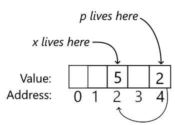
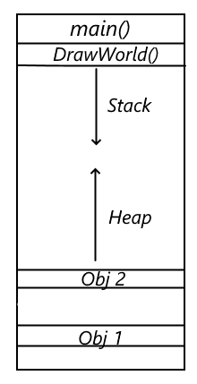
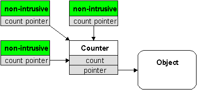
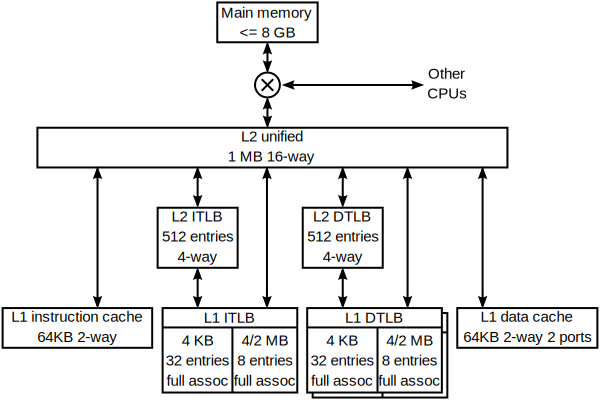

# Game Engine Architecture

## Fundamentals

---------------------
[Course Index](http://nikoladimitroff.github.io/Game-Engine-Architecture)

<div class="authors-section">
<table>
<tbody>
    <tr>
        <td>
            Nikola Dimitroff
        </td>
        <td>
            <a target="_blank" href="https://dimitroff.bg"><i class="fa fa-rss"></i></a>
            <a target="_blank" href="mailto:nikola@dimitroff.bg"><i class="fa fa-envelope-o"></i></a>
            <a target="_blank" href="https://github.com/nikoladimitroff"><i class="fa fa-github"></i></a>
            <a target="_blank" href="https://twitter.com/nikoladimitroff"><i class="fa fa-twitter"></i></a>
        </td>
    </tr>
    <tr>
        <td>
            Alexander Angelov
        </td>
        <td>
            <a target="_blank" href="mailto:aleksandar.angelovv@gmail.com"><i class="fa fa-envelope-o"></i></a>
            <a target="_blank" href="https://github.com/Alekssasho"><i class="fa fa-github"></i></a>
            <a target="_blank" href="https://twitter.com/Alekssasho"><i class="fa fa-twitter"></i></a>
        </td>
    </tr>
    <tr>
        <td>
            Viktor Ketipov
        </td>
        <td>
            <a target="_blank" href="mailto:info@kipiinteractive.com"><i class="fa fa-envelope-o"></i></a>
            <a target="_blank" href="https://github.com/k1p1"><i class="fa fa-github"></i></a>
            <a target="_blank" href="https://twitter.com/xk1p1x"><i class="fa fa-twitter"></i></a></p>
        </td>
    </tr>
</tbody>
</table>
</div>

<div class="companies-section">
<a class="ubisoft-logo" href="https://ubisoft.com" target="_blank"></a>
<br>
<a class="kipi-logo" href="http://kipiinteractive.com" target="_blank"></a>
</div>

--- NEXT SLIDE ---

# Sanity check

We are recording, aren't we?


--- NEXT SLIDE ---

## Review

What's the difference between these files?

| File                            | Description                                                                                                        |
| ------------------------------- | ------------------------------------------------------------------------------------------------------------------ |
| *Source/MyGame.Target.cs*       | <!-- .element class="fragment" data-fragment-index="0" --> Sets up the build environment for the *game* 'MyGame'   |
| *Source/MyGame/MyGame.Build.cs* | <!-- .element class="fragment" data-fragment-index="0" --> Sets up the build environment for the *module* 'MyGame' |

--- VERTICAL SLIDE ---

## Review

Judging by the names of these classes, what can you tell about them?

| Class               | Info                                                                            |
| ------------------- | ------------------------------------------------------------------------------- |
| `FDirectoryWatcher` | <!-- .element class="fragment" data-fragment-index="0" --> A standard C++ class |
| `TFunction`         | <!-- .element class="fragment" data-fragment-index="1" --> A template class     |

<!-- .element class="fragment" data-fragment-index="2" --> What other prefixes were there?

--- VERTICAL SLIDE ---

## Review

What's a unity build?

<!-- .element class="fragment" data-fragment-index="0" --> Putting all your source files into a single file
and compiling that one megafile, effectively skipping the linker.


--- NEXT SLIDE ---

# Fundamentals

1. C++ Review and Best Practices (smart pointers, iterators, error handling, libraries, unity builds)
1. Pipelines, Caches and Optimization
1. Tools support

--- NEXT SLIDE ---

## C++

* Most games are written in C/C++
* Even games that are not written in C++, have C++ at their core
  * the Platform-independence layer
  * parts of the Core layer, if not the entire one
* Or languages that are not C++, but close enough
  * Increasing interest in [Rust](https://www.rust-lang.org/)
    * Both [Embark Studios](https://www.embark-studios.com/) and [Ready At Dawn](http://www.readyatdawn.com/) has stated that new code will be Rust exclusive
  * [Jonathan Blow - A new programming language for
    games](https://www.youtube.com/watch?v=TH9VCN6UkyQ&list=PLmV5I2fxaiCKfxMBrNsU1kgKJXD3PkyxO)

--- NEXT SLIDE ---

# Basic C++ Review

...the room becomes silent in 3..2..1...

--- VERTICAL SLIDE ---

***What's a compiler and what's a linker?***

<!-- .element class="fragment" --> The
compiler converts each .cpp file into an .obj file. The linker glues .obj files in an executable or library.

--- VERTICAL SLIDE ---

***What's a reference?***

A reference is an alias to a variable.
<!-- .element class="fragment" data-fragment-index="0" -->

```cpp
int x = 5;
int& y = x;
y = 6;
std::cout << x; // 6
```
<!-- .element class="fragment" data-fragment-index="0" -->

--- VERTICAL SLIDE ---

***What's a pointer?***

A pointer is an integer that stores the address of the memory cell holding the variable's value.
<!-- .element class="fragment" data-fragment-index="0" -->

```cpp
int x = 5;
int* p = &x;
*y = 6;
std::cout << x; // 6
```
<!-- .element class="fragment" data-fragment-index="0" -->


<!-- .element class="fragment" data-fragment-index="0" -->

--- VERTICAL SLIDE ---

***What are `const` refs and `const` pointers?***

Ways to access the data and promising not to change it.
<!-- .element class="fragment" data-fragment-index="0" -->

```cpp
int x = 5;
const int& y = x;
// The following is a compilation error;
// y = 6; // x isn't const but can't be changed through y
x = 42; // that's fine
std::cout << x; // 42
```
<!-- .element class="fragment" data-fragment-index="0" -->

--- VERTICAL SLIDE ---

***What are the stack and the heap?***

A logical separation of the RAM. Stack memory is fast, automatic and static. The heap is slow, manual and dynamic.
The heap lets you do more but at a cost.
<!-- .element class="fragment" data-fragment-index="0" -->


<!-- .element class="fragment" data-fragment-index="0" -->

--- VERTICAL SLIDE ---

***What are `new` and `delete`?***

Keywords for constructing variables, and (almost always) allocating memory for them on heap.
<!-- .element class="fragment" data-fragment-index="0" -->

```cpp
int main()
{
    // On the stack; memory is freed when main ends
    int normalInt = 5;
    // On the heap; memory must be freed manually
    int* expensiveInt = new int(5);
    // If you forget the delete, you leak memory
    delete expensiveInt;
}
```
<!-- .element class="fragment" data-fragment-index="0" -->

--- VERTICAL SLIDE ---

***What are classes and structs?***

Blueprints for creating objects which represents some real world or program-specific concept.
<!-- .element class="fragment" data-fragment-index="0" -->

```cpp
// With all the math we need, every engine has some sort of Vector3
struct Vector3
{
    float X;
    float Y;
    float Z;
};
```
<!-- .element class="fragment" data-fragment-index="0" -->

--- VERTICAL SLIDE ---

***What's the big 3/4/5?***

```cpp
struct Vector3
{
    // A default constructor
    Vector3() : X(0.f), Y(0.f), Z(0.f)
    {}
    // A copy constructor
    Vector3(const Vector3 v) : X(v.X), Y(v.Y), Z(v.Z)
    {}
    // An assignment operator
    Vector3& operator=(const Vector3 v)
    { X = v.x; Y = v.Y; Z = v.Z; }
    // Destructor; this one is empty
    ~Vector3()
    {}
    // Homework: google move-assignment operator and Move-constructor
};
```
<!-- .element class="fragment" data-fragment-index="0" -->

--- VERTICAL SLIDE ---

***What's a template?***

```cpp
// A feature that allows us to reuse the same function
// or class for different types
template<typename T>
T Sum(T first, T second)
{
    return first + second;
}
...
int integer = Sum(2, 3); // 5
Vector3 vec = Sum(Vector3(1, 0, 0), Vector3(0, 1, 0)); // (1, 1, 0)
```
<!-- .element class="fragment" data-fragment-index="0" -->

--- VERTICAL SLIDE ---

***What's a `std::vector`?***

```cpp
// A dynamic array; O(1) appending, O(n) random insertion, O(n) search
std::vector<int> list = { 1, 2, 3, 5, 8, 13 }; // 6 items
list.push_back(list[4] + list[5]); // add the next Fibonacci
std::cout << list.size(); // 7
std::cout << list[list.size() - 1]; // 21
```
<!-- .element class="fragment" data-fragment-index="0" -->

--- VERTICAL SLIDE ---

***What's a `std::unordered_map`?***

*Not to be confused with `std::map`*

```cpp
// A hash table; O(1) insert, O(1) search
std::unordered_map<std::string, std::string> rulersByCountry =
{
    {"India", "Gandhi"},
    {"Bulgaria", "Simeon the Great"}
};
std::cout << rulersByCountry["Bulgaria"]; // Simeon the Great
```
<!-- .element class="fragment" data-fragment-index="0" -->

--- NEXT SLIDE ---

## Modern C++ (11 / 14 / 17)

The language you didn't learn in your Intro to programming courses

--- VERTICAL SLIDE ---

DISCLAIMER: The following slides aren't meant to be a complete reference to the material

* You don't need to know all of these to pass the course
* The more you know, the better you will be
* Use Google or suggested books

--- VERTICAL SLIDE ---

### Auto

Saves you from writing the variable type. Use with caution.

```cpp
auto num = 5;
auto realNum = 5.5;
std::vector<double> vec;
auto vecCopy = vec;
```

--- VERTICAL SLIDE ---

### Range-based for loop

Loops over the contents of a container without an index

```cpp
std::vector<int> v = {0, 1, 2, 3, 4, 5};
for (const int& i : v) {
    std::cout << i << ", " ;
}
```

--- VERTICAL SLIDE ---

### Even cooler in C++17

```cpp
for (auto&& [key, value] : myNap) {
    // use key and value
}
```

--- VERTICAL SLIDE ---

### $\lambda$ functions

In-place function. This one doesn't have a capture.

```cpp
const auto isEven = [](int i) { return i % 2 == 0; };
std::cout << isEven(5); // false
std::cout << isEven(4); // true
```

--- VERTICAL SLIDE ---

###  $\lambda$ functions

This one captures a variable.

```cpp
std::vector<int> primeNumbers = { 2, 3, 5, 7, 11, 13 };
const auto isPrime = [&primeNumbers](int value)
{
    for (const auto& num : primeNumbers)
    {
        if (num == value)
        {
            return true;
        }
    }
    return false;
};
std::cout << isPrime(5); // true
std::cout << isPrime(4); // false
```

--- VERTICAL SLIDE ---

### Algorithms

`<algorithm>` is a header of great importance

* Contains a bunch of algorithms usually found in code
* Can save you a lot of time implementing them
* Make code much more readable

--- VERTICAL SLIDE ---

### Algorithms

Find some item in a container

```cpp
#include <algorithm>
struct Player
{   const char* Name; const char* Color; };

std::vector<Player> characters =
{
    {"Nikola", "Red"},
    {"Alex", "Blue"},
    {"Viktor", "Green"}
};
auto alex = std::find_if(vec.begin(), vec.end(), [](const Player& p) {
        return strcmp(p.Name, "Alex") == 0;
});
if (alex != vec.end())
    std::cout << "Alex's color is " << alex.Color; // Blue
```

--- VERTICAL SLIDE ---

### Algorithms v2

Sort only the even numbers

```cpp
std::vector<int> numbers = { 42, 3, 5, 6, 0, 99, 10, 101 };

const auto isEven = [](int i) { return i % 2 == 0; };
auto newEnd = std::remove_if(numbers.begin(), numbers.end(), isEven);
numbers.erase(newEnd, numbers.end());
std::sort(numbers.begin(), numbers.end());

for (const auto& num : numbers)
    std::cout << num << ", "; // 0, 6, 10, 42
```

--- VERTICAL SLIDE ---

### And a bunch of other things that we aren't explaining

* The rest of `<algorithm>`
* `std::function`
* SFINAE
* `<thread>`
* `<chrono>`

--- NEXT SLIDE ---

## Pointer troubles

How stable is this code?

```cpp
void BringWeaponToPlayer(Player* player)
{
    Squire* squire = player->SpawnSquire();
    if (!squire->HasWeapons())
    {
        delete squire;
        return;
    }
    Weapon* weapon = squire->SpawnFirstWeapon();
    if (!player->CanEquip(weapon))
    {
        delete weapon;
        delete squire;
        return;
    }
    player->Equip(weapon);
    delete squire;
}
```

--- VERTICAL SLIDE ---

* The `squire` was deleted at 3 different places
* The `weapon` was deleted in just one, but it's unclear if that's fine
* It is easy for someone to mess it up

--- VERTICAL SLIDE ---

## More pointer troubles

What's the relationship between `Player` and its pointers?

```cpp
class Player
{
public:
    Weapon* PrimaryWeapon;
    Quest* RaidMission;
    SteamProfile* Profile;
}
```

--- VERTICAL SLIDE ---

The 3 different pointers express different relationships

* `Player` *owns* the `PrimaryWeapon` - when the player dies, the weapon should too
* `Player` *shares* the `RaidMission` - the raid mission object should be destroyed when all raid members are destroyed
* `Player` *uses* the `Profile` - their lifetimes are independent

--- NEXT SLIDE ---

# RAII & Smart pointers

Resource acquisition is initialization

* Whenever you access a resource
  * Acquire in constructor
  * Release in destructor

--- VERTICAL SLIDE ---

RAII is important because

* Makes responsibility clear <!-- .element class="fragment" data-fragment-index="0" -->
  * "Who should delete this?" <!-- .element class="fragment" data-fragment-index="0" -->
* Guarantees that the code which got the resource is the same to free it  <!-- .element class="fragment" data-fragment-index="1" -->
  * Different parts of the code may allocate resources differently  <!-- .element class="fragment" data-fragment-index="1" -->
* Saves you from errors  <!-- .element class="fragment" data-fragment-index="2" -->
  * Branching code needs multiple calls to delete without RAII  <!-- .element class="fragment" data-fragment-index="2" -->

--- VERTICAL SLIDE ---

Smart pointers are RAII helpers for memory.

Smart pointers are structs designed to act as if they were pointers.

* `operator*()`
* `operator->()`
* `explicit operator bool()`

--- NEXT SLIDE ---

### `std::unique_ptr`

C++ 11 introduces `std::unique_ptr`

* Uncopyable
* Moveable
* `std::unique_ptr` owns the resource it is pointing to.
  Use this to express ownership relation between types

Let's see some examples

--- VERTICAL SLIDE ---

### `std::unique_ptr<T>`

```cpp
class Player
{
public:
    std::unique_ptr<Weapon> PrimaryWeapon;
    Player()
        // Will be deleted in auto generated destructor
        : PrimaryWeapon(new RandomizedSword());
    {
        std::cout << PrimaryWeapon->GetName(); // "Axe of Cats"
    }
}
```

--- VERTICAL SLIDE ---

### `std::unique_ptr<T>`

```cpp
std::unique_ptr<char[]> ReadFile(const char* path)
{
    // Sometimes, we need to first allocate memory
    std::unique_ptr<char[]> buffer(new char[GetFileSize(path)]);
    // And then operate on it with no guarantee of success
    const bool didSucceed = TryReadFile(path);
    if (!didSucceed)
    {
        buffer.reset();
        // buffer is now nullptr; memory has been freed
    }
    return buffer;
}
```

--- VERTICAL SLIDE ---

### `std::unique_ptr<T>`

```cpp
std::unique_ptr<char[]> buffer = ReadFile("foo.txt");
if (buffer)
{
    std::cout << "First byte is " << buffer[0];
}
```

--- VERTICAL SLIDE ---

`std::unique_ptr` has a second template parameter

```cpp
struct CustomDeleter
{
    void operator()(void* p)
    {
        std::cout << "Instance " << p << " is dead now";
    }
};
...
std::unique_ptr<NPC, CustomerDeleter> npc;
```

--- NEXT SLIDE ---

## Reference counting

* Sometimes a resources is shared between different objects
* Increment a counter on access
* Decrement a counter on release
* When counter reaches 0 - delete

--- VERTICAL SLIDE ---

### `std::shared_ptr<T>`

C++ 11 introduces `std::shared_ptr`

* Copyable
* Moveable
* Ownership of an object is shared among all `std::shared_ptr` pointing to it.
  Use this to express shared ownership relation between types.

--- VERTICAL SLIDE ---

### `std::shared_ptr<T>`

```cpp
class Player
{
public:
    std::shared_ptr<RaidMission> Mission;
    Player(const std::shared_ptr<RaidMission>& mission)
        // Counter will be decremented in the destructor
        : Mission(mission);
    {
        std::cout << Mission->GetName(); // "Destroy 5 towers"
    }
}
```

--- VERTICAL SLIDE ---

### `std::shared_ptr<T>`

```cpp
// This works
std::shared_ptr<RaidMission> mission(new RaidMission("Destroy towers"));
// But always prefer this
std::shared_ptr<RaidMission> mission =
    std::make_shared<RaidMission>("Destroy towers"); // Counter == 1

{
    Player p1(mission); // Counter == 2
    mission.reset(); // Counter == 1; mission is now nullptr
    {
        Player p2(mission); // Counter == 2
    } // Counter == 1
} // Counter == 0; object is deleted
```

--- VERTICAL SLIDE ---

#### *Intrusive* reference counting

When the reference count is stored along the resource itself.

 <!-- .element class="fragment" data-fragment-index="0" -->
 <!-- .element class="fragment" data-fragment-index="1" -->

* `std::shared_ptr<T>`'s constructor uses a non-intrusive counter
<!-- .element class="fragment" data-fragment-index="2" -->
* `std::make_shared` uses an intrusive counter

<!-- .element class="fragment" data-fragment-index="2" -->

--- VERTICAL SLIDE ---

#### *Intrusive* reference counting

Intrusive is always better

no pointer chasing <br>
    = less memory accesses + less memory fragmentation <br>
    = more performance

--- VERTICAL SLIDE ---

## `std::shared_ptr` is subpar

* constructor has a widely different behaviour than `std::make_shared`
* no control over the type of the reference count
  * is it 8, 16, 32, 64 bits?
  * is it thread-safe?
* reference counting makes design **much** harder

Use with care.

--- VERTICAL SLIDE ---

## Reference Counting and cycles

```cpp
class RaidMission;
class Player
{ public:
    std::shared_ptr<RaidMission> Mission;
    Player(const std::shared_ptr<RaidMission>& mission)
        : Mission(mission) {}
}
class RaidMission
{ public:
    std::vector<std::shared_ptr<Player>> Players;
    void AddPlayer(const std::shared_ptr<Player>& p)
    { Players.push_back(p); }
}
...
auto mission = std::make_shared<RaidMission>();
auto player = std::make_shared<Player>(mission);
mission->AddPlayer(player); // ggwp; player is now immortal
```

If you have a cycle in the references between resources in
`std::shared_ptr`, these resources will never be freed.

--- VERTICAL SLIDE ---

## Handling cycles

* manually by breaking the cycle (e.g. call `std::shared_ptr<T>::reset` on either pointer)
* use *weak* references

--- NEXT SLIDE ---

## `std::weak_ptr`

*Weak* pointers point to a resource, but do not prolong its lifetime.

--- VERTICAL SLIDE ---

```cpp
std::weak_ptr<int> w;
{
    std::shared_ptr<int> s = std::make_shared<int>(42); // Counter == 1
    w = s; // Counter still 1
} // Counter == 0; object dies

// Is object alive?
if (std::shared_ptr<int> pointer = w.lock()) {
    std::cout << "Still alive! Value: " << *pointer;
} else {
    std::cout << "It's gone";
}
```

--- VERTICAL SLIDE ---

### `offset_ptr`

* `offset` pointers store an offset from their address to the pointee
* Normal pointers store absolute addresses
* Gotta write it yourself, there's no `std::offset_ptr`

--- VERTICAL SLIDE ---

It allows storing complex data in a single blob, instead of scattered objects.

The single blob is better:

* We can load/save it with a single read/write
* *Cache friendly*

[The Blob and I](http://bitsquid.blogspot.bg/2010/02/blob-and-i.html)

--- NEXT SLIDE ---

### Memory management

C++ has support for custom memory management
(*one of the reasons we use it in the first place*)

* `operator new` and `operator delete` are overridable
* and also overloadable
* each class can have its own
* STL containers have support for custom allocators

--- VERTICAL SLIDE ---

References:

* [`operator new`](http://en.cppreference.com/w/cpp/memory/new/operator_new)
* [`operator delete`](http://en.cppreference.com/w/cpp/memory/new/operator_delete)

--- VERTICAL SLIDE ---

Overriding `new` & `delete`

```cpp
void* operator new(std::size_t size)
{
    // Ask Windows for memory
    // YOU DON'T HAVE TO UNDERSTAND THIS CODE
    void* memory = VirtualAlloc(NULL,
        size,
        MEM_RESERVE | MEM_COMMIT,
        PAGE_READWRITE);
    return memory;
}
void operator delete(void* ptr)
{
    // Return the memory to Windows
    VirtualFree(ptr, 0, MEM_RELEASE);
}
```

--- VERTICAL SLIDE ---

Cons

These operators are global

* no information from the call site or the type
* no state (except global)
* prone to need mutex for multithreading

There's a better way

--- VERTICAL SLIDE ---

Placement `new`

```cpp
// Allocate memory (stack, heap, w/e)
char buffer[256];
// Construct Player in buffer
auto player = new (buffer) Player;
// Destroy the player instance, but memory is still allocated
player->~Player();
```

--- VERTICAL SLIDE ---

`operator new` has a bunch of other overloads

```cpp
void* operator new(std::size_t size, void* ptr);
void* operator new[](std::size_t size, void* ptr);
void* operator new(std::size_t size, user-defined-args...);
void* operator new[](std::size_t size, user-defined-args...);
```

--- VERTICAL SLIDE ---

```cpp
struct LinearAllocator {
    // Statically allocate 1 MB of memory
    char m_Buffer[1024 * 1024];
    int m_Offset;
    int m_BufferSize;
    void* Allocate(size_t size)
    {
        if (offset + size > m_BufferSize)
            return nullptr; // or crash!

        auto ptr = m_Buffer + m_Offset;
        m_Offset += size;
        return ptr;
    }
} g_PerFrameAllocator;
```

--- VERTICAL SLIDE ---

```cpp
void* operator new(std::size_t size, LinearAllocator* allocator)
{
    return allocator->Allocate(size);
}
...
// Create a new instance in the memory of the per-frame allocators
auto models = new (&g_PerFrameAllocator) Models();
```

--- VERTICAL SLIDE ---

How does one delete a object allocated with custom allocator?

* There is no custom syntax for `delete`!
* Invent your own (e.g. use custom deleter)

```cpp
template<typename T>
struct PerFrameDeleter
{
    void operator()(void* instance)
    {
        instance->~T();
        g_PerFrameAllocator->Deallocate(instance);
    }
};
...
std::unique_ptr<Player, PerFrameDeleter> player
    (new (&g_PerFrameAllocator) Player());
```

--- VERTICAL SLIDE ---

#### STL allocator

* [`allocator`](http://en.cppreference.com/w/cpp/memory/allocator)

* `std::vector<int, PerFrameAllocator>` and `std::vector<int, ScopedAllocator>`
are completely different from each other
  * Impossible to use algorithms on containers with different allocators.
* No state = must use globals

--- NEXT SLIDE ---

### Error handling

* Error handling in the language
  - C - error codes
  - C++ - exceptions;
  - Anyone willing to explain the difference?
* Error handling in the real world <!-- .element class="fragment" -->
  * error codes are error prone <!-- .element class="fragment" -->
  * exceptions are rebranded gotos <!-- .element class="fragment" -->
  * exceptions are poorly implemented <!-- .element class="fragment" -->

--- VERTICAL SLIDE ---

#### Exceptions

~~`goto`~~ exceptions are bad because they jump around unpredictably

```cpp
double MySqrt(double num)
{
    if (num < 0)
        throw std::invalid_argument("received negative value");
    return std::sqrt(num);
}
double DoSomeMath()
{
    double num;
    std::cin >> num;
    MySqrt(num); // What happens if num == -5?
}
```

[Full read here](https://www.joelonsoftware.com/2003/10/13/13/)

--- VERTICAL SLIDE ---

#### Exceptions

* have performance impact even when there no exceptions
  * on Windows function calls become significantly more expensive
  * GCC/CLANG use a static jump table, which makes the executable larger

--- VERTICAL SLIDE ---

* Exceptions are frowned upon in many environments
  * forbidden on the previous generation of consoles (PS3, XB360) - no runtime support
  * off-by-default on Android / iOS (you want your game small!)
  * off-by-default on current generation of consoles (PS4, XB1)

--- VERTICAL SLIDE ---

#### Error handling in the real world

* Logging
* Assertions
* Crash-handling

--- VERTICAL SLIDE ---

##### Logging

* Having only an error (with a callstack if we are lucky) often is not enough
* Games simulate many entities over many frames over many systems
* Logging is essential for understanding what is going on with the program

--- VERTICAL SLIDE ---

* There is no standard `C++` library for logging.

--- VERTICAL SLIDE ---

###### Choosing a logging library

* Logging is an aspect of the program
* It crawls all over the place

--- VERTICAL SLIDE ---

###### Logging libraries

* [glog][glog]
* [boost log][boost]
* Lots of them on github
* roll your own (at least for fun)

[glog]: https://code.google.com/p/google-glog/
[boost]: http://www.boost.org/doc/libs/1_60_0/libs/log/doc/html/index.html

--- VERTICAL SLIDE ---

###### Criteria

* Severities so you can ignore unimportant info but still have it there if needed
* Categories so you can filter messages in one system
* Compile time and run-time impact

--- VERTICAL SLIDE ---

###### What to log?

* Not too much (it is not free), but enough to understand what
  is going on.
* All important points in the lifetime of the application.
* [On logging errors and crashes][error]
  [error]: http://bitsquid.blogspot.com/2012/01/sensible-error-handling-part-1.html

--- VERTICAL SLIDE ---

### Assertions

* `assert`
  * only in `_DEBUG` builds
  * only aborts the program, at best you get the callstack

--- VERTICAL SLIDE ---

Custom assert mechanism

* turned off only for *shipping* builds
* gathers callstack, logs, everything possible

--- VERTICAL SLIDE ---

## Crash reporting

At the end there will be crashes

--- VERTICAL SLIDE ---

All operating systems allow registering of custom callback to be called
when the application crashes

--- VERTICAL SLIDE ---

You gather everything you can about the state and send it back home to be
examined.

--- VERTICAL SLIDE ---

### [Breakpad](https://code.google.com/p/google-breakpad/)

* portable
* allows automatic crash dump analysis

--- NEXT SLIDE ---

## Standard library != STL

--- VERTICAL SLIDE ---

#### STL containers

* no control over allocation patterns
* some containers allocate even when empty!

--- VERTICAL SLIDE ---

#### Standard Template Library

--- VERTICAL SLIDE ---

* poor memory management

--- VERTICAL SLIDE ---

* poor portability
  - The standard requires only O-notation for certain operations, all the
  rest is implementation defined
  - `std::string` in GCC (libstdc++) prior to 5.0 is using `copy-on-write`
  - The rest are using small string optimization


--- VERTICAL SLIDE ---

* poor control
  - `std::thread`
  - `std::async`
  - `std::atomic<int64_t>`

--- VERTICAL SLIDE ---

##### Alternatives

* EASTL - fixes the allocator issues of STL.
  https://github.com/electronicarts/EASTL
* Bitsquid Foundation library
* folly
* STLport

--- NEXT SLIDE ---

### Custom containers

* Frequently adopted practice
* Guarantees portability
* Guarantees quick fixes
* Requires some leaning

--- VERTICAL SLIDE ---

Custom containers will require custom iterators

```cpp
for (auto& pawn: pawns) {
    // actually calls begin(pawns) and end(pawns) and expects iterator
}
```

--- VERTICAL SLIDE ---
C
--- NEXT SLIDE ---

#### There is hope

There is a working group that thinks how to improve C++

* [Towards improved support for games, graphics, real-time, low latency,
embedded systems.](http://www.open-std.org/jtc1/sc22/wg21/docs/papers/2015/n4456.pdf)

* SCARY iterators

--- NEXT SLIDE ---

## Performance

...room goes silent in 3..2..1...

--- VERTICAL SLIDE ---

### Shortest review of how a computer works

* Processor reads and writes data from RAM
* RAM is slow so let there be caches
* CPU reads from L1 if possible, if not L2, if not L3, if not RAM, if not disk

--- VERTICAL SLIDE ---

### Mem hierarchy



<!-- .element class="attribution" --> By Traced by <a href="//commons.wikimedia.org/wiki/User:Stannered" title="User:Stannered">User:Stannered</a> - <a href="https://en.wikipedia.org/wiki/Image:Cache,hierarchy-example.png" class="extiw" title="en:Image:Cache,hierarchy-example.png">en:Image:Cache,hierarchy-example.png</a>, <a href="http://creativecommons.org/licenses/by-sa/3.0/" title="Creative Commons Attribution-Share Alike 3.0">CC BY-SA 3.0</a>, <a href="https://commons.wikimedia.org/w/index.php?curid=1846081">Link</a>


--- VERTICAL SLIDE ---

Warm caches = happy users

| Access time      | Action                                                    |
| ---------------: | --------------------------------------------------------- |
|           0.5 ns | CPU L1 dCACHE reference                                   |
|           1 ns   | speed-of-light (a photon) travel a 1 ft (30.5cm) distance |
|           5 ns   | CPU L1 iCACHE Branch mispredict                           |
|           7 ns   | CPU L2  CACHE reference                                   |
|          25 ns   | MUTEX lock/unlock                                         |
|         100 ns   | RAM access                                                |
|      10,000 ns   | Compress 1K bytes with Zippy PROCESS                      |
|      20,000 ns   | Send 2K bytes over 1 Gbps NETWORK                         |
|     250,000 ns   | Read 1 MB sequentially from MEMORY                        |
|   8,000,000 ns   | DISK seek                                                 |
|  20,000,000 ns   | Read 1 MB sequentially from DISK                          |
| 150,000,000 ns   | Send a NETWORK packet CA -> Netherlands                   |

[Source](http://norvig.com/21-days.html#answers)

--- VERTICAL SLIDE ---

<style>
#mem-access-anim {
    width: 1px;
    min-width: 100%;
    height: 1px;
    min-height: 100%;
}
</style>
<iframe id="mem-access-anim" width="100%" height="600" scrolling="no" src="resources/03.fundamentals/memory_access_anim.html"></iframe>

--- VERTICAL SLIDE ---

Cache enemies:

* `std::list`
* `std::map`, `std::set`

--- VERTICAL SLIDE ---

* `std::shared_ptr`
    * one pointer-chase for the RC
    * one pointer-chase for the actual object

--- VERTICAL SLIDE ---

* `virtual` functions
    * one pointer-chase for the objects v-table
    * one pointer-chase for the object itself
    * code cache - sorting objects by type

--- NEXT SLIDE ---

### Optimizations

Shipping games are built with every optimization possible!

--- VERTICAL SLIDE ---

This leads to Subtle, shipping only bugs

* static analysis may detect undefined behaviour

--- VERTICAL SLIDE ---

#### Link-time optimizations

* Allow the linker to generate code
    * inline functions accross objects
    * devirtualize calls

--- NEXT SLIDE ---

## Libraries!

The output of a linker can be:
* an executable (\*.exe, \*.elf, \*.out)
* a static library (\*.lib, \*.a)
* a dynamic library (\*.dll, \*.dylib, \*.so)

--- VERTICAL SLIDE ---

### Executables

* Contain a bunch of instructions and hardcoded data
* Contain a `int main(int argv, char** argc)` function!
* Different platforms use different formats but they are rather similar

--- VERTICAL SLIDE ---

### Static libraries

* Are basically an archive of object files
* The linker does nothing on them but package the archive
* Only needed during linking
* Cause code duplication
* Need to be rebuild for every compiler / linker option possible
* Symbols leak into the final binary

--- VERTICAL SLIDE ---

### Dynamic (shared) libraries

* Are ***identical*** to executables in every aspect other that they
lack `int main()`
  - though they may have `DllMain()`
* Need to be distributed along the executable
* Save code duplication
* Reusable
* Don't leak symbols
* Symbols must be exported / imported
  - A symbol is any class / function / variable
* Can be delay loaded!

--- VERTICAL SLIDE ---

### The OS loader

* The part responsible for loading executables and dynamic libraries into memory
* Maps relative addresses to virtual addresses

--- VERTICAL SLIDE ---

### The OS loader algorithm

```
dependentLibraries = load exe into memory()
for each lib in dependentLibraries:
    check if dll is not already loaded in memory
    try load lib from the executable's directory
    try load lib from some list of predefined paths
    try load lib from the OS standard library location
```

More details for Windows:
https://msdn.microsoft.com/en-us/library/windows/desktop/ms682586(v=vs.85).aspx

--- VERTICAL SLIDE ---

### Tips & tricks

* Use *dumpbin* / *nm* to inspect libraries
  - unix also pack *LD_DEBUG* - incredibly useful for inspecting the loader
* Different platforms have various gotchas
  - unix loaders may load related symbols from multiple libraries :((((
* Working with libraries is tricky at first
  - which is why we'll make you

--- NEXT SLIDE ---

## Back to game linking


--- VERTICAL SLIDE ---

#### Static linking

* games are preferrably linked into a single executable, without dynamic
  libraries
* dynamic libraries are used to speed up development

--- VERTICAL SLIDE ---

Static linking allows

* more inlining
* less overhead when calling functions
    * DLL boundary is calling a function through pointer
    * On Posix it is even worse (symbols are lazy bound)
* no DLL hell (games need to run on every possible PC out there)

--- NEXT SLIDE ---

## Tools

C++ lacks tooling.

--- NEXT SLIDE ---

### Build systems

* `make`
* `ninja`

--- VERTICAL SLIDE ---

#### Project generation systems

Allow taking advantage of the native IDE (Visual Studio, Xcode, Eclipse)

* `cmake`
* `premake`, `genie`
* `gyp`

--- VERTICAL SLIDE ---

#### Cross compiling

* There are projects that allow using Visual Studio with gcc/clang as a cross-compilation tool
  * vs-android
* Visual Studio 2015 supports compiling and debugging for Android and iOS

--- NEXT SLIDE ---

### Debuggers

* Visual Studio
* Xcode
* gdb / lldb
* Minitrace
* RAD Game Tools are working on something!

--- VERTICAL SLIDE ---

### Graphical tooling

* RenderDoc
* NSight
* AMD PerfTools
* Visual Studio
* Xcode
* Platform Specific - for consoles
* https://github.com/Celtoys/Remotery

--- NEXT SLIDE ---

### Performance profilers

Performance profiling changes the behaviour of the program!

* Intel VTune
* Project pin - allows instrumenting the binary
* Visual Studio
* Xcode
* VerySleepy - sampling profiling
* minitrace

--- VERTICAL SLIDE ---

* valgrind - cachegrind
    * valgrind actually emulates a CPU and interprets the machine code

--- NEXT SLIDE ---

# Questions?

Sincere apologies for the lack of cats


