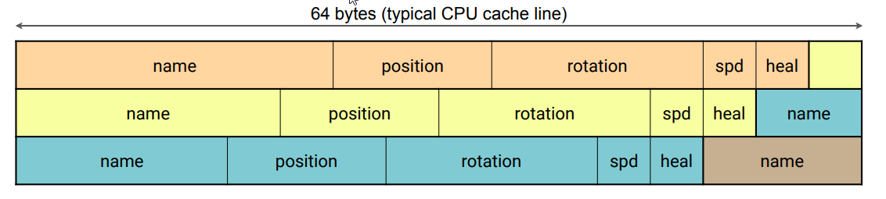

# Game Engine Architecture

## Gameplay Architecture

---------------------
[Course Index](http://nikoladimitroff.github.io/Game-Engine-Architecture)

<div class="authors-section">
<table>
<tbody>
    <tr>
        <td>
            Nikola Dimitroff
        </td>
        <td>
            <a target="_blank" href="https://dimitroff.bg"><i class="fa fa-rss"></i></a>
            <a target="_blank" href="mailto:nikola@dimitroff.bg"><i class="fa fa-envelope-o"></i></a>
            <a target="_blank" href="https://github.com/nikoladimitroff"><i class="fa fa-github"></i></a>
            <a target="_blank" href="https://twitter.com/nikoladimitroff"><i class="fa fa-twitter"></i></a>
        </td>
    </tr>
    <tr>
        <td>
            Alexander Angelov
        </td>
        <td>
            <a target="_blank" href="mailto:aleksandar.angelovv@gmail.com"><i class="fa fa-envelope-o"></i></a>
            <a target="_blank" href="https://github.com/Alekssasho"><i class="fa fa-github"></i></a>
            <a target="_blank" href="https://twitter.com/Alekssasho"><i class="fa fa-twitter"></i></a>
        </td>
    </tr>
    <tr>
        <td>
            Viktor Ketipov
        </td>
        <td>
            <a target="_blank" href="mailto:viktor@kipiinteractive.com"><i class="fa fa-envelope-o"></i></a>
            <a target="_blank" href="https://github.com/k1p1"><i class="fa fa-github"></i></a>
            <a target="_blank" href="https://twitter.com/xk1p1x"><i class="fa fa-twitter"></i></a></p>
        </td>
    </tr>
</tbody>
</table>
</div>

<div class="companies-section">
<a class="ubisoft-logo" href="https://ubisoft.com" target="_blank"></a>
<br>
<a class="kipi-logo" href="http://kipiinteractive.com" target="_blank"></a>
</div>

--- NEXT SLIDE ---

# Sanity check

We are recording, aren't we?


--- NEXT SLIDE ---

### Review

What are the stack and the heap?

* A logical separation of the RAM. Stack memory is automatic and static. The heap is manual and dynamic.

<!-- .element class="fragment" data-fragment-index="0" -->


<!-- .element class="fragment" data-fragment-index="0" -->

--- VERTICAL SLIDE ---

## Review

Name some of the things we learnt last week about Modern C++.

* Auto
* `for (auto& foo : foos)`
* Lambdas
* `<algorithm>`
* RAII and smart pointers
* Delegates and events

<!-- .element class="fragment" -->

--- VERTICAL SLIDE ---

## Review

```cpp
class Human
{
    PointerType1<HumanBody> m_Body;
    PointerType2<House> m_Home;
    PointerType3<SubwayStation> m_NearestSubwayStation;
};
```

What should `PointerType1`, `PointerType2` and `PointerType3` be?


```cpp
class Human
{
    /* a human owns their body */
    std::unique_ptr<HumanBody> m_Body;
    /* a home is shared by family members */
    std::shared_ptr<House> m_Home;
    /* a human only uses the subway, but has no control over it */
    SubwayStation* m_NearestSubwayStation;
};
```
<!-- .element class="fragment" -->

--- VERTICAL SLIDE ---

## Review

Explain these error handling methods

| Method     | Explanation |
| ---------- | ----------- |
| Exceptions | Ask the code up the callstack if it knows how to deal with the problem, crash otherwise <!-- .element class="fragment" --> |
| Error code | Tell the caller the operation failed and the reason why  <!-- .element class="fragment" --> |
| Assert     | Crash the program when an incoverable error occurs <!-- .element class="fragment" --> |
| Hide & log | Log the problem and ignore it, try again next time <!-- .element class="fragment" --> |

--- NEXT SLIDE ---

In a long-running application we need two things:

* Infinite loop - don't exit the program until some signal
* Event-based programming - react when an external event to happen (e.g. input)

--- VERTICAL SLIDE ---

## Infinite loop

```cpp
while (true)
{
    bool wasButtonPressed = checkKeyboardInput();
    if (wasButtonPressed)
        DispatchEvent(Events::ButtonPress, getPressedKey());

    bool wasWindowResized = currentSize != oldSize;
    if (wasWindowResized)
        DispatchEvent(Events::Resize, currentSize, oldSize);

    Draw();
}
```

--- VERTICAL SLIDE ---

An example in Windows

```cpp
int WINAPI WinMain(HINSTANCE hInstance, HINSTANCE hPrevInstance,
    LPSTR lpCmdLine, int nCmdShow)
{
    while(true)
    {
        MSG msg;
        BOOL bRet = GetMessage(&msg, NULL, 0, 0);

        if (bRet > 0) // (bRet > 0 - message must be processed)
        {
            TranslateMessage(&msg);
            DispatchMessage(&msg);
        }
        else if (bRet < 0)  {} // (bRet == -1 indicates an error)
        else break; // (bRet == 0 indicates "exit program")
    }
    return msg.wParam;
}
```

--- VERTICAL SLIDE ---

### A ***WIN***dow ***PROC***edure

Handles all events Windows sends to the application

```cpp
LRESULT CALLBACK MyWinProc(HWND hwnd, UINT msg,
    WPARAM wParam, LPARAM lParam)
{
    switch (msg)
    {
        case WM_KEYDOWN:
             // ...
             break;
        case WM_RESIZE:
             // ...
             break;
         default:
             return DefWindowProc(hwnd, msg, wParam, lParam);
    }
    return 0;
}
```

--- NEXT SLIDE ---

## Game Loop

An infinite loop but for games

```cpp
bool gRun = true;
int main()
{
    gRun = Initialize();
    while (gRun) {
        DoNextFrame();
    }
    Unitialize();
    return 0;
}
```

--- NEXT SLIDE ---

### Initialization

- Initialize the fundamental systems
  - memory management
  - logging and error handling
  - threading/task systems
  - rendering - create the application / window and the graphics device

--- VERTICAL SLIDE ---

**Do not load levels, models, connect to servers, etc.!**

This will make the start-up slow

Start the loop as fast as possible and show a loading screen.

--- NEXT SLIDE ---

### Uninitialization

- flush and stop the fundamental systems

--- NEXT SLIDE ---

### Frame update

A **frame** is a single iteration of the game loop.

60 fps => 16ms per frame for all systems!

--- NEXT SLIDE ---

```cpp
void DoNextFrame() {
    ProcessInput();
    UpdateWorldState();
    UpdateRenderState();
    Render();
}
```

--- NEXT SLIDE ---

#### Process input

- local - keyboard, mouse, gamepads, steering wheel, HMD, kinect, eye tracking, etc.
- remote
  - other players actions
  - server dictated state

--- NEXT SLIDE ---

#### Update World State

- update player
- update actors
- update environment

Make sure actions do not contradict the
laws in the game. (Players can not walk through walls)

--- VERTICAL SLIDE ---

```cpp
void UpdateWorldState() {
    UpdatePhysics(); // How water flows or a bullet flies
    CheckForCollisions(); // Find what objects collided this frame
    ExecutePlayerActions(); // Map player input to gameplay actions
    UpdateEnvironment();
    UpdateAI();
}
```

--- VERTICAL SLIDE ---

Taking a shot in a shooter game.

- Player presses the trigger <!-- .element class="fragment" -->
- A particle system creates projectiles, smoke <!-- .element class="fragment" -->
- The player position, aim and game time are used to compute the projectile trajectory <!-- .element class="fragment" -->
- An animation is played of the player pressing the trigger and recoil <!-- .element class="fragment" -->
- Timer starts to prevent automatic fire in the next couple of frames <!-- .element class="fragment" -->
- Projectile reaches target <!-- .element class="fragment" -->
- The game update scores, blood splatters, rag doll animation plays, etc. <!-- .element class="fragment" -->

--- VERTICAL SLIDE ---

Everything in a game is a continuous process. You need to get used to writing code that runs
over several frames.

--- NEXT SLIDE ---

#### Update Render State

- Update camera
- Gather all objects visible to the Player
- Determine what will be rendered and in what order
  - Terrain
  - Visible models
  - Particles, decals
  - UI
  - VFX (blur, lens flare)

--- NEXT SLIDE ---

#### Render

- Record rendering commands
- Replay the commands and draw everything

--- VERTICAL SLIDE ---

##### Why record rendering commands?

- Communication with the graphics device is not cheap
  - it involves calling driver / system functions (user mode vs kernel mode)
- Graphics drives can send more efficiently a batch of commands at once
- Great for multithreading

--- NEXT SLIDE ---

### Multithreaded architectures

All modern game engines utilize multithreading in some form

--- VERTICAL SLIDE ---

#### Basic

At least separate thread for rendering or every system in its own thread:

- Gameplay in main
- Rendering
- Physics
- IO

--- VERTICAL SLIDE ---

##### Synchronization

Systems run in different threads, but are synchronized.

- Otherwise the player may see frame that has happened a couple of seconds ago
- Or the rendering thread may take all the resources and starve the other
  threads

--- VERTICAL SLIDE ---

###### Side by Side

The renderer is rendering the same frame that was just created


--- VERTICAL SLIDE ---

###### Offset

The renderer is one(several) frame(s) behind the world


--- VERTICAL SLIDE ---

#### Task based parallelism

- each actor or system update is a task
- allows better utilization of the system hardware

--- VERTICAL SLIDE ---


--- NEXT SLIDE ---

## Timing

Being on time is hard.

--- NEXT SLIDE ---

Time is important in order for the game to be immersive.

- It turns the discrete frames into smooth experience
- makes the game believable
- makes the game fair

--- NEXT SLIDE ---

### How do we simulate a racing car going with 150 km/h?

* 150 km/h = 150 000 / 3600 ~ 42 m/s
* 60 frames per second, so we move it with 0.7 meters each frame
* <!-- .element class="fragment" --> Right?

--- VERTICAL SLIDE ---

- What happens if the system can't make 60 fps and runs with 30?
  - the car will move with 75 km/h instead <!-- .element class="fragment" -->
  - players with slower machines will be disadvantaged <!-- .element class="fragment" -->
- what happens if the game runs with between <!-- .element class="fragment" -->
  30 and 120 fps? (assume vsync is off)
  - the car reaches the trees near the sharp corner and automatically slows down <!-- .element class="fragment" -->

--- NEXT SLIDE ---

### Delta time

Time passed since the last frame is called **delta time**.

This way time in the game doesn't depend on the framerate.

--- NEXT SLIDE ---

So each frame we move the car with:

```
auto deltaTime = GetDeltaTimeInSeconds();
auto deltaCar = carVelocity * deltaTime;
```

--- NEXT SLIDE ---

How to get the delta time?

* We know it - it is 16ms!
  - <!-- .element class="fragment" --> Right?
* <!-- .element class="fragment" --> Platform timers

--- NEXT SLIDE ---

#### Delta time aware loop

```cpp
Time now();

auto lastFrameTime = now();
while (gRun) {
   auto currentFrameTime = now();
   auto delta = currentFrameTime - lastFrameTime;
   update(delta);
   lastFrameTime += delta;
}
```

Right? <!-- .element class="fragment" -->

--- VERTICAL SLIDE ---

A car moving at 42 m/s and will have moved 400m after 10s.

--- VERTICAL SLIDE ---

- usually time is measured in *ms* and stored in `float`
- accumulating lots of small float numbers create [accumulation errors][error]
- the game time will move slower than the real one!

[error]: http://stackoverflow.com/questions/249467/what-is-a-simple-example-of-floating-point-rounding-error

--- NEXT SLIDE ---

```cpp
float now();

auto previousTime = now();
while (gRun) {
   auto currentFrameTime = now();
   auto delta = currentFrameTime - previousFrameTime;
   update(delta);
   previousFrameTime = currentFrameTime;
}
```

--- VERTICAL SLIDE ---

The moral so far:

* Never compute time by accumulating time deltas
* Use the `now()` function to get the current time

--- VERTICAL SLIDE ---

- Unix timestamps are from January, 1st, 1970
- roughly 1569761316 seconds since then.
- `float` can exactly represent numbers up to 2^24
- $$\frac{1569761316}{2^{24}} \approx 93s$$

**The timer gets precision of 93 seconds = time will only increment by 93s!**
<!-- .element class="fragment" -->

If the type was `double`, the precision is $$\frac{1569761316}{2^{53}} \approx 10^{-7}s$$
<!-- .element class="fragment" -->

--- VERTICAL SLIDE ---

#### Timers and multithreading

- time can be different in different threads
- some OS may not support steady timers (historically)

--- VERTICAL SLIDE ---

The moral:

* Never compute time by accumulating time deltas
* Use the `now()` function to get the current time
* Use types with sufficient precision for all time related computations

--- NEXT SLIDE ---

## Game objects

--- NEXT SLIDE ---

Traditional object-orientated programming doesn't work for games.

--- VERTICAL SLIDE ---

If we are making *Super Mario*, then *Mario* has:

- input
- physics
- rendering

We want these to be independent so that they can be combined.

--- VERTICAL SLIDE ---

 <!-- .element class="constrain-image" -->

```cpp
class Mario : Renderable, PhysicsObject, InputControlled
{
};
```

--- VERTICAL SLIDE ---

Mario can get a kart to move faster

```cpp
class Player : Renderable, PhysicsObject, InputControlled, Motorized
{
};
```

--- VERTICAL SLIDE ---

NPC also have physics and rendering, but they are controlled by the AI

```cpp
struct NPC : Renderable, PhysicsObject, AIControlled
{
};
```

--- VERTICAL SLIDE ---

How do you make it possible to switch between Mario and Luigi?
Which gets to be `AIControlled` and which gets to be `InputControlled`?

--- VERTICAL SLIDE ---

This is a bit better because of no multiple inheritance

```cpp
class Mario
{
    Renderable renderable;
    PhysicsObject physics;
    InputControlled input;
};
```

--- VERTICAL SLIDE ---

But you still may not create a new object without a C++ engineer creating class for that.

--- VERTICAL SLIDE ---

Using OOP will quickly lead to combinatorial explosion of classes.
It also:

- leads to tight coupling between the different subsystems
- "everything is slow" vibe - OOP is not efficient
- can't dynamically add new behaviour

--- NEXT SLIDE ---

### Entity & Component

Each entity (player, NPC, ...) is a collection of components (rendering,
  physics, input controlled, AI controlled)

- http://gamedevs.org/uploads/data-driven-game-object-system.pdf
- http://gameprogrammingpatterns.com/component.html

--- VERTICAL SLIDE ---

- We have: `RenderComponent`, `PhysicsComponent`, `InputComponent`, ...
- *Mario* is a collection of these components
  - When *Mario* gets the kart, it gets a `VehicleComponent`

--- VERTICAL SLIDE ---

```cpp
class Actor
{
    std::vector<IComponent*> m_Components;
};
class Player : public Actor
{
    Player()
    {
        m_Components = { new RenderComponent(), new PhysicsComponent() };
    }
}
```
--- VERTICAL SLIDE ---

- Now everything is composable
- Adding new entities is simple
  - Just add several components
  - Designer friendly

--- VERTICAL SLIDE ---

Working with  entities means talking to the components

```cpp
void ApplyDamage(Entity* player, float damage) {
    if (player->HasComponent<HealthComponent>()) {
        HealthComponent* component =
            player->GetComponent<HealthComponent>();
        component->ApplyDamage(damage);
    }
}
```

--- VERTICAL SLIDE ---

- Previous function is generic and can work for any entity which has `HealthComponent`
- No longer need to separate function for dealing damage to players or NPCs

--- VERTICAL SLIDE ---

```cpp
class Orbit : public Component
{
public:
   float3 objectToOrbitAround;
   void Update() override
   {
       float3 currentPos = myEntity->GetComponent<Transform>().position;
       PhysicsComponent& physics = Entity->GetComponent<Physics>();
       physics.velocity += SomehowSteerTowards(currentPos,
                                            objectToOrbitAround);
   }
}
```

--- VERTICAL SLIDE ---

```cpp
void UCollidingPawnMovementComponent::TickComponent(float DeltaTime,
    enum ELevelTick TickType,
    FActorComponentTickFunction *ThisTickFunction)
{
    Super::TickComponent(DeltaTime, TickType, ThisTickFunction);
    FVector DesiredMovementThisFrame =
        ConsumeInputVector().GetClampedToMaxSize(1.0f) * DeltaTime;
    if (DesiredMovementThisFrame.IsNearlyZero())
        return;
    FHitResult Hit;
    SafeMoveUpdatedComponent(DesiredMovementThisFrame,
        UpdatedComponent->GetComponentRotation(), true, Hit);
    // If we bumped into something, try to slide along it
    if (Hit.IsValidBlockingHit()) {
        SlideAlongSurface(
            DesiredMovementThisFrame, 1.f - Hit.Time, Hit.Normal, Hit);
    }
};
```

--- VERTICAL SLIDE ---

Designer Friendly

- One click to create new entitiy.
- After that just choose what components to add to it from a dropdown.
- No need for a programmer to create a new C++ class.

--- VERTICAL SLIDE ---

### Cons

- Accessing components requires an indirection (so probably a cache miss)
  - Find the component in the entity's list
  - Component are allocated on the heap
  - Possibly a virtual call

- Could be amortized with caches

--- NEXT SLIDE ---

### Sidenote: Data-oriented design

A way of thinking when designing and implementing systems

--- VERTICAL SLIDE ---

What is a program doing on the most basic level ?

--- VERTICAL SLIDE ---

Transforming data from one format to another

A game transforms player input to colors on the screen.

--- VERTICAL SLIDE ---

Main point of DoD

- Data is everything, code is not important
- Think of data and how to transform it
- Where there is one, there is many
- Similar to relational databases

Must Watch !
<iframe width="560" height="315" src="https://www.youtube.com/embed/rX0ItVEVjHc" frameborder="0" allowfullscreen></iframe>

--- VERTICAL SLIDE ---

### Pros

- Easier to reason about code
- Easier to reason about performance
- Machine friendly
    - Cache friendly
    - Vectorization opportunities (SIMD)
    - Easier to parallelize

--- VERTICAL SLIDE ---

Good on theory but how does it look ?

--- VERTICAL SLIDE ---

#### Array of Structures (AoS)

Standard OOP relies on AoS

```cpp
struct Object { 
    string name;
    Vector3 position;
    Quaternion rotation;
    float speed;
    float health;
};

--- VERTICAL SLIDE ---



--- VERTICAL SLIDE ---

#### Structure of Arrays (SoA)

DoD prefers SoA

```cpp
// structure of arrays
struct Objects { 
    vector<string> names;
    vector<Vector3> positions;
    vector<Quaternion> rotations;
    vector<float> speeds;
    vector<float> healths;
};
```

--- VERTICAL SLIDE ---


--- VERTICAL SLIDE ---

#### OOP

```cpp
struct PositionComponent : public Component {
    float x, y;
};

struct MoveComponent : public Component { 
    float velx, vely; 
    WorldBoundsComponent* bounds; 
    MoveComponent(float minSpeed, float maxSpeed)  {} 
    virtual void Start() override
    {
        bounds = FindOfType<WorldBoundsComponent>();
    }
    virtual void Update(double time, float deltaTime) override; 
};
```
--- VERTICAL SLIDE ---

#### OOP

```cpp
virtual void MoveComponent::Update(double time, float deltaTime) override
{ 
    // get Position component on our game object
    PositionComponent* pos =
        GetGameObject().GetComponent<PositionComponent>(); 
    // update position based on movement velocity & delta time
    pos->x += velx * deltaTime; 
    pos->y += vely * deltaTime; 
    // check against world bounds; put back onto bounds and mirror 
    // the velocity component to "bounce" back
    if (pos->x < bounds->xMin) { velx = -velx; pos->x = bounds->xMin; } 
    if (pos->x > bounds->xMax) { velx = -velx; pos->x = bounds->xMax; } 
    if (pos->y < bounds->yMin) { vely = -vely; pos->y = bounds->yMin; } 
    if (pos->y > bounds->yMax) { vely = -vely; pos->y = bounds->yMax; } 
}
```

--- VERTICAL SLIDE ---

#### DOD

```cpp
struct MoveComponent : public Component
{ 
    float velx, vely; 
}; 
struct MoveSystem
{ 
    WorldBoundsComponent* bounds; 
    std::vector<PositionComponent*> positionList; 
    std::vector<MoveComponent*> moveList;
    void UpdateSystem(double time, float deltaTime);
} 
```

--- VERTICAL SLIDE ---

#### DOD

```cpp
void MoveSystem::UpdateSystem(double time, float deltaTime) 
{ 
    // go through all the objects
    for (size_t io = 0, no = positionList.size(); io != no; ++io)  { 
        PositionComponent* pos = positionList[io]; 
        MoveComponent* move = moveList[io]; 
        // update position based on movement velocity & delta time
        pos->x += move->velx * deltaTime; 
        pos->y += move->vely * deltaTime; 
        // confine to bounds and mirror the velocity component to "bounce"
        if (pos->x < bounds->xMin) { move->velx = -move->velx; pos->x = bounds->xMin; } 
        if (pos->x > bounds->xMax) { move->velx = -move->velx; pos->x = bounds->xMax; } 
        if (pos->y < bounds->yMin) { move->vely = -move->vely; pos->y = bounds->yMin; } 
        if (pos->y > bounds->yMax) { move->vely = -move->vely; pos->y = bounds->yMax; } 
    }
}
```

--- VERTICAL SLIDE ---

* Heavly used in graphics renderers and system programming
* Starting to gain more traction in gameplay programming as well

--- VERTICAL SLIDE ---

Huge topic - a lot can be said about it
Go read a [book](http://www.dataorienteddesign.com/dodmain/).

--- NEXT SLIDE ---

#### A pure Entity Component System aka ECS

Also called property-based design

--- VERTICAL SLIDE ---

Entity is just an index

```cpp
using Entity = uint32;
```

--- VERTICAL SLIDE ---

Components are just data with no logic

```cpp
struct Position {
    float3 position;
};

struct Rotation {
    float angle;
};
```

--- VERTICAL SLIDE ---

All of the logic and behaviour are in Systems

```cpp
void MoveSystemUpdate(EntityManager& manager) {
    for(auto&& [position, movement] :
        manager.QueryAllComponents<Position, Movement>())
    {
            position.position += 
                movement.speed *
                movement.direction;
    }
}
```

--- VERTICAL SLIDE ---

- Different than what most programmers are used to
- Very different to OOP
- However a lot of games are shipped with this
- Notable examples
    - Overwatch. [Must Watch !!!!](https://www.youtube.com/watch?v=W3aieHjyNvw)
    - Insomniac Games
    - [Unity is pushing for this very much](https://unity.com/dots)
    - [Dungeon Siege](https://www.gamedevs.org/uploads/data-driven-game-object-system.pdf)

--- NEXT SLIDE ---

Questions?
