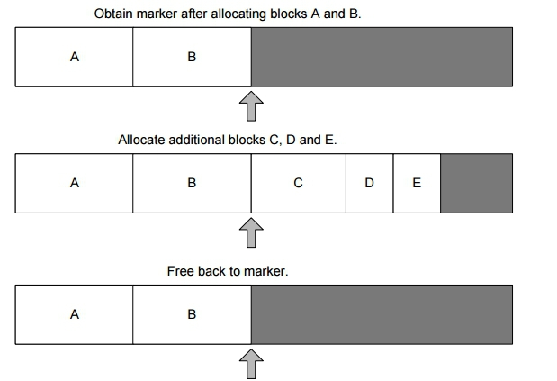
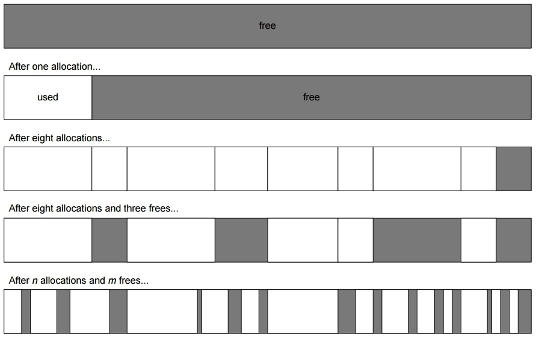

# Game Engine Architecture

## Engine support (low-level) systems

---------------------
[nikoladimitroff.github.io/Game-Engine-Architecture](http://nikoladimitroff.github.io/Game-Engine-Architecture)

Nikola Dimitroff
<a href="mailto:nikola@dimitroff.bg"><i class="fa fa-envelope-o"></i></a>
<a href="https://github.com/nikoladimitroff"><i class="fa fa-github"></i></a>
<a href="https://dimitroff.bg"><i class="fa fa-rss"></i></a>

Alexander Angelov
<a href="mailto:aleksandar.angelovv@gmail.com"><i class="fa fa-envelope-o"></i></a>
<a href="https://github.com/Alekssasho"><i class="fa fa-github"></i></a>

Dimitar Trendafilov
<a href="mailto:dimitar@coherent-labs.com"><i class="fa fa-envelope-o"></i></a>
<a href="https://github.com/dimitarcl"><i class="fa fa-github"></i></a>

--- NEXT SLIDE ---

# Sanity check

We are recording, aren't we?


--- NEXT SLIDE ---

## Review

- What does *spring arm* do?

--- NEXT SLIDE ---

## Low-level systems

- Subsystem start and shutdown
- Memory Management. Allocators.
- Resources and file system
- cooking and backing content
- configuration

--- NEXT SLIDE ---

### Subsystems

?

--- VERTICAL SLIDE ---

- Memory Management
- Logging
- IO and Assets
- Networking
- Physics
- Input
- Visual Effects
- Rendering
- Gameplay
- Scripting

--- NEXT SLIDE ---

How a subsystem is represented in the code?

- a separate library
- a singleton

--- NEXT SLIDE ---

#### A separate library

- properly separated interface from implementation
  - can be tested in isolation
  - better build times
  - plugin systems
    - 2D vs 3D physics / rendering)
    - different scripting engines
    - only cooked content in production builds

--- NEXT SLIDE ---

#### A singleton

For most subsystems it is convinient to be implemented as a singleton.

--- VERTICAL SLIDE ---

- Allocator per subsystem
- Logger
- IO
- Scripting Engine
- ...

--- VERTICAL SLIDE ---

##### Singleton

Logger.h:

```
class Logger {
};

extern Logger g_Logger;
```

Logger.cpp:

```
Logger g_Logger;

Logger::Logger()
    : m_Buffer(g_Allocator->Allocate(1024));
{}
```

--- VERTICAL SLIDE ---

?

--- VERTICAL SLIDE ---

- Order of initialization of global variables in different translation units is
  not defined
- The `g_Allocator` might not be initialized yet

--- VERTICAL SLIDE ---

Logger.h:

```
class Logger {
    static Logger& Get();
};

```

Logger.cpp:

```

Logger& Logger::Get() {
    static Logger logging;
    // initialization
    return logging;
}

Logger::Logger()
    : m_Buffer(Allocator::Get()->Allocate(1024));
{}
```

--- VERTICAL SLIDE ---

?

--- VERTICAL SLIDE ---

```
  static Logger logger;
001A1092  mov         eax,dword ptr fs:[0000002Ch]  
001A1098  mov         ecx,dword ptr [_tls_index (01A5100h)]  
001A109E  mov         ecx,dword ptr [eax+ecx*4]  
001A10A1  mov         eax,dword ptr ds:[001A50ACh]  
001A10A6  cmp         eax,dword ptr [ecx+4]  
001A10AC  jle         Logger::Get+7Eh (01A10EEh)  
001A10AE  push        1A50ACh  
001A10B3  call        _Init_thread_header (01A14FDh)  
001A10B8  add         esp,4  
001A10BB  cmp         dword ptr ds:[1A50ACh],0FFFFFFFFh  
001A10C2  jne         Logger::Get+7Eh (01A10EEh)  
001A10C4  push        10h  
001A10C6  mov         dword ptr [ebp-4],0  
001A10CD  call        operator new[] (01A1138h)  
001A10D2  push        offset `Logger::Get'::`2'::`dynamic atexit destructor for 'logger'' (01A2160h)  
001A10D7  mov         dword ptr [logger (01A50A8h)],eax  
001A10DC  call        atexit (01A1397h)  
001A10E1  push        1A50ACh  
001A10E6  call        _Init_thread_footer (01A14BEh)  
001A10EB  add         esp,0Ch  
  return logger;
001A10EE  mov         eax,offset logger (01A50A8h)  
}
```

--- VERTICAL SLIDE ---

* It generates an expensive `if`
* no easy way to re-initialize the system
  - unload and load the DLL (only for DLLs)
  - hacks

```
auto& logger = Logger::Get();
logger.~Logger();
new (&logger) Logger();
```


--- VERTICAL SLIDE ---

##### Enter the simple style

```
extern Allocator* g_Allocator;
extern Logger* g_Logger;
int main() {
    g_Allocator = Memory::Initialize();
    g_Logger = Logging::Initialize();

    while (1) {
        // amuse 
    }

    Logging::Shutdown(g_Logger);
    Memory::Shutdown(g_Allocator);
    return 0;
}
```

--- VERTICAL SLIDE ---

- Order is explicit (so are dependencies)
- Order of `shutdown` might be different

--- NEXT SLIDE ---

## Memory Management

is hard

--- NEXT SLIDE ---

- memory is limited
- allocation is slow

--- NEXT SLIDE ---

- Memory is limited
  - phones
  - consoles
  - PC -> Shipping a title for China -> XP - 32 bit, 3GB at max

--- VERTICAL SLIDE ---

- Memory budget per subsystem / feature
- How to enforce a budget?
  - by tracking
    - a different allocator for each subsystem

--- VERTICAL SLIDE ---

```cpp
enum class SubsystemTags { ... };
template<T, SubsystemTags Tag>
class TaggedAllocator
{...};

#define IMPLEMENT_SUBSYSTEM_TYPES(Subsystem, Tag)\
    template<typename T> \
    using Subsystem##UniquePtr = std::unique_ptr<T, TaggedAllocator<T, Tag>>;
    ...

void Physics::Update(float dt)
{
    IMPLEMENT_SUBSYSTEM_TYPES(Physics, SubsystemTags::Physics);
    PhysicsUniquePtr collider(new Collider3D());
    ...
};

```


--- VERTICAL SLIDE ---

- Allocation is slow

--- VERTICAL SLIDE ---

- `malloc`* and `new`* are general purpose
  - have to handle from 0 to tens of GBs allocations
  - in any order
  - in any thread
- Fragmentation

--- VERTICAL SLIDE ---

- Pre-allocate all the memory on start and use it later
  - used in spaceships / cars / planes other reliable systems
- If we use again a general purpose allocator, it will be again slow
- Use allocators chosen for the particular pattern of allocations and usage


--- VERTICAL SLIDE ---

### Stack (linear) allocator

- Preallocate a block of memory
- *allocate* portions of this block using a stack behaviour
  - *allocate* just moves a pointer further in the block
  - *free* should be in the opposite order.

--- VERTICAL SLIDE ---

Since the *free* is not always in the opposite order, it is simpler to actually
never free memory. Instead the allocation pointer is reset to a certain value
position from time to time.

--- VERTICAL SLIDE ---



--- VERTICAL SLIDE ---

[Sample
implementation](http://coherent-labs.com/blog/temporary-allocations-in-c/)

--- VERTICAL SLIDE ---

### Double-ended stack allocators

- use two ends of the pre-allocated block to allocate / free memory
- one end for memory blocks that are likely to stay for long time
  - i.e. current level / map
- the other end for temporary blocks that are not going to live more than a
  frame

--- VERTICAL SLIDE ---

### Pool allocator

All objects from a given type have the same size.

- Preallocate a large memory block and use it for a single size / type
  allocations

--- VERTICAL SLIDE ---

- Store a free-list of the free blocks
- Single linked list
- Since the block is free, we can store *next* pointer in the block

--- VERTICAL SLIDE ---

```
class PoolAllocator {
    PoolAllocator(int objectSize, int objectCount);
    void* Allocate();
    void Free(void*);

    int ObjectSize;
    int Objects;
    char* Buffer;
    char* FreeHead;
};
```

--- VERTICAL SLIDE ---

```
PoolAllocator::PoolAllocator(int objectSize, int objectCount)
    : ObjectSize(objectSize)
    , ObjectCount(objectCount)
    , Buffer(new char[ObjectSize * ObjectCount])
    , FreeHead(Buffer)
{
    for (int i = 0; i < objectCount; ++i) {
        *(char**)(Buffer+i) = Buffer + i + 1;
    }
}
```

--- VERTICAL SLIDE ---

```
void* PoolAllocator::Allocate() {
    auto block = m_FreeHead;
    m_FreeHead = *(char**)(block);
}
```

--- VERTICAL SLIDE ---
```
void PoolAllocator::Free(void* block) {
    *(char**)block = m_FreeHead;
    m_FreeHead = block;
}
```

--- VERTICAL SLIDE ---

#### Fragmentation



--- VERTICAL SLIDE ---

- there is no fragmentation in stack allocators
- Pool Allocators might be fragmented, but it doesn't matter
  - as long as there is a free slot, it will be enough for an allocation


--- VERTICAL SLIDE ---

### Alignment

- some systems require objects to be aligned for some instructions
  - SIMD instructions on ARM

--- VERTICAL SLIDE ---

```cpp
// Note: alignment must be a power of two
void* simpleAllocateAligned(size_t size, size_t alignment)
{
    void* unaligned = allocate(size + alignment); // Assume unaligned = 0xDEADCAFE
    size_t mask = alignment - 1; // Assume alignment = 16, mask is then 0x0000000F
    size_t misalignment = unaligned & mask; // = 0x0000000E
    size_t adjustment = alignment - misalignment; // = 1
    void* aligned = unaligned + adjustment;
    return aligned;
}

```

--- NEXT SLIDE ---

## Resources and IO

--- NEXT SLIDE ---

- File access is bad
  - it is slow
  - it is different on each platform

--- NEXT SLIDE ---

### The filesystem is different on each platform

- Windows - case-insensitive
- Posix - case-sensitive
- Mac OS X - depends on how the disk is mounted!

--- VERTICAL SLIDE ---

- *C:* - drive letter is only on Windows
- Consoles and phones have some prefixes for card, dvd, hdd
- Consoles and phones restrict access to the filesystem
- All OSes restrict write access for regular users
  - installing the game in a system folder and logging next to the executable...

--- VERTICAL SLIDE ---

- Just opening a file is slow
- IO is slow
  - buffered several reads / writes are free, but the real ones are slower


--- VERTICAL SLIDE ---

- Disk is often a bottleneck
- DVDs are slow
- SSDs are small and expensive
- cards on phones are slow (People go for more MBs)

--- VERTICAL SLIDE ---

- There is a single disk controller on most systems
- No point in having multiple threads for IO, if the IO is bottleneck

--- VERTICAL SLIDE ---

Most game engines have a dedicated IO thread

- or all IO tasks are combined, so they are not executed at the same time

--- VERTICAL SLIDE ---

#### OSes support asynchronous IO

- We can do many IO operations without waiting and blocking
- The game code already is using asynchronous IO, because IO is another thread.

--- NEXT SLIDE ---

- Traversing a folder structure is slow
    - *Content/Meshes/Characters/Player/Mario.collada*
      - each slash is a read the directory descriptor, find the entry and repeat
- Having files out in the open is not a good idea
  - easier to take out content
  - easier to cheat by changing content

--- VERTICAL SLIDE ---

- Virtual filesystem
- Resource references

--- VERTICAL SLIDE ---

#### Virtual filesystem

- API that behaves like a filesystem, but reads the files from some kind of an
  archive (zip, lzma, ...)
  - no need to worry about slashes, symbols, roots, drives, etc
- can use multiple archives to allow updates and partial installs
  - Original *content-0.pak* content
  - Patch 1.1 contains *content-1.pak*, which can override content in
    *content-0*

--- VERTICAL SLIDE ---

- The structure is fixed, so there can be a single global index
  - *Content/Meshes/Characters/Player/Mario.collada* can be a single
    lookup

--- VERTICAL SLIDE ---

- Can have a special structure, orthogonal to the folder structure
  - all the textures for a model can be stored after the model
        - improves read speed from the DVD
- Can use compression to reduce download and install times
  - copying a single large faster is much faster than a large number of small
    files
- Support streaming
  - install only the vital assets with the game, stream the rest while the
    player is playing


--- VERTICAL SLIDE ---

#### Asset streaming

- Games have lots of content, even free-to-play
    - bandwidth is not free
    - players do not want to wait
- Download only the game and the content for the first level
- Download everything else, once the player is in the game

--- VERTICAL SLIDE ---

### Resource references

- Paths are human-friendly
  - hierarchical organization
- Paths are not efficient for computers
  - strings - heap allocations, take up memory, mess up caches


--- VERTICAL SLIDE ---

#### GUIDs

Global (Universally) Unique IDentifiers

- 128 bit integer

--- VERTICAL SLIDE ---

- Generate a GUID for each resource
  - or even each revision of a resource
- at asset-cook-time replace all asset references with the appropriate guids


--- VERTICAL SLIDE ---

#### Hashes

- Replace the path of an asset with its hash

- If a path comes from somewhere, it is still easy to find the resource
  * GUIDs will need a lookup table

--- VERTICAL SLIDE ---

##### Perfect hashes

If the hash is not perfect, we'll still have to keep the full path around to
allow conflict resolution.

The set of assets is known in the game, so a perfect hash can be used. This will
allow replacing asset references with a single int.

--- VERTICAL SLIDE ---

- `gperf` - given a set of strings will generate a perfect-hash function
  - will use mininum computations
  - will use minimal hash function - for $N$ strings, $Max(Hash(s))$ will be close to
    $N$
  - adding resources requires recooking (to generate a new hash function)
- *Murmur* hash with a special seed
  - at asset-cook-time, find a seed for the *Murmur/City* hash algorithms that
    generates a perfect hash function
  - just read the seed at startup, eventually remap hashes

--- NEXT SLIDE ---

#### Asset cooking

The process of converting development content to shipping content

- development content
  - human-friendly - paths, text-based, etc.
  - content-creation tools friendly
    - models in 3D Studio MAX, Maya, COLLADA formats
    - textures in PSD, TIFF
- shipping content
  - hashes for paths
  - models as sets of vertices, indices, material ids & texture ids
  - textures in GPU compressed formats

--- VERTICAL SLIDE ---

##### Image formats

- PNG - mostly RGBA_8 - 32 bits per pixel
- JPEG - lossy

Both are expensive to decode at runtime and consume a lot of memory

- 2s spritesheet animation of a 100px * 100 px
$$
120 * 100 * 100 * 4 = 4800000 = 4.8 MB
$$

- 2s spritesheet animation of a 200px * 200 px

$$
120 * 200 * 200 * 4 = 4 * 4800000 = 19.2 MB
$$
    
* https://github.com/mainroach/crabby

--- VERTICAL SLIDE ---

##### GPU texture formats

- Generally lossy formats, but since they are made for GPUs, the lost quality is
  almost invisible
- Each platform has its own:
  - DDS / BC formats for Windows
  - PlayStation 4 has its own
  - PVRTC for iOS
  - ETC format for OpenGL ES 2.0/3.0 (Android)

http://www.reedbeta.com/blog/2012/02/12/understanding-bcn-texture-compression-formats/


--- VERTICAL SLIDE ---

http://mainroach.blogspot.bg/2014/03/the-png-vs-gpu-battle-on-android.html
http://mainroach.blogspot.bg/2014/03/png-bloat-in-android-games.html

--- NEXT SLIDE ---

#### Versioning resources

Assets are binary and large
 
- hard for Version Control Systems to chew on
  - [Perforce](https://www.perforce.com/)
  - [Github's Git Large-File-Storage](https://git-lfs.github.com/)
  - A couple of other Git based solutions
  - Mercurial largefile support  
- Custom, in-house tools
  - Separate metadata from the files
  - store all versions 

--- NEXT SLIDE ---

#### Patching resources

- The game checks for updates on start
- If necessary - downloads the new patch, installs it and restarts  
  - Patching the executable may require a separate process
- Generating diffs for binary, compressed files is not easy
  - http://xdelta.org/
- Patching a 2 GB pak file, just to add a byte in the middle will be terribly
  slow and might easily fail
  - add the changed content in a new pak file and override the old one

--- NEXT SLIDE ---

### Memory management for Resources

--- NEXT SLIDE ---

- Pool - read files in chunks
- Stack - double ended, or a separate allocator stack

--- VERTICAL SLIDE ---


--- NEXT SLIDE ---

- GPU memory has to be managed too

--- NEXT SLIDE ---

## Reflection

Treating code as resources


--- VERTICAL SLIDE ---

Reflection is any mechanism that allows for code introspection:

* Looking up / iterating a set of classes or class members by name or type
* Instantiating looked up classes
* Invoking looked up functions; reading / writing to fields
* Creating new classes at runtime
* Basically, `<type_traits>` at runtime

--- VERTICAL SLIDE ---

* Some languages provide out-of-the-box reflection (C#, Java, Python, JS)
* Reflection is much harder to achieve in C++

--- VERTICAL SLIDE ---

#### The ways of reflection

* [RTTI](http://en.cppreference.com/w/cpp/types/type_info)
    - Almost useless, extra-overhead, cannot be configured per-class
* Annotated source code
    - Configurable; lots of boilerplate, error-prone

```cpp
BEGIN_REFLECT(Foo)
class Foo
{
    REFLECT_MEMBER(int, Bar)
    int Bar;
};
END_REFLECT(Foo)
```

--- VERTICAL SLIDE ---

#### The ways of reflection (cont.)

* Compiler hacking
    - use an external tool parsing debugging info / the AST or
    modify an open-source compiler
    - powerful; kind of platform-dependent, un-configurable
* Custom tool + annotations
    - custom tool looking for certain annotations
    - if found, do magic tricks with the AST to parse the type
    - has all the good things

```cpp
REFLECT_CLASS()
class Foo
{
    REFLECT_PROPERTY()
    int Bar;
};
```

--- NEXT SLIDE ---

### Configuration

Every engine needs basic configuration

- where is the content?
- graphics quality
  - AA, LODs, FOV, etc
- log level

--- VERTICAL SLIDE ---

Gameplay:

- difficulty level
- most of the gameplay is actually configuration
  - speed of time, character movement
  - cost and effect of actions
    - i.e. cost of highway per km vs the number of cars in a city builder game

There are games, whose gameplay is written entirely in configuration files

--- NEXT SLIDE ---

- Text vs. binary files
- Local vs. cloud storage

--- VERTICAL SLIDE ---

#### Text files

- *ini* files
  - very simple and quite popular
  - no complex structures
- *json* - not very human friendly
- *xml* - no, just don't
- custom format
  - boost has a library for that
- full scale programming language, i.e. Lua, JavaScript, Scheme
  - keep the amount of logic in the config sane (or no logic at all)

--- VERTICAL SLIDE ---

Text files have to be parsed

- slow
- makes allocations

--- VERTICAL SLIDE ---

#### Binary files

- not human friendly
- asset cooking can convert a text configuration into a binary one
  - use the text configuration to initialize C++ structures and serialize them

--- VERTICAL SLIDE ---
#### Runtime configuration

- Quake console
  - *cvars* - globally registered variables, that can be tweaked from the
    console
  - Unreal Engine 4 is using a similar system
- Developer menus - can change variables or execute more complex gameplay
  - i.e. craft an item, without having the Crafting interface ready
- Terminal / shell in the game
  - add a REPL powered by a scripting language
- RPC / HTTP rest for remote access
  - typing on a console can be difficult


--- VERTICAL SLIDE ---

#### Storing configurations

- Some platforms restrict the amount of data you can save
- Cloud storage - my settings will be preserved, no matter where I play from
  - requires internet


--- NEXT SLIDE ---

Questions?

