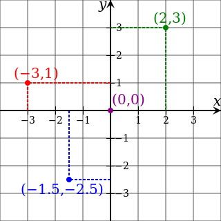
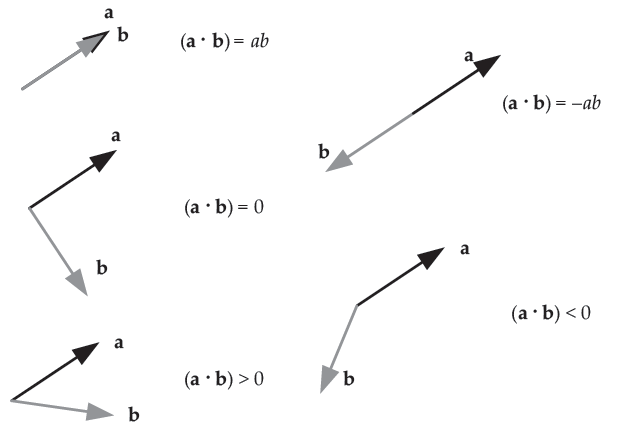

# Game Engine Architecture

## Math

---------------------
[Course Index](http://nikoladimitroff.github.io/Game-Engine-Architecture)

<div class="authors-section">
<table>
<tbody>
    <tr>
        <td>
            Nikola Dimitroff
        </td>
        <td>
            <a target="_blank" href="https://dimitroff.bg"><i class="fa fa-rss"></i></a>
            <a target="_blank" href="mailto:nikola@dimitroff.bg"><i class="fa fa-envelope-o"></i></a>
            <a target="_blank" href="https://github.com/nikoladimitroff"><i class="fa fa-github"></i></a>
            <a target="_blank" href="https://twitter.com/nikoladimitroff"><i class="fa fa-twitter"></i></a>
        </td>
    </tr>
    <tr>
        <td>
            Alexander Angelov
        </td>
        <td>
            <a target="_blank" href="mailto:aleksandar.angelovv@gmail.com"><i class="fa fa-envelope-o"></i></a>
            <a target="_blank" href="https://github.com/Alekssasho"><i class="fa fa-github"></i></a>
            <a target="_blank" href="https://twitter.com/Alekssasho"><i class="fa fa-twitter"></i></a>
        </td>
    </tr>
    <tr>
        <td>
            Viktor Ketipov
        </td>
        <td>
            <a target="_blank" href="mailto:viktor@kipiinteractive.com"><i class="fa fa-envelope-o"></i></a>
            <a target="_blank" href="https://github.com/k1p1"><i class="fa fa-github"></i></a>
            <a target="_blank" href="https://twitter.com/xk1p1x"><i class="fa fa-twitter"></i></a></p>
        </td>
    </tr>
</tbody>
</table>
</div>

<div class="companies-section">
<a class="ubisoft-logo" href="https://ubisoft.com" target="_blank"></a>
<br>
<a class="kipi-logo" href="http://kipiinteractive.com" target="_blank"></a>
</div>

--- NEXT SLIDE ---

# Sanity check

We are recording, aren't we?


--- NEXT SLIDE ---

## Review

What qualities does good a logging library has?

* Severities so you can ignore unimportant info but still have it there if needed
* Categories so you can filter messages in one system
* Log to file, console, etc.
* Timing info

<!-- .element class="fragment" -->

--- VERTICAL SLIDE ---

## Review

What does this do?

```cpp
char buffer[256];
auto player = new (buffer) Player;
player->~Player();
```

Constructs the `player` object into the memory of the `buffer` and destructs it.
<!-- .element class="fragment" -->

--- VERTICAL SLIDE ---

## Review

What's an allocator and why would anyone ever use one?

* Allocators are objects which know how to allocate memory in a good way
* General allocator are slow since they know nothing about your data
* Memory needs to tracked and budgeted among subsystems

<!-- .element class="fragment" -->

--- VERTICAL SLIDE ---

## Review

What's reflection?

A system which allows a program to observe its own source code and modify its definition based on that.
<!-- .element class="fragment" -->

--- NEXT SLIDE ---

## Contents

1. [Vectors](#/vectors)
1. [Matrices](#/matrices)
1. [Coordinate system changes](#/coordinate-system-changes)
1. [Quaternions](#/quaternions)
1. [Interpolation](#/interpolation)

--- NEXT SLIDE ---

Good math skills are invaluable when creating games.

<iframe width="400" height="300" src="https://www.youtube.com/embed/_GyFRMr4uf4" frameborder="0" allowfullscreen></iframe>

--- VERTICAL SLIDE ---

1. How do you create a cinematic scene in which the camera
spirals outward of the protagonist?
1. How do you decide not to draw roofs and walls in top-down
games?
1. How do you compute the direction of a ball hit by footballer?

Spoiler alert: Math
<!-- .element class="fragment" -->

--- VERTICAL SLIDE ---

In case you didn't think that the books in the first lecture were enough:

[Mathematics for 3D Game programming...](http://www.amazon.com/Mathematics-Programming-Computer-Graphics-Edition/dp/1435458869)

--- NEXT SLIDE ---

<!-- .slide: id="vectors" -->

What's a coordinate system?

--- VERTICAL SLIDE ---

## Definition: Coordinate system

A system which uniquely determines the position of
a geometric element in a given space.

Also known as a *frame of reference*.

--- VERTICAL SLIDE ---

What types of coordinate systems are there?

--- VERTICAL SLIDE ---

## Types

Polar Vs. Carthesian




--- VERTICAL SLIDE ---

* The carthesian system is defined by its origin and a set of perpendicular axes
* The principal axes are called basis vectors and are denoted with $(i, j, k)$ or $(e_1, e_2, e_3)$
* Usually the x and z are parallel to the floor and y is perpendicular
    - x is the *abscissa*, z is the *applicate*, y is the *ordinate*

--- VERTICAL SLIDE ---


* The handedness of a system does not change the mathematics
* Usually a left-handed system is used as this corresponds to the depth of the scene
* It doesn't matter which approach you choose, just pick one and stick to it.

--- NEXT SLIDE ---

What's a vector?

--- VERTICAL SLIDE ---

## Definition: Vector

Algebraically: a tuple of real numbers

Geometrically: a geometric object with magnitude and direction that shows displacement

--- VERTICAL SLIDE ---

The coordinates of a point in a carthesian coordinate system is a vector
which means we can describe all geometric objects with vectors alone.

--- VERTICAL SLIDE ---

* Points are vectors are represented with the same data structure.
* But they aren't the same!
  * points are absolute and independent of the coordinate system
    * their coordinates change but the points are static
  * vectors are relative and depend on the coordinate system

--- VERTICAL SLIDE ---

Note on convention - assume the following notations on all slides below:

$$
p = (x, y, z) \\\\
q = (u, v, w)
$$

--- VERTICAL SLIDE ---

### Vector operations

$$
(x, y, z)\pm(u, v, w) = (x \pm u,y \pm v,z \pm w) \\\\
c(x, y, z)=(cx, cy, cz) \\\\
|(x, y, z)| = \sqrt{x^2 + y^2 + z^2} \\\\
dist(p, q) = |p - q|
$$

--- VERTICAL SLIDE ---

Square roots are slow! Try to use the squared length
instead as much as possible:

$$
|(x, y, z)|^2 = x^2 + y^2 + z^2 \\\\
distSquared(p, q) = |p - q|^2
$$

```cpp
float MAX_PLAYER_DISTANCE_SQUARED = 5 * 5;
if (distSquared(player, enemy) < MAX_PLAYER_DISTANCE_SQUARED)
    enemy.attack(player);
```

--- VERTICAL SLIDE ---

### Definition: Normalized vector

A vector with unit length is called normalized.
They are useful when one only cares
about the direction the vector is pointing to.

The process of converting a vector to a normalized vector
is called *normalization*.

$$
n = {a \over |a| }
$$

--- VERTICAL SLIDE ---

### Definition: Normal vector

A vector that is perpendicular to a given object
(e.g. plane)

* Normal vectors are often normalized but don't need to be.
* Every vector is a normal to some object.

--- VERTICAL SLIDE ---


--- VERTICAL SLIDE ---

What's a dot product?

--- NEXT SLIDE ---

## Dot product

Algebraically:

$$
(x, y, z) \cdot (u, v, w) = xu + yv + zw
$$

Geometrically:

$$
p \cdot q = |p||q|\cos(\theta)
$$

--- VERTICAL SLIDE ---

### Properties

* Commutative $p \cdot q = p \cdot q$
* Distributive $p \cdot (q \pm r) = p \cdot q \pm p \cdot r$

--- VERTICAL SLIDE ---

### Usage

$$
p \perp q \iff \theta = {k\pi \over 2} \iff p \cdot q = 0 \\\\
p \parallel q \iff \theta = k\pi \iff p \cdot q = |p||q| \\\\
\angle pq = \arccos{\frac {p \cdot q}{|p||q|}}
$$


--- VERTICAL SLIDE ---

### Usage

* Are two vectors perpendicular? Check if $p \cdot q = 0$
* Are two vectors collinear? Check if $|p \cdot q| = |p||q|$
* Are two vectors opposite? Check if $p \cdot q = -|p||q|$
* Is the angle between two vectors accute or obtuse? Check $sign(p \cdot q)$

--- VERTICAL SLIDE ---



--- VERTICAL SLIDE ---


$PlayerDirection \cdot TrackDirection < 0$

--- NEXT SLIDE ---

## Cross product

If I have 2 perpendicular vectors, how do I compute a third vector orthogonal
to the other two?

--- VERTICAL SLIDE ---


--- VERTICAL SLIDE ---

### Definition

$$
p \times q =\begin{vmatrix}
            i&j&k \\\\
            p_x&p_y&p_z \\\\
            q_x&q_y&q_z \\\\
            \end{vmatrix}
           =(\begin{vmatrix}
            p_y&p_z \\\\
            q_y&q_z
            \end{vmatrix},
            -\begin{vmatrix}
            p_x&p_z \\\\
            q_x&q_z
            \end{vmatrix},
            \begin{vmatrix}
            p_x&p_y \\\\
            q_x&q_y
            \end{vmatrix})
$$

--- VERTICAL SLIDE ---

### Properties

* **Not** commutative! $p \times q \neq q \times p$
* Anti-commutative $p \times q = -q \times p$
* Distributive $p \times (q \pm r) = (p \times q) \pm (p \times r)$

--- NEXT SLIDE ---

<!-- .slide: id="matrices" -->

What's a matrix?

--- VERTICAL SLIDE ---

## Matrices

A matrix is a rectangular array of mathematical objects, usually numbers.


--- VERTICAL SLIDE ---

### Matrix multiplication aka concatenation

It's complicated.

$$
[AB]\_{ij} = \sum\_{r=1}^n A\_{i,r}B\_{r,j}
$$

Multiplication is ***not*** commutative!

--- VERTICAL SLIDE ---

Vectors can be though of as a $n \times 1$ (column-vector)
matrix and thus can also be multiplied with a matrix.

$$
\begin{vmatrix}
a & b & c \\\\
d & e & f \\\\
g & h & i \end{vmatrix}
\begin{vmatrix}
x\\\\
y\\\\
z\end{vmatrix} =
\begin{vmatrix}
ax + by + cz \\\\
dx + ey + fz \\\\
gx + hy + iz \end{vmatrix}
$$


--- VERTICAL SLIDE ---

...or as a $1 \times n$ (row-vector)

$$
\begin{vmatrix}
x & y & z
\end{vmatrix}
\begin{vmatrix}
a & d & g \\\\
b & e & h \\\\
c & f & i \end{vmatrix} =
\begin{vmatrix}
ax + by + cz \\\\
dx + ey + fz \\\\
gx + hy + iz \end{vmatrix}
$$

--- VERTICAL SLIDE ---

It doesn't matter which approach you choose, just pick one and stick to it.

--- VERTICAL SLIDE ---

### Matrix transpose

The matrix reflected across its main diagonal

$$
[M^{\mathrm{T}}]\_{i,j} = [M]\_{j,i}
$$

An important property:

$$
ABC = C^{\mathrm{T}}B^{\mathrm{T}}A^{\mathrm{T}}
$$

--- VERTICAL SLIDE ---

### Identity matrix

$$
I = \begin{vmatrix}
    1 &0 & 0 \\\\
    0 &1 & 0 \\\\
    0 &0 & 1 \end{vmatrix}
\\\\
IM = MI = M
$$


--- VERTICAL SLIDE ---

### Determinant

The determinant is a magical number that each matrix has.
It's defined as

$$
\det(M) = \sum\_{\sigma \in S\_n} sgn(\sigma) \prod\_{i=1}^n m\_{i,\sigma_i}
$$

where $S_n$ is the set of all permutations over ${1, 2, 3, ..., n}$

Example:

$$
\det(\begin{vmatrix}a&b\\\\c&d\end{vmatrix}) = ad - bc
$$

--- VERTICAL SLIDE ---

### Minor / cofactor

The $i, j$ **minor** $M_{i,j}$ of a matrix $M$ is the determinant
of same matrix with the $i$-th row and $j$-th column removed.


The $i, j$ **cofactor** $C_{i,j}$ of a matrix $M$ is the value:

$$
C\_{i,j} = (-1)^{i+j}M_{i,j}
$$

--- VERTICAL SLIDE ---

### Matrix inversion

The inverse of $M$ is denoted $M^{-1}$ and has the property
$$
MM^{-1} = I
$$

An important property:

$$
ABC = C^{-1}B^{-1}A^{-1}
$$

--- VERTICAL SLIDE ---

### Inverse computation

$$
M^{-1}={1 \over det(M)}C^{\mathrm{T}} \\\\
      ={1 \over \det(M)}
       \begin{pmatrix}
       C\_{11} & C\_{21} & \cdots & C\_{n1} \\\\
       C\_{12} & C\_{22} & \cdots & C\_{n2} \\\\
       \vdots & \vdots & \ddots & \vdots \\\\
       C\_{1n} & C\_{2n} & \cdots & C\_{nn} \\\\
       \end{pmatrix}
$$

where $C$ is the adjugate matrix (the matrix of cofactors)

--- NEXT SLIDE ---

## Transformations

A transformation is a function over points

--- VERTICAL SLIDE ---

We care the most about *affine* transformations -
these preserve points, lines and planes as well as
parallelism.

Translation, rotation, scaling and their compositions
are all affine transformations.

--- VERTICAL SLIDE ---

Any affine transform can be described using a matrix $T$ and
a vector $b$:

$$
f(p) = Tp + b
$$

Wouldn't it be awesome if we could represent the transformation
with only a matrix?

--- VERTICAL SLIDE ---

## Orthogonal transformations

Orthogonal transformations preserve not only parallel lines
but also all angles and can be defined using a single $3 \times 3$
matrix (unlike affine transforms).

Rotations and reflections are orthogonal.

--- VERTICAL SLIDE ---

A transformation is orthogonal iff its matrix is orthogonal.

A matrix $M$ is orthogonal iff

$$
M^{-1} = M^{\mathrm{T}}
$$

--- VERTICAL SLIDE ---

## Homogenous coordinates

Instead of $3 \times 3$ matrices we can use $4 \times 4$ to accomodate
for translations.

Our 4D transforms look like this:

$$
M = \begin{vmatrix}
    T & b \\\\
    0 & 1\end{vmatrix}\\\\
f(p) = Mp
$$


--- VERTICAL SLIDE ---

We also need to extend our vectors and points to 4D by adding
a 4th component $w$ using the equality:

$$
(x, y, z, w) = ({x \over w}, {y \over w}, {z \over w})
$$

* The point $(x, y, z)$ becomes $(x, y, z, 1)$
* The vector $(x, y, z)$ becomes $(x, y, z, 0)$
* When using affine transforms there's no need for $w$ to ever be
any other number.

--- VERTICAL SLIDE ---

### Translation

Defined by a vector $t$

$$
translate(p, t) = \begin{vmatrix}
1 & 0 & 0 & t_x \\\\
0 & 1 & 0 & t_y \\\\
0 & 0 & 1 & t_z \\\\
0 & 0 & 0 & 1\end{vmatrix}
\begin{vmatrix}
x\\\\
y\\\\
z\\\\
1\end{vmatrix} =
\begin{vmatrix}
x + t_x \\\\
y + t_y \\\\
z + t_z \\\\
1 \end{vmatrix}
$$

--- VERTICAL SLIDE ---

### Rotation

A rotation is defined with a normalized vector $r$ and
an angle $\varphi$. $r$ describes the axis around which to rotate.

For any arbitrary $r$ the rotation matrix looks scary, so let's
start with principal axes.


--- VERTICAL SLIDE ---

## Rotation around $x$

$$
rotate(p, i, \varphi) = \begin{vmatrix}
1 & 0             & 0            & 0 \\\\\
0 & cos \varphi   & \sin \varphi & 0 \\\\
0 & -\sin \varphi & \cos \varphi & 0 \\\\
0& 0            & 0          & 1 \end{vmatrix}
\begin{vmatrix}
x\\\\
y\\\\
z\\\\
1\end{vmatrix} =
\begin{vmatrix}
x \\\\
y\cos \varphi + z\sin \varphi \\\\
-y\sin \varphi + z\cos \varphi \\\\
1 \end{vmatrix}
$$

--- VERTICAL SLIDE ---

## Rotation around $y$

$$
rotate(p, j, \varphi) = \begin{vmatrix}
\cos \varphi  & 0 & \sin \varphi & 0 \\\\
0              & 1 & 0             & 0 \\\\
-\sin \varphi & 0 & \cos \varphi & 0 \\\\
0              & 0 & 0 & 1 \end{vmatrix}
\begin{vmatrix}
x\\\\
y\\\\
z\\\\
1\end{vmatrix} =
\begin{vmatrix}
x\cos \varphi + z\sin \varphi \\\\
y \\\\
-x\sin \varphi + z\cos \varphi \\\\
1 \end{vmatrix}
$$

--- VERTICAL SLIDE ---

## Rotation around $z$

$$
rotate(p, k, \varphi) =
\begin{vmatrix}
\cos \varphi   & \sin \varphi & 0 & 0 \\\\
-\sin \varphi  & \cos \varphi & 0 & 0 \\\\
0            & 0          & 1 & 0 \\\\
0            & 0          & 0 & 1 \end{vmatrix}
\begin{vmatrix}
x\\\\
y\\\\
z\\\\
1\end{vmatrix} =
\begin{vmatrix}
x\cos \varphi + y\sin \varphi \\\\
-x\sin \varphi + y\cos \varphi \\\\
z \\\\
1 \end{vmatrix}
$$

--- VERTICAL SLIDE ---

## Rotation around arbitrary axis $r$

$$
\begin{vmatrix}
\cos \varphi +r_x^2 (1-\cos \varphi)        & r_x r_y (1-\cos \varphi) - r_z \sin \varphi & r_x r_z (1-\cos \varphi) + r_y \sin \varphi & 0 \\\\
r_y r_x (1-\cos \varphi) + r_z \sin \varphi & \cos \varphi + r_y^2(1-\cos \varphi)        & r_y r_z (1-\cos \varphi) - r_x \sin \varphi & 0 \\\\
r_z r_x (1-\cos \varphi) - r_y \sin \varphi & r_z r_y (1-\cos \varphi) + r_x \sin \varphi & \cos \varphi + r_z^2(1-\cos \varphi)        & 0 \\\\
0 & 0 & 0 & 1
\end{vmatrix}
$$

--- VERTICAL SLIDE ---

## Scaling

Defined by a vector $s$ - usually uniform ($s_x = s_y = s_z$)

$$
scale(p, s) = \begin{vmatrix}
s_x & 0 & 0 & 0 \\\\
0 & s_y & 0 & 0 \\\\
0 & 0 & s_z & 0 \\\\
0 & 0 & 0 & 1\end{vmatrix}
\begin{vmatrix}
x\\\\
y\\\\
z\\\\
1\end{vmatrix} =
\begin{vmatrix}
s_x x \\\\
s_y y \\\\
s_z z \\\\
1 \end{vmatrix}
$$

--- VERTICAL SLIDE ---

### Composition

To get the final object transform, multiply all submatrices:

$$
M = translate(t) rotate(r, \varphi) scale(s)
$$

Mind the order - with column-major vectors, transforms are read right-to-left!

--- VERTICAL SLIDE ---

## Live demo

<a target="_blank" href="resources/09.math/transformdemo/transformations.html">Click me</a>

--- VERTICAL SLIDE ---

## Memory layout

* The last row of our matrices is always $(0, 0, 0, 1)$
and is never changed - we only need a $3 \times 4$
matrix in memory
* Storing the matrix's row continiously is preferable
because when multiplying matrices and vectors we need the entire row
in the cache and that also makes it better for SIMD

```cpp
struct Matrix
{
    float Values[3][4];
};
```

--- NEXT SLIDE ---

<!-- .slide: id="coordinate-system-changes" -->

## Coordinate systems

From your current position, which way is north?


--- VERTICAL SLIDE ---

Multiple coordinate systems can greatly simplify solutions
so we should also study transformations of entire coordinate systems.

--- VERTICAL SLIDE ---

## Some important coordinate systems

* *Local space* aka *object space* aka *model space*
  - Imagine a 3D model of a character. If you want to rotate it by 90deg
  you'd expect it to rotate around its local axes.

--- VERTICAL SLIDE ---

## Some important coordinate systems

* *World space*
  - The global space. Usually the origin is chosen to minimize coordinate values.

--- VERTICAL SLIDE ---

## Some important coordinate systems

* *View space*
  - The space with origin the camera's focal point and axes parallel to
  the camera's screen.

--- VERTICAL SLIDE ---


--- VERTICAL SLIDE ---

## Basis change

Assume that we have two coordinate systems $L$ (for local) and $G$ (for global).
The matrix

$$
M\_{L \to G} = \begin{vmatrix}
i\_{G\_x} & j\_{G\_x} & k\_{G\_x} & O\_{G\_x} \\\\
i\_{G\_y} & j\_{G\_y} & k\_{G\_y} & O\_{G\_y} \\\\
i\_{G\_z} & j\_{G\_z} & k\_{G\_z} & O\_{G\_z} \\\\
0         & 0         & 0         & 1\end{vmatrix}
$$

converts vectors from $L$ to $G$ where $i_G, j_G, k_G$ are the basis
vectors, $O_G$ is the origin of $L$, all of which are expressed in coordinates of $G$.

--- VERTICAL SLIDE ---

$M\_{L \to G}$ can be used to transform an object into world space
or transform the world space basis into local space (mind the direction!).

$M\_{G \to L} = M\_{L \to G}^{\mathrm{-1}}$ can be used in the opposite direction.

--- VERTICAL SLIDE ---

## Example usage

The formula for rotation matrix around an arbitrary vector $r$
can be derived by changing the basis to one in which $r$ matches
the $x$ axes:

$$
rotate(r, \varphi) = M\_{L \to G} rotate(i, \varphi) M\_{G \to L}
$$

--- VERTICAL SLIDE ---

### Coordinate system summary

* Changing the system can make some hard tasks trivial
* Solve the problem with a system centered on the object, then transform to/from of it
* Matrices are awesome!
  * make it trivial to change the system
  * the code is simple as it only deals with 1 object

--- NEXT SLIDE ---

<!-- .slide: id="quaternions" -->

## Quaternions

Quaternions are 4D-Vector-like structures with a key property


--- VERTICAL SLIDE ---

The *unit* quaternion $q$ represents a rotation around $r$ at angle $\varphi$ if:

$$
q = (\sin {\varphi \over 2} r_x, \sin {\varphi \over 2} r_y, \sin {\varphi \over 2} r_z, \cos {\varphi \over 2})
$$

--- VERTICAL SLIDE ---

It's useful to split the quaternion in 2:

$$
q = (q_v, q_s), where \\\\
q_v = (\sin {\varphi \over 2} r_x, \sin {\varphi \over 2} r_y, \sin {\varphi \over 2} r_z) \\\\
q_s = \cos {\varphi \over 2}
$$

Note that $q_v$ is a vector, whereas $q_s$ is a scalar.

--- VERTICAL SLIDE ---

## Quaternion multiplication (Grassman product)

It's easy! You only need to:

$$
pq = [(p_s q_v + q_s p_v + p_v \times q_v), (p_s q_s - p_v \cdot q_v)]
$$

--- VERTICAL SLIDE ---

## Quaternion inversion

The inverse of a quaternion...inverses the rotation. It is much more simpler to compute:

$$
q^{-1} = {q^* \over |q|^2}
$$

$$
q^{*} = (-q\_v, q\_s)
$$

Since we are only working with unit quaternions $|q| = 1$ so $q^{-1} = q^*$.

Compare that with matrix inversion!

--- VERTICAL SLIDE ---

## Quaternion-vector multiplication

1. Convert the vector $v$ to quaternion form - $v_q = (v_x, v_y, v_z, 0)$
2. Multiply the vector from left and right - $v' = rotate(q, v) = q v_q q^{-1}$
3. Extract the vector from the quaternion - $v_{result} = {(v_x', v_y', v_z') \over {sin {\varphi \over 2}}}$

--- VERTICAL SLIDE ---

## Quaternion concatenation

To apply the rotations $q_1, q_2, q_3$ in that order:

$$
q\_{total} = q\_3 q\_2 q\_1 \\\\
v' = q\_{total} v q\_{total}^{-1}
$$

--- VERTICAL SLIDE ---

## Rotation formalisms comparison

* Euler angles - gimbal locks; operation order-dependent; BUT great for people!
* Axis + angle - needs conversion to another formalism
* Rotation matrix - big and inefficient
* Quaternion - best for code, worst for people

--- NEXT SLIDE ---

## Putting in code

```cpp
struct Vector3
{
    float X, Y, Z;
    Vector3 operator+(const Vector3& other) const;
    ...
};
struct Matrix
{
    float Values[3][4];
    Vector3 operator*(const Vector3& v) const;
    ...
};
struct Quat
{
    float X, Y, Z, W;
    Vector3 RotateVector(const Vector3& v) const;
    Matrix ToMatrix() const;
};
```

--- VERTICAL SLIDE ---

### SQT

The most popular way to store transformations is
**S**cale, **Q**uaternion, **T**ranslation:

```cpp
struct Transform
{
    float Scale;
    Quaternion Rotation;
    Vector3 Translation;
};
```

8 floats for uniform scaling, 10 for nonuniform

--- VERTICAL SLIDE ---

### Transformation code

would look like something like

```cpp
const Transform& transform = player->GetTransform();
const Matrix worldMatrix = MatrixHelper::Scale(transform.Scale) *
    MatrixHelper::FromQuat(transform.Rotation) *
    MatrixHelper::Translation(transform.Translation);

const Matrix viewMatrix = camera->GetViewMatrix();
const Matrix worldViewMatrix = worldMatrix * viewMatrix;
RenderObject(worldViewMatrix, player->GetMesh());
```

--- VERTICAL SLIDE ---

### Implementing math operations

...is a fun exercise but you don't have to:

* [GML](http://glm.g-truc.net/0.9.5/index.html)
* [GMTL](http://ggt.sourceforge.net/)
* [Eigen](http://eigen.tuxfamily.org/index.php?title=Main_Page)

--- NEXT SLIDE ---

<!-- .slide: id="interpolation" -->

## Definition: Interpolation

Interpolation is a method for predicting the value of a function $f$
at point $x, a < x < b$ for some $a$ and $b$ given $f(a)$ and $f(b)$.

Usually, instead of an absolute point $x$ we are looking for some
point $p$ lying $\alpha$% away from the endpoints.

--- VERTICAL SLIDE ---

* Interpolation attempts to simulate an unknown or complex function
with a simple one - a line, a parabole, a cubic curve

--- VERTICAL SLIDE ---

### Linear interpolation (LERP)

Assume that the function is a line:

$$
lerp(a, b, \alpha) = (1 - \alpha) a + \alpha b
$$

* Always works
* Is often the best

--- VERTICAL SLIDE ---

### Spherical linear interpolation (SLERP)

* Assume that the function is part of a circle / sphere
* Works correctly for quaternions
* The proper way for rotating the camera around your protagonist!


--- VERTICAL SLIDE ---


--- VERTICAL SLIDE ---

$$
\theta = \arccos {(p \cdot q)} \\\\
slerp(p, q, \beta) = {\sin {(1 - \beta) \theta} \over \sin \theta}p + {\sin {\beta \theta} \over \sin \theta} q
$$

--- VERTICAL SLIDE ---

### Other interpolation methods

You can basically pick any function you like, but here's an
[Example from CSS](https://easings.net/en)

--- NEXT SLIDE ---

## Summary

* Dot product to compute angles between vectors.
* Cross product to compute vectors orthogonal to a plane
* Vectors to store translations
* Vectors and points are different, but are stored in the same struct
* Quaternions to store rotations
* It's pronounced ОЙЛЕР, not ЮЛЕР and not ЕУЛЕР

--- VERTICAL SLIDE ---

## Summary

* Game objects have transformations - translation, rotation, scale
* We usually store the transform in SQT before computing a final transformation matrix
* We can concatenate any number of matrices to add more transforms
* The full matrix is used to place the object in the world
* We use another matrix to project the world to the screen

--- VERTICAL SLIDE ---

## Summary

* Interpolation is used across the game for smooth movements
* Even predetermined animations are based on interpolation
* There are many ways to interpolate, but lerp and slerp are the basics

--- NEXT SLIDE ---

Questions?


