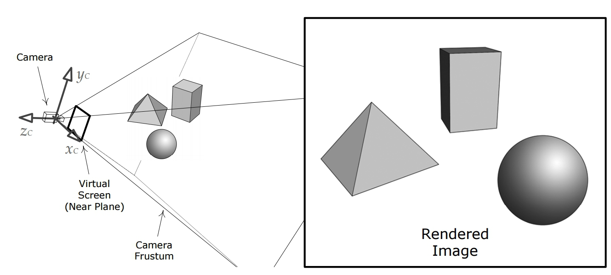
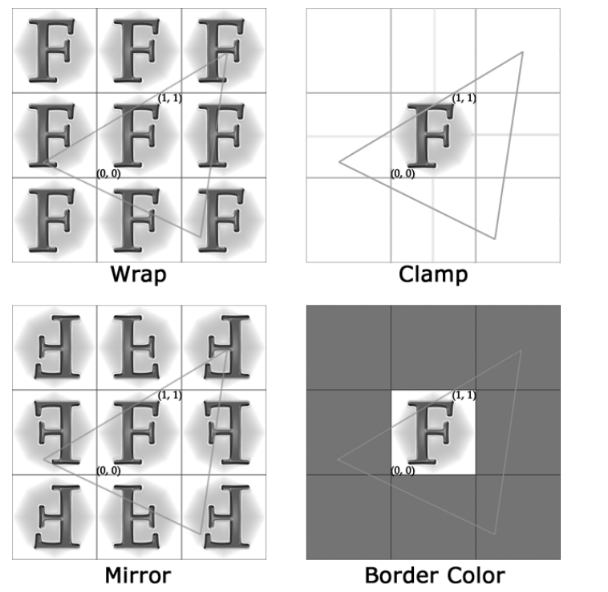
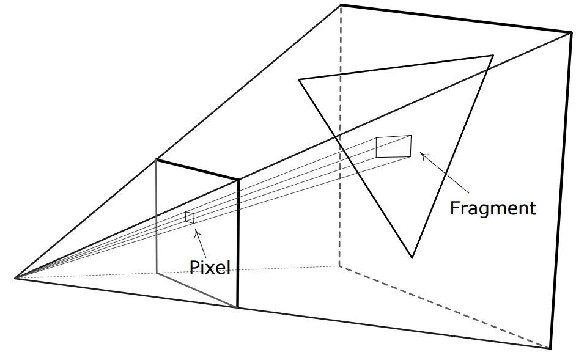
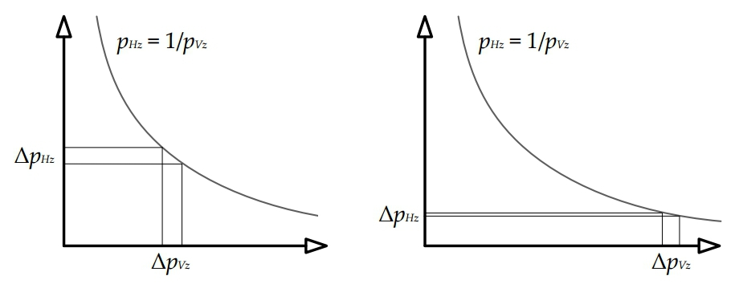

# Game Engine Architecture

## Rendering

---------------------
[nikoladimitroff.github.io/Game-Engine-Architecture](http://nikoladimitroff.github.io/Game-Engine-Architecture)

Nikola Dimitroff
<a href="mailto:nikola@dimitroff.bg"><i class="fa fa-envelope-o"></i></a>
<a href="https://github.com/nikoladimitroff"><i class="fa fa-github"></i></a>
<a href="https://dimitroff.bg"><i class="fa fa-rss"></i></a>

Dimitar Trendafilov
<a href="mailto:dimitar@coherent-labs.com"><i class="fa fa-envelope-o"></i></a>
<a href="https://github.com/dimitarcl"><i class="fa fa-github"></i></a>

--- NEXT SLIDE ---

## Review

--- NEXT SLIDE ---

Disclaimer

The following material should be covered by a complete course (at least one)
of its own.

--- NEXT SLIDE ---

Rendering a scene

* *virtual scene*
* *virtual camera*
* *light sources*
* *visual properties*

--- NEXT SLIDE ---

--- NEXT SLIDE ---

Styles

* photorealistic
* cartoon
* charcoal sketch
* watercolor
* wool

--- NEXT SLIDE ---

A scene

- set of objects
  - opaque
  - transparent
  - translucent

--- NEXT SLIDE ---

Representations of objects

* equations
* NURBS
* subdivision
* triangle meshes

--- NEXT SLIDE ---

Triangles

The triangle is the simplest type of polygon. Any fewer than three vertices,
and we wouldn’t have a surface at all.

- A triangle is always planar.
- Triangles remain triangles under most kinds of transformations, including
  affine transforms and perspective projections.
- Virtually all commercial graphics-acceleration hardware is designed around
  triangle rasterization.

--- NEXT SLIDE ---

Tessellation

Triangulation

--- NEXT SLIDE ---

--- NEXT SLIDE ---

Constructing a triangle mesh

- Winding
- Triangle list
- indexed triangle list
- triangle strip
- triangle fan

--- NEXT SLIDE ---

Vertex cache optimization

--- NEXT SLIDE ---

- Model space
- World space and mesh instancing
  - buildings directly in world space (precision...)

--- NEXT SLIDE ---

Surface properties

- diffuse color
- shininess / reflectivity
- roughness
- texture
- opacity
- refraction

--- NEXT SLIDE ---

Vertex attributes

- position vector
- vertex normal
- vertex tangent
- diffuse color
- specular color
- texture coordinates
- skinning weights

--- NEXT SLIDE ---

Attribute interpolation

--- NEXT SLIDE ---

--- NEXT SLIDE ---

--- NEXT SLIDE ---

Attribute interpolation is not enough

--- NEXT SLIDE ---

Textures

- diffuse albedo
- texture coordinates
- texture addressing

--- NEXT SLIDE ---

--- NEXT SLIDE ---

--- NEXT SLIDE ---

- miplevel
- world-space texel density
- texture filtering
  - nearest neighbor
  - bilinear
  - trilinear
  - anisotropic

--- NEXT SLIDE ---

Materials

--- NEXT SLIDE ---

Lighting

- local and global illumination
 

--- NEXT SLIDE ---

- Phong Lighting model
- Blinn-Phong
- BRDF

--- NEXT SLIDE ---

- static lighting
- ambient lights
- directional lights
- point lights
- spot lights
- area lights
- emissive

--- NEXT SLIDE ---

Virtual Camera

- Frustrum

--- NEXT SLIDE ---

--- NEXT SLIDE ---

- Projections
  - Perspective projection

--- NEXT SLIDE ---

--- NEXT SLIDE ---

- Screen space
- Framebuffer

--- NEXT SLIDE ---

Rasterization

--- NEXT SLIDE ---

--- NEXT SLIDE ---

Z-Buffer

--- NEXT SLIDE ---

--- NEXT SLIDE ---

W-Buffering

--- NEXT SLIDE ---

Rendering Pipeline

--- NEXT SLIDE ---

- Tools stage (offline). Geometry and surface properties (materials) are de-
fined.
- Asset conditioning stage (offline). The geometry and material data are processed
by the asset conditioning pipeline (ACP) into an engine-ready
format.
- Application stage (CPU). Potentially visible mesh instances are identified
and submitted to the graphics hardware along with their materials for
rendering.
- Geometry processing stage (GPU). Vertices are transformed and lit and projected
into homogeneous clip space. Triangles are processed by the optional
geometry shader and then clipped to the frustum.
- Rasterization stage (GPU). Triangles are converted into fragments that are
shaded, passed through various tests (z-test, alpha test, stencil test, etc.)
and finally blended into the frame buffer.

--- NEXT SLIDE ---

--- NEXT SLIDE ---

GPU pipeline

--- NEXT SLIDE ---

--- NEXT SLIDE ---

AA

--- NEXT SLIDE ---

Visibility detection

--- NEXT SLIDE ---

Scene graphs

--- NEXT SLIDE ---

--- NEXT SLIDE ---

Deferred Rendering

--- NEXT SLIDE ---

Implementation details

- single-threaded
- multi-threaded
- task based

