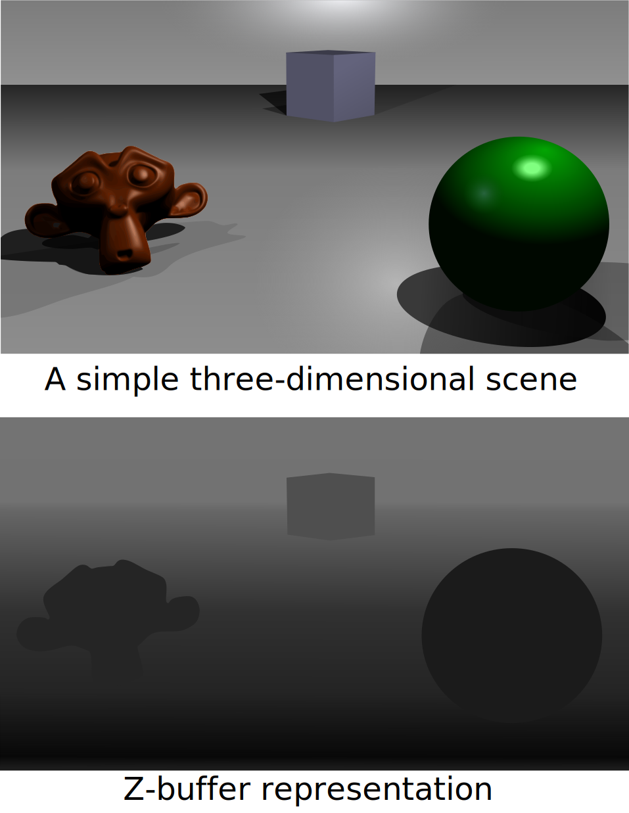
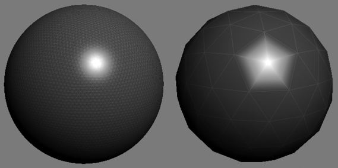
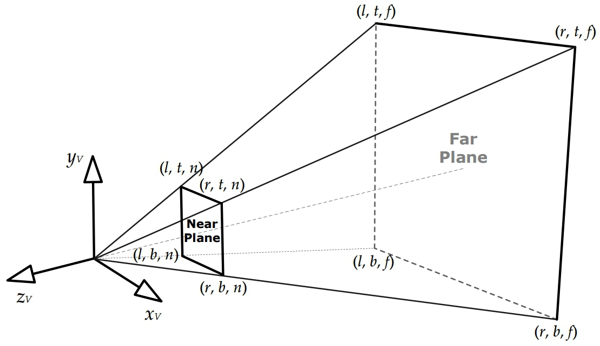

# Game Engine Architecture

## Rendering

---------------------
[Course Index](http://nikoladimitroff.github.io/Game-Engine-Architecture)

<table>
<tbody>
    <tr>
        <td>
            Nikola Dimitroff
        </td>
        <td>
            <a target="_blank" href="https://dimitroff.bg"><i class="fa fa-rss"></i></a>
            <a target="_blank" href="mailto:nikola@dimitroff.bg"><i class="fa fa-envelope-o"></i></a>
            <a target="_blank" href="https://github.com/nikoladimitroff"><i class="fa fa-github"></i></a>
            <a target="_blank" href="https://twitter.com/nikoladimitroff"><i class="fa fa-twitter"></i></a>
        </td>
    </tr>
    <tr>
        <td>
            Alexander Angelov
        </td>
        <td>
            <a target="_blank" href="mailto:aleksandar.angelovv@gmail.com"><i class="fa fa-envelope-o"></i></a>
            <a target="_blank" href="https://github.com/Alekssasho"><i class="fa fa-github"></i></a>
            <a target="_blank" href="https://twitter.com/Alekssasho"><i class="fa fa-twitter"></i></a>
        </td>
    </tr>
    <tr>
        <td>
            Viktor Ketipov
        </td>
        <td>
            <a target="_blank" href="mailto:viktor@kipiinteractive.com"><i class="fa fa-envelope-o"></i></a>
            <a target="_blank" href="https://github.com/k1p1"><i class="fa fa-github"></i></a>
            <a target="_blank" href="https://twitter.com/xk1p1x"><i class="fa fa-twitter"></i></a>

        </td>
    </tr>
</tbody>
</table>

 

--- NEXT SLIDE ---

# Sanity check

We are recording, aren't we?

--- NEXT SLIDE ---

## Review

What are the pros and cons of these:

* Euler angles
* Axis + angle
* Rotation matrices
* Quaternions

--- VERTICAL SLIDE ---

## Review

How do you convert homogenous to heterogenous coordinates?

--- NEXT SLIDE ---

## Disclaimer

The following material should be covered by a complete course (at least one)
of its own.

--- NEXT SLIDE ---

## Rendering algorithms

How do you a draw 3D cats on a 2D screen?

--- VERTICAL SLIDE ---

## Ray tracing

--- VERTICAL SLIDE ---

Raytracing looks awesome! [Chaos Group](http://www.chaosgroup.com/en/2/index.html)
made a bussiness out of solving ray-tracing.

* [But it's reaaaaaaaaaaaly slow - 100+ rays for each pixel](http://www.longtail.com/the_long_tail/2006/12/pixar_quiz.html)
* So it mostly works on prerendered scenes (though it can be made to work for some cases)

Enter rasterization!

--- VERTICAL SLIDE ---

## Painter's algorithm

--- VERTICAL SLIDE ---

## Z-Buffer

--- VERTICAL SLIDE ---

## Scan-line

--- NEXT SLIDE ---

## Rendering a scene

* *virtual scene*
* *virtual camera*
* *light sources*
* *visual properties*

--- VERTICAL SLIDE ---

--- NEXT SLIDE ---

## Styles

* photorealistic
* cartoon
* charcoal sketch
* watercolor
* wool

--- NEXT SLIDE ---

## A scene

- set of objects
  - opaque
  - transparent
  - translucent

--- NEXT SLIDE ---

## Representations of objects

* equations
* NURBS
* subdivision
* triangle meshes

--- VERTICAL SLIDE ---

## Triangles

The triangle is the simplest type of polygon. Any fewer than three vertices,
and we wouldn’t have a surface at all.

- A triangle is always planar.
- Triangles remain triangles under most kinds of transformations, including
  affine transforms and perspective projections.
- Virtually all commercial graphics-acceleration hardware is designed around
  triangle rasterization.

--- VERTICAL SLIDE ---

## Tessellation

Triangulation

--- VERTICAL SLIDE ---

--- VERTICAL SLIDE ---

Constructing a triangle mesh

- Winding
- Triangle list
- indexed triangle list
- triangle strip
- triangle fan

--- NEXT SLIDE ---

Vertex cache optimization

--- NEXT SLIDE ---

- Model space
- World space and mesh instancing
  - buildings directly in world space (precision...)

--- NEXT SLIDE ---

## Surface properties

- diffuse color
- shininess / reflectivity
- roughness
- texture
- opacity
- refraction

--- NEXT SLIDE ---

## Vertex attributes

- position vector
- vertex normal
- vertex tangent
- diffuse color
- specular color
- texture coordinates
- skinning weights

--- NEXT SLIDE ---

## Attribute interpolation

--- VERTICAL SLIDE ---

--- VERTICAL SLIDE ---

--- VERTICAL SLIDE ---

Attribute interpolation is not enough

--- NEXT SLIDE ---

## Textures

- diffuse albedo
- texture coordinates
- texture addressing

--- VERTICAL SLIDE ---

--- VERTICAL SLIDE ---

--- VERTICAL SLIDE ---

- miplevel
- world-space texel density
- texture filtering
  - nearest neighbor
  - bilinear
  - trilinear
  - anisotropic

--- NEXT SLIDE ---

## Lighting

- local and global illumination

--- VERTICAL SLIDE ---

Rendering Equation

--- VERTICAL SLIDE ---

- Phong Lighting model

- Blinn-Phong

--- VERTICAL SLIDE ---

Physically Based Rendering

--- VERTICAL SLIDE ---

 BRDF

--- VERTICAL SLIDE ---

- static lighting
- ambient lights
- directional lights
- point lights
- spot lights
- area lights
- emissive

--- VERTICAL SLIDE ---

* Gamma correction
* SRGB
* HDR

--- NEXT SLIDE ---

## Materials

--- NEXT SLIDE ---

## Virtual Camera

- Frustrum

--- VERTICAL SLIDE ---

--- VERTICAL SLIDE ---

- Projections
  - Perspective projection

--- VERTICAL SLIDE ---

--- VERTICAL SLIDE ---

- Screen space
- Framebuffer

--- NEXT SLIDE ---

## Rasterization

--- VERTICAL SLIDE ---

--- VERTICAL SLIDE ---

Z-Buffer

--- VERTICAL SLIDE ---

--- VERTICAL SLIDE ---

W-Buffering

--- NEXT SLIDE ---

## Rendering Pipeline

--- VERTICAL SLIDE ---

- Tools stage (offline). Geometry and surface properties (materials) are defined.
- Asset conditioning stage (offline). The geometry and material data are processed
by the asset conditioning pipeline (ACP) into an engine-ready
format.

--- VERTICAL SLIDE ---

- Application stage (CPU). Potentially visible mesh instances are identified
and submitted to the graphics hardware along with their materials for
rendering.
- Geometry processing stage (GPU). Vertices are transformed and lit and projected
into homogeneous clip space. Triangles are processed by the optional
geometry shader and then clipped to the frustum.
- Rasterization stage (GPU). Triangles are converted into fragments that are
shaded, passed through various tests (z-test, alpha test, stencil test, etc.)
and finally blended into the frame buffer.

--- VERTICAL SLIDE ---

--- NEXT SLIDE ---

## GPU pipeline

--- VERTICAL SLIDE ---

--- NEXT SLIDE ---

Anti-Aliasing

--- VERTICAL SLIDE ---

--- VERTICAL SLIDE ---

- MSAA
- FXAA
- TXAA
- Others

--- VERTICAL SLIDE ---

--- NEXT SLIDE ---

## Scene graphs

--- VERTICAL SLIDE ---

Visibility detection

--- VERTICAL SLIDE ---

--- NEXT SLIDE ---

## Particles

--- VERTICAL SLIDE ---

--- NEXT SLIDE ---

## Post Processing

--- VERTICAL SLIDE ---

* HDR
* Bloom
* Motion Blur
* Tone Mapping
* Lens Flare
* Ambient Occlusion

--- VERTICAL SLIDE ---

--- VERTICAL SLIDE ---

--- NEXT SLIDE ---

## Forward Rendering and Deferred Rendering

--- VERTICAL SLIDE ---

Forward Rendering

--- VERTICAL SLIDE ---

Deffered Rendering

--- VERTICAL SLIDE ---

G-Buffer

--- NEXT SLIDE ---

Implementation details

- single-threaded
- multi-threaded
- task based

--- VERTICAL SLIDE ---

Async Compute

--- NEXT SLIDE ---

# Mobile GPU

--- VERTICAL SLIDE ---

Tiled deferred renderer

--- NEXT SLIDE ---

## Modern API

- Dx12
- Vulkan
- Metal

--- VERTICAL SLIDE ---

- Explicit Memory Allocation
- Explicit Resource Binding
- Explicit Synchronizations

--- VERTICAL SLIDE ---

--- NEXT SLIDE ---

## GPU Debugging

--- VERTICAL SLIDE ---

Every vendor has custom tools

- NVidia NSight
- AMD Perf Studio
- PIX
- Renderdoc

--- VERTICAL SLIDE ---

