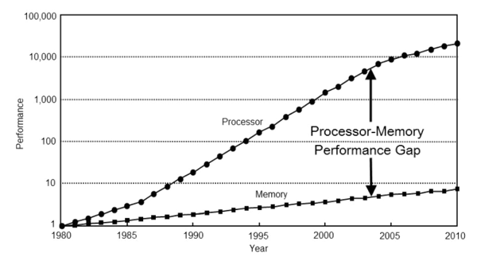

# Game Engine Architecture

## Rendering

---------------------
[Course Index](http://nikoladimitroff.github.io/Game-Engine-Architecture)

<div class="authors-section">
<table>
<tbody>
    <tr>
        <td>
            Nikola Dimitroff
        </td>
        <td>
            <a target="_blank" href="https://dimitroff.bg"><i class="fa fa-rss"></i></a>
            <a target="_blank" href="mailto:nikola@dimitroff.bg"><i class="fa fa-envelope-o"></i></a>
            <a target="_blank" href="https://github.com/nikoladimitroff"><i class="fa fa-github"></i></a>
            <a target="_blank" href="https://twitter.com/nikoladimitroff"><i class="fa fa-twitter"></i></a>
        </td>
    </tr>
    <tr>
        <td>
            Alexander Angelov
        </td>
        <td>
            <a target="_blank" href="mailto:aleksandar.angelovv@gmail.com"><i class="fa fa-envelope-o"></i></a>
            <a target="_blank" href="https://github.com/Alekssasho"><i class="fa fa-github"></i></a>
            <a target="_blank" href="https://twitter.com/Alekssasho"><i class="fa fa-twitter"></i></a>
        </td>
    </tr>
    <tr>
        <td>
            Viktor Ketipov
        </td>
        <td>
            <a target="_blank" href="mailto:viktor@kipiinteractive.com"><i class="fa fa-envelope-o"></i></a>
            <a target="_blank" href="https://github.com/k1p1"><i class="fa fa-github"></i></a>
            <a target="_blank" href="https://twitter.com/xk1p1x"><i class="fa fa-twitter"></i></a></p>
        </td>
    </tr>
</tbody>
</table>
</div>

<div class="companies-section">
<a class="ubisoft-logo" href="https://ubisoft.com" target="_blank"></a>
<br>
<a class="kipi-logo" href="http://kipiinteractive.com" target="_blank"></a>
</div>

--- NEXT SLIDE ---

# Sanity check

We are recording, aren't we?


--- NEXT SLIDE ---

## Review

Why isn't ray tracing appropriate for real time rendering?
* Really slow because each pixel needs tracing of many rays.
* This will change in the next 5 years.
* Hardware with ray tracing capabilities in coming to the market


--- NEXT SLIDE ---

## Today

* Graphical Processing Units
* DirectX 12 API
* Two important rendering components
  * Rendering Data Extraction
  * Framegraph

--- VERTICAL SLIDE ---

## Review

Lighting from functional point of view in real time

* Inputs
* Outputs
* Transform

--- VERTICAL SLIDE ---

## Review

Direct Lighting Inputs

 * Light Visibility    - Many types
 * Materials           - BRDF formula (normal, specular, albedo)
 * Baked data          - Depends on the game
 * Lights              - Many types (point, spot, area)

--- VERTICAL SLIDE ---

 Indirect Lighting Inputs
  * Scene sampled direct lighting
  * Might be Offline or Online
  * Might be Per point on the scene
  * Might be Recorded in space (probes)
  * Materials

--- VERTICAL SLIDE ---

Final Lighting inputs
 * Direct Lighting
 * Indirect Lighting

--- VERTICAL SLIDE ---

 Post Lighting processing
 * Tone Mapping
 * Artistic Postprocessing
 * Antialiasing methods

--- VERTICAL SLIDE ---

 So let us start to dissect them in terms of data
 * When we do not have raytracing, we must use the rasterizer algorithm.
 * We throw geometry against it and get buffers with 2D data.
 * We have two means for doing this, an API and an accelerator

--- VERTICAL SLIDE ---

## Graphical Processing Units

--- VERTICAL SLIDE ---

Definitions
* Latency
 *  Time to finish a fixed task
  *   33 or 16 ms frame ( 30 or 60 fps)
  *   15 ns for inserting an element into a queue
Throughput
* Tasks per unit time
  *  16 GB/s memory transfer
  *  4 Megapixels/s shading samples

--- VERTICAL SLIDE ---
Processor history

* Moore's law
 * The number of transistors can be doubled every (1.5 years) (1969)
* Performance
  * Transistor performance. 
   * Improves linearly as size scales down
  * Wires scale poorly. 
   * Delays are increased, signals are lost. Relays are installed
   * 2 km of wiring on AMD Rysen

--- VERTICAL SLIDE ---
Processor history

* TDP – Thermal design power
  * Determines cooling requirements. Measured in watts (ex. 15W, 100W, 250W)
  * Power supply and cooling match and exceed TDP
  * Power = ½ Capacitive Load * Voltage ^ 2 * Frequency
  * Capacitive Load – function of number of transistors
  * Voltage – depends on transistors
  * Frequency can be adjusted

--- VERTICAL SLIDE ---
Obstacles to increasing frequency


--- VERTICAL SLIDE ---
Memory barrier - DRAM

| Year | DRAM Growth | Capacity |
| ---- | ---- | ---- |
|1990 | 60%/year | 4x/3 years |
|1996 | 60%/year | 4x/3 years |
|2003 | 40-60%/year | 4x/3-4 years |
|2007 | 40%/year | 2x/2 years |
|2011 - | 25-40%/year | 2x/2-3 years |

--- VERTICAL SLIDE ---
Capital for research

.jpg)

--- VERTICAL SLIDE ---
Memory barrier - speed



* 1980: RAM latency ~ 1 cycle
* 2011: RAM latency ~ 150 - 400 + cycles

Sin(x) values in a table are faster in 1980

--- VERTICAL SLIDE ---
* CPU
  * Low latency, low throughput ( ns, < 100 GB/s )
* GPU
  * High latency, high throughput (ms, > 100 GB /s )

| | AMD Athlon II x4 | Radeon 5750 |
| ---- | ---- | ---- |
|TDP|95W| 86W|
|FLOPS| 30 GFLOPS| 1008 GFLOPS|
|Transistors| 300 M (768PH)| 1040 M|
|Bandwith GB/s| 9 ( 4 OpenCL )| 70 ( 40 OpenCL )|

--- VERTICAL SLIDE ---
CPU Components
* ALU
  * compute
* Fetch
  * instructions stream, microops
* Execution context
  * registers, where is the program
* Branch predictor
  * conditions, if, else, while, for

--- VERTICAL SLIDE ---
CPU Components

* Out of order logic
 * tries to guess where the code will go 
* Memory prefetch
 * tries to fetch memory into the cache before it is used
* Data cache (varies)
 * L1 4ns 16Kib/32Kib
 * L2 40ns 256Kib/512Kib
 * L3 100ns 16Mib

--- VERTICAL SLIDE ---
CPU


--- VERTICAL SLIDE ---
GPU - remove complex logic, pack simpler cores
* ALU
  * compute
* Fetch
  * instructions stream, microops
* Execution context
  * registers, where is the program

--- VERTICAL SLIDE ---
 GPU - Share the fetch logic

* All cores execute the same program and the same instruction

```cpp
struct vs_output
{
  float4  position: SV_POSITION; 
  float3  normal: Normal;
  float2  uv: TexCoord; 
};

Texture2D     g_diffuse;
SamplerState  g_default_sampler;

float3        g_light_direction;

float4 main( in  vs_output input) : SV_Target
{
  float3 f_1 = diffuse.Sample(default_sampler, input.uv).xyz;
  float3 f_2 = f_1 * saturate ( dot ( light_direction, input.normal ) );
  return float4(f_2, 1.0f);
}
```
--- VERTICAL SLIDE ---
 GPU - Share the fetch logic
* All cores (70+) execute the same program and the same instruction
* Every has different data, but the code is the same

```cpp
sample r0.xyz, v2.xyxx, t0.xyzw, s0
dp3_sat r0.w, cb0[0].xyzx, v1.xyz
mul o0.xyz, r0.wwww, r0.xyzx
mov o0.w, 1(1.0000)
```
--- VERTICAL SLIDE ---
Shared execution stream


--- VERTICAL SLIDE ---
Branches
```cpp
if ( x  > 0 )
{
  x = dot(x,y);
}
else
{
  x = 2 * dot(x,y);
}
```
| T0 | T1 | T2 | T3 | T4 | T5 | T6 | T7 |
| ---- | ---- | ---- | ---- | ---- | ---- | ---- | ---- |
| T | F | F | F | T | T | T | T |

Both branches are taken and the results are merged

--- VERTICAL SLIDE ---
GPU Stalls
* Stalls in a processor occurs, when the ALU units must wait for an external device to bring data to compute
* On CPU these units help
 * Out of order logic – scans instruction stream
 * Branch predictor – tries to predict branches, based on past branch history
 * Cache hierarchy – fast serving of memory requests if data was used before
* On GPU this was removed
* Memory latency is hundreds of cycles (500 is not uncommon)

--- VERTICAL SLIDE ---
GPU – Hiding STALLS

* Idea, saturate the gpu with work.
* Issue data request for item N, block
* Issue data request for item N + 1, block
* Issue data request for item N + 2, block

* Data comes for item N, execute
* Data comes for item N + 1, execute
* Data comes for item N + 2, execute
* After initial delay of 3, every clock we produce result

--- VERTICAL SLIDE ---
GPU – Local Data Storage on a Compute Unit

* Computation requires storage resources on the chip
* ALU registers (store intermediate results)
* Register memory comes from a register file around 128kb - 256kb
* If the shaders use small number of registers we can schedule on the unit more of them
* Less than 24 registers per shader is ideal for AMD(GCN).
* Steps are incremented in 4, 28,32, etc...

--- VERTICAL SLIDE ---
GPU Bandwitdh, theoretical

Example Radeon 5750
* Memory Controller - 73 GB/s
* 720 Processors ( 80 processors packed in 9 cores)
* 720 MHz core clock
* 720 Multiply add per clock

* Operation = C = A * B + C
 * Load A, Load B, Load C
 * Multiply 
 * Store D
 * 16 * 720 = 11520 bytes per clock
 * 720 MHz * 11520 ~ 7.54 TB/s

--- VERTICAL SLIDE ---
GPU Bandwitdh, theoretical
* Bandwidth is a critical resource
 * Must be preserved and saved with ALU computations
 * Data must be tightly packed before processing
 * Data should be reused across computing elements
 * Still GPU memory system is very effective
 * Reorders / interleaves / repacks memory

--- VERTICAL SLIDE ---
GPU Memory blocks
* L1 Cache per core (16 kb - 32kb) (RW)
* L2 Cache in MB ( RW )
* Texture Cache KB (RO).
* Textures are special packing for 2D data (morton order)
* Shared memory for a core (speed ups)

--- VERTICAL SLIDE ---
GPU Graphic Blocks
* Rasterizer
 * Produces pixels from triangles
 * Groups pixels in quads (2x2)
* Tessellator
 * Produces new triangles
* HiZ / Cull Depth
 * Helps removing invalid pixels
* Thread Scheduler
 * Schedules threads on the GPU

--- VERTICAL SLIDE ---
GPU Graphic Blocks
* Command processor
 * Parses commands from the GPU
* ROP (Raster operations)
 * Blending of pixels
* Input assembler
 * Assembles primitives for the vertex shaders
 * Will be replaced with Mesh Shaders
* RT Cores
 * Raytracing cores
* Tensor Cores
 * Machine learning ops

--- VERTICAL SLIDE ---
* Command generation for a game
 * CPU is responsible for generation
 * Gathers data and prepares commands draw, set texture, set blending mode, set pixel shader
 * Can be multithreaded
 * Several threads generate command buffers
 * They are chained together at the end
 * Usually double or triple buffering
 * Buffering increases parallelism
 * But increases latency also
 * 30 ms cpu generation
 * 30 ms gpu consume
 * 8-10 ms controller input
 * DirectX 11 buffers three frames by default
 * So 120 ms latency if you are at 30 fps

--- VERTICAL SLIDE ---
GPU - SUMMARY
* Pack many and simple cores on the same die
* Share instruction stream between cores
* Cover stalls with shared work


--- NEXT SLIDE ---

## Application Programming Interface
DirectX 12 / Vulkan

* Goal
 * Abstract the Hardware
 * Provide connection through the OS

--- VERTICAL SLIDE ---
 * Set states of the hardware
 * Issue work in the form of a command

--- VERTICAL SLIDE ---
DirectX 9/11  example
```cpp
void Object::Draw( ID3D11CommandList* list)
{
  list->VSSetShader(...)
  list->PSSetShader(...)
  list->VSSetShader(...)
  list->VSSetShaderResources(...)
  list->PSSetShaderResources(...)
  list->VSSetConstantBuffers(...)
  list->PSSetConstantBuffers(...)
  list->IASetVertexBuffers(...)
  list->IASetIndexBuffer(...)
  list->OMSetBlendState(...);
  list->RSSetState(...);
  list->DrawIndexed(...);
}
```

--- VERTICAL SLIDE ---
AMD PAL Example


 
--- VERTICAL SLIDE ---
DirectX 9,11 / OpenGL are delayed APIs By Design
* Basic problem, Frame time is unpredictable
* CPU is bottlenecked with work that may not be needed
* Pipeline states are set and parsed on draw call submission
* Triggers problems with resource usage
* Buffers my be bound on input or output operations
* Gpu Caches are flushed on every potentially every output set
* Hides memory residency

--- VERTICAL SLIDE ---
DirectX 9, 11 / OpenGL are delayed APIs By Design
* Drivers spawn threads
* One thread per core (nvidia)
* Two core threads (intel)
* One thread for the immediate context (amd)
* They do interfere with the game threads.
* So what can we do?
* Optimize driver threads? Taxes all games, good ones and bad ones.
* If you do more work on the cpu on a laptop it remains less power for the GPU. They are tied together.

--- VERTICAL SLIDE ---
DirectX 9, 11 / OpenGL are delayed APIs By Design
* Console developers had access to lower level GPU abstractions for years.
* Simplified apis, simplified os

--- VERTICAL SLIDE ---
DirectX 12 / Vulkan
* So what about if we level down the abstraction a bit ?
* Just little above the hardware level
* AMD did Mantle library, eventually turned out to be Vulkan  

--- VERTICAL SLIDE ---
Goals of DirectX 12

* Improve performance of CPU bound games
* Improve multicore scaling
* Improve performance on power constrained platforms
* Improve heat and battery life
* By reducing the CPU load

--- VERTICAL SLIDE ---
Main components of the API

* Memory
* Commands
* Synchronization
* Pipeline State
* Resource binding

--- VERTICAL SLIDE ---
Memory. One must manage memory by herself/himself. This is what the driver does

* Heaps
* What are resources?
* Textures, Index Buffers
* Shaders, Geometry, Buffers, ByteBuffers
* Subresources ?
* Mip 0, Mip 1 of a texture
* Cube sides of a cube texture ?
* Texture in an array of textures.
* Reserved Resources
* Committed Resources
* Placed resources

--- VERTICAL SLIDE ---
Heaps

* Request an allocation of memory from the driver.
```cpp
d3d12device->CreateHeap( HeapDescription, Size in Bytes);
```
* Types of heaps
* VRAM of the GPU - accessed by the GPU only
* Geometry, Textures, Render Targets.
* Upload - used to transfer data across the PCI bus from the CPU to the GPU - Constants, Matrices, Streamed Geometry
* Readback - used to transfer back from the GPU - Screenshots
* Custom - UMA (consoles)

--- VERTICAL SLIDE ---
Now when one allocates the heap he must manage the memory inside. He/she must answer this questions:

* Creating resources inside, freeing resources
* How about multiple threads allocations?
* When I free something, does the gpu use it?
* What about the fragmentation of this memory?

* What about if the OS requires eviction?
* Alignment of resources
* 4 bytes for geometry
* 64KB for textures
* 4MB for MSAA render targets

--- VERTICAL SLIDE ---
When we create a heap accessible by the CPU

* Write Combine
* We must write there without holes.
* All member of the structures must be filled with data or 0.
* We bypass the cache system of the CPU. Reading is slow (hundreds of cycles)
* Suitable for write only data
* Bone Transforms is an example
* Write back
* Performs update of the page regularly
* So we may be able to write with holes or missing data.

--- VERTICAL SLIDE ---
DirectX 12 Descriptor Heaps

* We need a way to pass pointers to the GPU data around the code and dereference it on the GPU (shaders)
* On the cpu you have int32_t* or HANDLE that points to an address and you copy them around and dereference
```cpp
d3d12devicommandList->OMSetRenderTarget( gpuPointer )
```
* Descriptors come to replace the pointers for the gpu data
* They are abstraction, usually 64 or 128 bytes.

--- VERTICAL SLIDE ---
DirectX 12 Descriptor Heaps

* The driver stores data inside.
* You can create them with GPU memory
* You can copy them around to the command lists
* And you must ensure that they point to valid GPU data when used
* On the GPU

--- VERTICAL SLIDE ---
DirectX 12 Descriptor Heaps

* Descriptors are organized in a heap by types
* Shader Resource View (for reading from shaders)
* Render Target View ( for output from the shaders)
* Depth Stencil View (for the depth buffer).
* Sampler ( this is a special hardware that performs sampling )
* From the theory of signals
* Sampling means to read the values of the signals
* Geometry is a signal, Textures are signal.

--- VERTICAL SLIDE ---
DirectX 12 Examples

* Critical 
 * Must reside always
* Scaled Optional
 * Game Data - Art Supplied data
* Reused in a frame
 * Lighting Buffers, Skinning Buffers, Animation Buffers, Post Process Buffers
* Streaming resources
 * Terrain data or other big structures

--- VERTICAL SLIDE ---
Placed Resources

* Can be created in a heap.
 * Very lightweight. Can be created in a heap
  * You must manage the offset in the heap. Very useful for small data 4KB
  * Example: You allocate 32 MB for textures and manage the allocations by yourself. 
* Committed Resources
  * Backed by physical memory.
* Reserved resources
  * Allocates address space, without actual physical memory
  * Can be committed and decommitted on demand (through the device)

--- VERTICAL SLIDE ---
DirectX 12 Work Generation

* Commands, Bundles
* The CPU generates commands for the gpu in a format close the gpu
* Bundles are commands which are generated up front
* Commands are submitted in Command Lists
* Memory for Command Lists is managed by Command Allocators

--- VERTICAL SLIDE ---
DirectX 12 Work submission

* Generated commands are submitted through queues
* Queues can have different types of commands
* Direct, Bundle, Compute, Copy,  Video Decode, Video Encode
* Priority, how the OS treats the commands submitted there
* Queues can be mapped to hardware.
* Some AMD models have two queues
* Some have many queues
* Some have Specialized Queues for Copying only through DMA

--- VERTICAL SLIDE ---
DirectX 12 Synchronization

* Fences encapsulate values which increase monotonically in time.  App is responsible for increasing the fences
* Fence
 * Can block a gpu queue to wait on another gpu queue
 * Can block the cpu until the gpu passes a point
* Gpu
 * queue->Signal(fence, 100);
 * anotherQueue->Wait(fence, 100);
* Cpu
 * m_fence->SetEventOnCompletion(fence, 100); WaitForSingleObject(fence, INFINITE);

--- VERTICAL SLIDE ---
DirectX 12 Synchronization Examples

* Wait for the previous frame to finish in a double buffered scenario
* CPU Execute Commands ( frame n ), wait for the GPU to finish processing commands for frame n - 1
* Wait for the GPU to pass an execution point to transfer memory to the CPU
* Two queues graphic and compute work cooperatively to deliver better performance
* Combine memory graphics loads with compute loads

--- VERTICAL SLIDE ---
DirectX 12 Pipeline State
* Represents the whole GPU pipeline as a monolithic block
* Rasterizer, Blend State, Shaders, Depth, MSAA
* For compute just shaders
* On DX11 they are separate and the driver must check on every draw call if it was changed and rebuild
* The intended usage is that one builds either offline or during loading time.  (Usually thousands 50 000)
* Can be cached, but the app must rebuild on os or gpu changes
* Compiling takes a lot of time 1-2 seconds

--- VERTICAL SLIDE ---
DirectX 12 Resource Binding

* Shaders must reference resources
* Constant Buffers – constant memory for the shader
* Unordered Access Views – write for the shader
* Render targets – write for the shader (why different?)
* Shader Resources Views – read for the shader
* References are descriptors which are bound in a format defined in an abstraction called Root Signature
* If the contents of the descriptors do not change drivers can cache or optimize

--- VERTICAL SLIDE ---
DirectX 12 Root Signature

* Similar to an API function. 
* Definition of what type of parameters the function to expect
* It may contain
* Descriptor Tables
* One or several tables with descriptors of resources
* Descriptors Directly
* Several limited constants embedded directly in the command list
* Example, number of a mesh

--- VERTICAL SLIDE ---
DirectX 12 Resource Transitions

* Using resources for reading and writing from different Compute Units must be synchronized so we end up with deterministic data
* Resource transitions are an abstraction that covers under the hood flushes or invalidation of the gpu caches.
* Directx 11 was doing this in the driver.
* Now this is offset explicitly to the app

--- VERTICAL SLIDE ---
DirectX 12 Resource Barriers

* Transition Barrier
* Transition barrier indicates that a set of subresources transition between different usages
* Aliasing Barrier
* An aliasing barrier indicates a transition between usages of two different resources which have overlapping mappings into the same heap
* Unordered access view barrier
* A UAV barrier indicates that all UAV accesses, both read or write, to a particular resource must complete between any future UAV accesses, both read or write

--- VERTICAL SLIDE ---
DirectX 12 Resource Transition Example
* Depth Write – Depth Read
* When we bind a resource as a depth for write
* It is in compressed form in the gpu memory to accelerate rendering.
* Setting the resource for read triggers decompression, which can be 0.5 ms, depending on the resolution
* What about reading / writing multiple times in this depth resource?

--- VERTICAL SLIDE ---
Directx12 Resource Transition Example (AMD)
* Delta Color Compression
* Form of lossless compression of the render targets on the GPU
* The key idea is to process whole blocks instead of individual pixels. Inside a block, only one value is stored with full precision, and the rest is stored as a delta – hence the name
* Clear to 0 or 1
* Do not flag render targets as shader readable unless you need them to be

--- VERTICAL SLIDE ---
Key takeaway
* DirectX 12 / Vulkan
 * High performance
 * Control over scalability
* More work, better result
* Still not widely used on Mobile
* If you need simple examples, may consider DirectX 11 / OpenGL

--- NEXT SLIDE ---
## Submitting work to the GPU

 * Simulate game objects
 * Determine what to render
 * Generate GPU Commands
 * Preform GPU Work
 * Display

--- VERTICAL SLIDE ---
* Data resides in lists
* Examples: static objects, buildings, vegetation
* Dynamic Objects: Transforms are updated every frame (characters, animals, collided objects)
* Process these lists, produce another structure, suitable for rendering
* Important to separate graphic data from gameplay data
* Cache immutable data. Processed only on loading

--- VERTICAL SLIDE ---
```cpp
struct StaticObject
{
  uint32_t m_transformIndex;
  uint32_t m_flags; // bit 0, bit1, bit2, bit...
};

struct DynamicObject
{
  uint32_t m_transformIndex;
  uint32_t m_flags; // bit 0, bit1, bit2, bit...
};
```
--- VERTICAL SLIDE ---
```cpp
struct Building : public StaticObject;
struct Tree : public StaticObject;
struct Goblin : public DynamicObject;

struct GraphicWorld
{
  //data oriented by type, not one Object
  std::vector<float4x4>    m_static_transforms;
  std::vector<float4x4>    m_dynamic_transforms;
  
  std::vector<Tree>        m_trees;
  std::vector<Building>    m_buildings;
  std::vector<Goblin>      m_goblins;
};
```
--- VERTICAL SLIDE ---
Decouple Simulation from Rendering
* Add Latency
* Simulate Game Frame N
* Copy to Mirror N (Sync point)
* Render Frame N-1
* This works with jobs

--- VERTICAL SLIDE ---


--- VERTICAL SLIDE ---
Decouple Simulation from Rendering
* As soon as the player moves thame camera (poll)
* Start traversing static objects, what is visible
* Simulate Game Frame N
* Copy to Mirror N (Sync point, small number)
* Render Frame N-1
* This works with jobs or concurrent tasks (render and simulate)

--- VERTICAL SLIDE ---


--- VERTICAL SLIDE ---
Traversal of objects
 * Perform pulling of needed data
 * Ex. Position, orientation
 * Ex. Materials data
 * For every view, pass, object
 * Game Object Data != Render Data

--- VERTICAL SLIDE ---
Render Passes
 * Depth Pass prime Depth
 * G-Buffer Pass
 * Shadows Pass (8 views)
 * Reflection Pass ( Water )
 * Lighting Pass
 * Forward Renderer Pass
 * Particles
 * Blur
 * Antialiasing
 * Can be around 60+

--- VERTICAL SLIDE ---
  Traversing
 * Produces frame packets 
  * Around 2-3 MB of data. Fits in L3 Cache
 * Operates on Views
   * View = Camera | Frustum
   * Visbility -> Extract -> Prepare -> Submit

--- VERTICAL SLIDE ---
 Visbility ( View )
 * Frustum Culling
 * Small object culling
 * Level of Detail Selection
 * Usage of SIMD AVX (8 elements)

--- VERTICAL SLIDE ---
 Extract ( View )
 * Sort objects by type or key ( for cache )
 * Allocate space in the frame packet.
 * Only can be done during the extract phase !!!, no updates from simulation

--- VERTICAL SLIDE ---
 Prepare ( View ) on visible objects
 * Skip computations not perceivable
 * Cloth simulation or other visual work
 * Prepares data for submission in the frame packet

--- VERTICAL SLIDE ---
 Submit (View)
 * One object can be mapped in many types of rendering
 * Skinning, Static, Decals, Water, Sky -> Feature Renderers

--- VERTICAL SLIDE ---


--- VERTICAL SLIDE ---


--- VERTICAL SLIDE ---
Degrees of freedom
 * Many Objects
 * Many Views
 * Many Feature Renderers
 * Many Passes
 * Simple skeleton example in git

--- NEXT SLIDE ---
Frame Graph

* Memory usage during a frame (8ms,16ms,33ms)
* How to manage transitions and caches
* Make modules simpler

--- VERTICAL SLIDE ---
Moving away from immediate mode rendering
* Rendering code split into passes
* Multi-phase retained mode rendering API
* Setup phase
* Compile phase
* Execute phase
* Built from scratch every frame
* Code-driven architecture

--- VERTICAL SLIDE ---
Frame Graph setup phase
* Define render / compute passes
* Define inputs and output resources for each pass
* Code flow is similar to immediate mode rendering

--- VERTICAL SLIDE ---
Render passes must declare all used resources
* Read
* Write
* Create

External permanent resources are imported to Frame Graph
* History buffer for TAA
* Backbuffer

--- VERTICAL SLIDE ---
Frame Graph resource example
```cpp
RenderPass::RenderPass(FrameGraphBuilder& builder)
{
  // Declare new transient resource
  FrameGraphTextureDesc desc;
  desc.width = 1280;
  desc.height = 720;
  desc.format = RenderFormat_D32_FLOAT;
  desc.initialSate = FrameGraphTextureDesc::Clear;
  m_renderTarget = builder.createTexture(desc);
}
```

--- VERTICAL SLIDE ---
Frame Graph resource example
```cpp
RenderPass::RenderPass(FrameGraphBuilder& builder,
  FrameGraphResource input,
  FrameGraphMutableResource renderTarget)
{
  // Declare resource dependencies
  m_input = builder.read(input, readFlags);
  m_renderTarget = builder.write(renderTarget, writeFlags);
}
```

--- VERTICAL SLIDE ---


--- VERTICAL SLIDE ---
Frame Graph resource example
```cpp
FrameGraphResource addMyPass(FrameGraph& frameGraph, 
  FrameGraphResource input, FrameGraphMutableResource output)
{
  struct PassData
  {
    FrameGraphResource input;
    FrameGraphMutableResource output;
  };

  auto& renderPass = frameGraph.addCallbackPass<PassData>(“MyRenderPass",
  [&](RenderPassBuilder& builder, PassData& data)
  {
    // Declare all resource accesses during setup phase
    data.input = builder.read(input);
    data.output = builder.useRenderTarget(output).targetTextures[0];
  }, 
  [=](const PassData& data, const RenderPassResources& resources, IRenderContext* renderContext)
  {
    // Render stuff during execution phase
    drawTexture2d(renderContext, resources.getTexture(data.input));
  });

  return renderPass.output;
}
```

--- VERTICAL SLIDE ---
* Runtime system
* Memory managment
 * Allocate when needed 
 * Free as soon as possible
 * Memory is taken from pools
* Automatically manage transitions of resources based on input/output 


 
 


--- NEXT SLIDE ---

# Questions?
