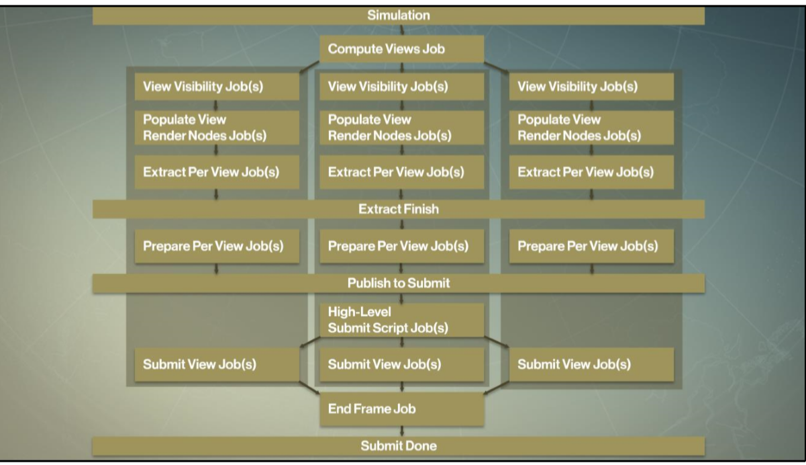

# Game Engine Architecture

## Rendering

---------------------
[Course Index](http://nikoladimitroff.github.io/Game-Engine-Architecture)

<div class="authors-section">
<table>
<tbody>
    <tr>
        <td>
            Nikola Dimitroff
        </td>
        <td>
            <a target="_blank" href="https://dimitroff.bg"><i class="fa fa-rss"></i></a>
            <a target="_blank" href="mailto:nikola@dimitroff.bg"><i class="fa fa-envelope-o"></i></a>
            <a target="_blank" href="https://github.com/nikoladimitroff"><i class="fa fa-github"></i></a>
            <a target="_blank" href="https://twitter.com/nikoladimitroff"><i class="fa fa-twitter"></i></a>
        </td>
    </tr>
    <tr>
        <td>
            Alexander Angelov
        </td>
        <td>
            <a target="_blank" href="mailto:aleksandar.angelovv@gmail.com"><i class="fa fa-envelope-o"></i></a>
            <a target="_blank" href="https://github.com/Alekssasho"><i class="fa fa-github"></i></a>
            <a target="_blank" href="https://twitter.com/Alekssasho"><i class="fa fa-twitter"></i></a>
        </td>
    </tr>
    <tr>
        <td>
            Viktor Ketipov
        </td>
        <td>
            <a target="_blank" href="mailto:viktor@kipiinteractive.com"><i class="fa fa-envelope-o"></i></a>
            <a target="_blank" href="https://github.com/k1p1"><i class="fa fa-github"></i></a>
            <a target="_blank" href="https://twitter.com/xk1p1x"><i class="fa fa-twitter"></i></a></p>
        </td>
    </tr>
</tbody>
</table>
</div>

<div class="companies-section">
<a class="ubisoft-logo" href="https://ubisoft.com" target="_blank"></a>
<br>
<a class="kipi-logo" href="http://kipiinteractive.com" target="_blank"></a>
<br>
<a class="omeda-logo" href="https://omedastudios.com/" target="_blank"></a>
</div>

--- NEXT SLIDE ---

# Sanity check

We are recording, aren't we?


--- NEXT SLIDE ---

## Review

Briefly, how does rasterization work ?
* Goes through all the geometry one by one and goes through the graphics pipeline to draw it <!-- .element class="fragment" data-fragment-index="0" -->
* Uses Z-Buffer to prevent depth issues <!-- .element class="fragment" data-fragment-index="0" -->

--- VERTICAL SLIDE ---

What is BRDF ?

$$
f_{r}(\mathbf x, \omega_{i}, \omega_{o})
$$
* Bidirectional Reflectance Distribution Function <!-- .element class="fragment" data-fragment-index="0" -->
* How much light is reflected from incoming to outgoing direction <!-- .element class="fragment" data-fragment-index="0" -->

--- VERTICAL SLIDE ---

Give couple of examples of data stored in G-Buffer

* Normal <!-- .element class="fragment" data-fragment-index="0" -->
* Diffuse Color <!-- .element class="fragment" data-fragment-index="0" -->
* Roughness <!-- .element class="fragment" data-fragment-index="0" -->

--- NEXT SLIDE ---

## Quick Recap

- Scene into
- Meshes into
- Triangles & Materials

- Camera & Lighting

--- NEXT SLIDE ---

## Rendering Pipeline

--- VERTICAL SLIDE ---

* Tools stage (offline). Geometry and surface properties (materials) are defined.
* Asset conditioning stage (offline). The geometry and material data are processed
by the asset conditioning pipeline (ACP) into an engine-ready
format.

--- VERTICAL SLIDE ---

* Application stage (CPU). Potentially visible mesh instances are identified
and submitted to the graphics hardware along with their materials for
rendering.

* Geometry processing stage (GPU). Vertices are transformed, lit and projected
into homogeneous clip space. Triangles are processed by the optional
geometry shader and then clipped to the frustum.

* Rasterization stage (GPU). Triangles are converted into pixels that are
shaded (coloured), passed through various tests (e.g. z-test)
and finally blended into the frame buffer.

--- VERTICAL SLIDE ---


--- NEXT SLIDE ---

## GPU pipeline

--- VERTICAL SLIDE ---


--- NEXT SLIDE ---

## GPU Architecture


--- VERTICAL SLIDE ---

Definitions
* Latency
 *  Time to finish a fixed task
  *   33 or 16 ms frame ( 30 or 60 fps)
  *   15 ns for inserting an element into a queue
* Throughput
 * Tasks per unit time
  *  16 GB/s memory transfer
  *  4 Megapixels/s shading samples

--- VERTICAL SLIDE ---
* CPU
  * Low latency, low throughput ( ns, < 100 GB/s )
* GPU
  * High latency, high throughput (ms, > 100 GB /s )

--- VERTICAL SLIDE ---
CPU Components
* ALU
  * compute
* Fetch
  * instructions stream, microops
* Execution context
  * registers, where is the program
* Branch predictor
  * conditions, if, else, while, for

--- VERTICAL SLIDE ---
CPU Components

* Out of order logic
 * tries to guess where the code will go 
* Memory prefetch
 * tries to fetch memory into the cache before it is used
* Data cache (varies)
 * L1 4ns 16Kib/32Kib
 * L2 40ns 256Kib/512Kib
 * L3 100ns 16Mib

--- VERTICAL SLIDE ---
CPU


--- VERTICAL SLIDE ---
GPU - remove complex logic, pack simpler cores
* ALU
  * compute
* Fetch
  * instructions stream, microops
* Execution context
  * registers, where is the program

--- VERTICAL SLIDE ---
 GPU - Share the fetch logic

* All cores (70+) execute the same program and the same instruction
* Every has different data, but the code is the same

--- VERTICAL SLIDE ---
Branches
```cpp
if ( x  > 0 )
{
  x = dot(x,y);
}
else
{
  x = 2 * dot(x,y);
}
```
| T0 | T1 | T2 | T3 | T4 | T5 | T6 | T7 |
| ---- | ---- | ---- | ---- | ---- | ---- | ---- | ---- |
| T | F | F | F | T | T | T | T |

Both branches are taken and the results are merged

--- VERTICAL SLIDE ---
GPU Stalls
* Stalls in a processor occur, when the ALU units must wait for an external device to bring data to compute
* On CPU these units help
 * Out of order logic – scans instruction stream
 * Branch predictor – tries to predict branches, based on past branch history
 * Cache hierarchy – fast serving of memory requests if data was used before
* On GPU this was removed
* Memory latency is hundreds of cycles (500 is not uncommon)

--- VERTICAL SLIDE ---
GPU – Hiding STALLS

* Idea, saturate the gpu with work.

* Issue data request for item N, block
* Issue data request for item N + 1, block
* Issue data request for item N + 2, block
* Data comes for item N, execute
* Data comes for item N + 1, execute
* Data comes for item N + 2, execute
* After initial delay of 3, every clock we produce result

--- VERTICAL SLIDE ---
GPU – Local Data Storage on a Compute Unit

* Computation requires storage resources on the chip
* ALU registers (store intermediate results)
* Register memory comes from a register file around 128kb - 256kb
* If the shaders use small number of registers we can schedule on the unit more of them
* Less than 24 registers per shader is ideal for AMD(GCN).

--- VERTICAL SLIDE ---
GPU Bandwidth, theoretical
* Bandwidth is a critical resource
 * Must be preserved and saved with ALU computations
 * Data must be tightly packed before processing
 * Data should be reused across computing elements
 * Still GPU memory system is very effective
 * Reorders / interleaves / repacks memory

--- VERTICAL SLIDE ---
GPU Memory blocks
* L1 Cache per core (16 kb - 32kb) (RW)
* L2 Cache in MB ( RW )
* Texture Cache KB (RO).
* Textures are special packing for 2D data (Morton order)
* Shared memory for a core (speed ups)

--- VERTICAL SLIDE ---
GPU Graphic Blocks
* Rasterizer
 * Produces pixels from triangles
 * Groups pixels in quads (2x2)
* Tessellator
 * Produces new triangles
* HiZ / Cull Depth
 * Helps removing invalid pixels
* Thread Scheduler
 * Schedules threads on the GPU

--- VERTICAL SLIDE ---
GPU Graphic Blocks
* Command processor
 * Parses commands from the GPU
* ROP (Raster operations)
 * Blending of pixels
* Input assembler
 * Assembles primitives for the vertex shaders
 * Will be replaced with Mesh Shaders
* RT Cores
 * Raytracing cores
* Tensor Cores
 * Machine learning ops

--- VERTICAL SLIDE ---
GPU - SUMMARY
* Pack many and simple cores on the same die
* Share instruction stream between cores
* Cover stalls with shared work

--- NEXT SLIDE ---

## The hardware device

Abstracts the GPU for you

* DirectX
* OpenGL
* Console-specific
* Console on nonconsoles - DX12, Vulkan, Metal

--- VERTICAL SLIDE ---

## The shader model

The set of features supported by your GPU

* Shader model 6 is the latest and greatest

--- VERTICAL SLIDE ---

## Working with a graphics-device overview

* Initializing the device
* Using the device to create helper objects
    - Render targets
    - Textures
    - Buffers
    - Samplers, Scissors, etc.
* Binding the state
* Drawing

--- VERTICAL SLIDE ---

### Initialize the device

```cpp
// Create the swap chain, Direct3D device, and Direct3D device context.
result = D3D11CreateDeviceAndSwapChain(
   NULL, D3D_DRIVER_TYPE_HARDWARE, NULL, 0, &featureLevel, 1,
   D3D11_SDK_VERSION,
   &swapChainDesc, &m_SwapChain, &m_Devic, NULL, &m_Context);
if (FAILED(result))
{
    // Error
}
```

--- VERTICAL SLIDE ---

### Creating a resource

```cpp
D3D11_TEXTURE2D_DESC desc = { 0 };
desc.Width = 1920;
desc.Height = 1080;
desc.Format = DXGI_FORMAT_R8G8B8A8_UNORM;
desc.Usage = D3D11_USAGE_DEFAULT;
desc.BindFlags = D3D11_BIND_SHADER_RESOURCE;
D3D11_SUBRESOURCE_DATA* init = nullptr;

ID3D11Texture2D* resource;
HRESULT hr = m_Device->CreateTexture2D(&desc, init, &resource);
if (FAILED(hr))
{
    // Error
}
// Use the texture
```

--- VERTICAL SLIDE ---

### Binding state

```cpp
ID3D11ShaderResourceView* textures[MAX_TEXTURES_COUNT];
textures[0] = myTexture;
m_Context->PSSetShaderResources(0, 1, textures);

m_Context->VSSetShader(currentVS, nullptr, 0);
m_Context->PSSetShader(currentPS, nullptr, 0);
```

--- VERTICAL SLIDE ---

### Drawing

```cpp
m_Context->IASetPrimitiveTopology(D3D_PRIMITIVE_TOPOLOGY_TRIANGLELIST);
m_Context->DrawIndexed(indexCount, startIndex, baseVertexIndex);
```

--- VERTICAL SLIDE ---

### Draw loop

```cpp
SortObjectsByShaderThenByMaterial();
SetState();
for(all shaders)
	SetShaders();
	for(all materials)
		SetMaterialProperties();
		for(all meshes)
			Draw();
```

--- VERTICAL SLIDE ---

### HLSL

```cpp
struct VertexShaderInput
{
  float4 Position : POSITION0;
  float3 Normal : NORMAL0;
  float2 TexCoords : TEXCOORD0;
};
```

--- VERTICAL SLIDE ---

```cpp
VertexShaderOutput VertexShaderFunction(VertexShaderInput input)
{
  VertexShaderOutput output;
  float4 posWorld = mul(input.Position, World);
  output.Position = mul(posWorld, ViewProjection);
  output.TexCoords = input.TexCoords;
  output.Normal = mul(input.Normal, (float3x3)World);
  output.WorldPos = posWorld;
  return output;
}
```

--- VERTICAL SLIDE ---

```cpp
float4 PixelShaderFunction(VertexShaderOutput input) : COLOR0
{
  // Get light direction for this fragment
  float3 lightDir = normalize(input.WorldPos - LightPosition);
  float diffuseLighting = saturate(dot(input.Normal, -lightDir));
  // Using Blinn half angle modification for performance over correctness
  float3 h = normalize(normalize(CameraPos - input.WorldPos) - lightDir);
  float specLighting = pow(saturate(dot(h, input.Normal)), SpecularPower);

  return float4(
    AmbientLightColor +
    (DiffuseColor * LightDiffuseColor * diffuseLighting ) +
    (SpecularColor * LightSpecularColor * specLighting));
  }
```

--- VERTICAL SLIDE ---

DirectX 12 / Vulkan

* Much more verbose code
* First triangle in Vulkan in about 800-1000 lines of code
* Multithreaded by design
* Much finer control (closer to consoles)
  * Memory
  * Synchronization
  * Execution
* Smaller drivers and more code in the engine

--- NEXT SLIDE ---
## Submitting work to the GPU

 * Simulate game objects
 * Determine what to render
 * Generate GPU Commands
 * Preform GPU Work
 * Display

--- VERTICAL SLIDE ---
* Data resides in lists
* Examples: static objects, buildings, vegetation
* Dynamic Objects: Transforms are updated every frame (characters, animals, collided objects)
* Process these lists, produce another structure, suitable for rendering
* Important to separate graphic data from gameplay data
* Cache immutable data. Processed only on loading

--- VERTICAL SLIDE ---
```cpp
struct StaticObject
{
  uint32_t m_transformIndex;
  uint32_t m_flags; // bit 0, bit1, bit2, bit...
};

struct DynamicObject
{
  uint32_t m_transformIndex;
  uint32_t m_flags; // bit 0, bit1, bit2, bit...
};
```
--- VERTICAL SLIDE ---
```cpp
struct Building : public StaticObject;
struct Tree : public StaticObject;
struct Goblin : public DynamicObject;

struct GraphicWorld
{
  //data oriented by type, not one Object
  std::vector<float4x4>    m_static_transforms;
  std::vector<float4x4>    m_dynamic_transforms;
  
  std::vector<Tree>        m_trees;
  std::vector<Building>    m_buildings;
  std::vector<Goblin>      m_goblins;
};
```
--- VERTICAL SLIDE ---


--- VERTICAL SLIDE ---
Decouple Simulation from Rendering
* As soon as the player moves the camera (poll)
* Start traversing static objects, what is visible
* Simulate Game Frame N
* Copy to Mirror N (Sync point, small number)
* Render Frame N-1
* This works with jobs or concurrent tasks (render and simulate)

--- VERTICAL SLIDE ---


--- VERTICAL SLIDE ---


--- VERTICAL SLIDE ---


--- VERTICAL SLIDE ---


--- VERTICAL SLIDE ---
Traversal of objects
 * Perform pulling of needed data
 * Ex. Position, orientation
 * Ex. Materials data
 * For every view, pass, object
 * Game Object Data != Render Data

--- VERTICAL SLIDE ---
  Traversing
 * Produces frame packets 
  * Around 2-3 MB of data. Fits in L3 Cache
 * Operates on Views
   * View = Camera | Frustum
   * Visibility -> Extract -> Prepare -> Submit

--- VERTICAL SLIDE ---
 Visibility per view
 * Frustum Culling
 * Small object culling
 * Level of Detail Selection
 * Usage of SIMD AVX (8 elements)

--- VERTICAL SLIDE ---
 Extract per View
 * Sort objects by type or key ( for cache )
 * Allocate space in the frame packet.
 * Only can be done during the extract phase !!!, no updates from simulation

--- VERTICAL SLIDE ---
 Prepare per View on visible objects
 * Skip computations not perceivable
 * Cloth simulation or other visual work
 * Prepares data for submission in the frame packet

--- VERTICAL SLIDE ---
 Submit per View
 * One object can be mapped in many types of rendering
 * Skinning, Static, Decals, Water, Sky -> Feature Renderers

--- VERTICAL SLIDE ---


--- VERTICAL SLIDE ---
Degrees of freedom
 * Many Objects
 * Many Views
 * Many Feature Renderers
 * Many Passes

--- NEXT SLIDE ---
Render Graph

* Memory usage during a frame (8ms,16ms,33ms)
* How to manage transitions and caches
* Make code simpler

--- VERTICAL SLIDE ---
```cpp
RenderTarget p0 = pass0.AllocateRenderTarget();
RenderTarget p1 = pass1.AllocateRenderTarget();
RenderTarget p2 = pass2.AllocateRenderTarget();

pass1.UseTarget(p0);
pass2.UseTarget(p0, p1);
pass3.UseTarget(p2);
```

--- VERTICAL SLIDE ---
Targets
  * Targets can add up memory (4GB)
  * Not used during the whole frame (4GB)
  * Allocation should be fast
```

--- VERTICAL SLIDE ---
Render Passes Control
  * Setup phase
  * Compile phase
  * Execute phase
  * Built from scratch every frame
  * Code-driven architecture

--- VERTICAL SLIDE ---
Render Graph setup phase
 * Define render / compute passes
 * Define inputs and output resources for each pass
 * Code flow is similar to immediate mode rendering

--- VERTICAL SLIDE ---

Render passes must declare all used resources

* Read
* Write
* Create

External permanent resources are imported to Render Graph
 * History buffers
 * Backbuffer

--- VERTICAL SLIDE ---
Render Graph resource example
```cpp
RenderPass::RenderPass(FrameGraphBuilder& builder)
{
  // Declare new transient resource
  FrameGraphTextureDesc desc;
  desc.width = 1280;
  desc.height = 720;
  desc.format = RenderFormat_D32_FLOAT;
  desc.initialSate = FrameGraphTextureDesc::Clear;
  m_renderTarget = builder.createTexture(desc);
}
```

--- VERTICAL SLIDE ---
Render Graph resource example
```cpp
RenderPass::RenderPass(RenderGraphBuilder& builder,
  RenderGraphResource input,
  RenderGraphMutableResource renderTarget)
{
  // Declare resource dependencies
  m_input = builder.read(input, readFlags);
  m_renderTarget = builder.write(renderTarget, writeFlags);
}
```
--- VERTICAL SLIDE ---

```cpp
RenderGraphResource addMyPass(RenderGraph& frameGraph, RenderGraphResource input, RenderGraphMutableResource output)
  struct PassData
  {
    RenderGraphResource input;
    RenderGraphMutableResource output;
  };
  auto& renderPass = frameGraph.addCallbackPass<PassData>("MyRenderPass",
  [&](RenderPassBuilder& builder, PassData& data)
  {
    data.input = builder.read(input);
    data.output = builder.useRenderTarget(output).targetTextures[0];
  }, 
  [=](const PassData& data, const RenderPassResources& resources, IRenderContext* renderContext)
  {
    drawTexture2d(renderContext, resources.getTexture(data.input));
  });
```
--- VERTICAL SLIDE ---


--- VERTICAL SLIDE ---
Runtime

* Rebuild
* Memory management
 * Allocate when needed 
 * Free as soon as possible
 * Memory is taken from pools
* Automatically manage transitions of resources based on input/output 

--- VERTICAL SLIDE ---

--- VERTICAL SLIDE ---


--- VERTICAL SLIDE ---


--- NEXT SLIDE ---

## GPU Debugging

--- VERTICAL SLIDE ---

Every vendor has custom tools

- NVidia NSight
- AMD Perf Studio
- PIX
- Renderdoc

--- VERTICAL SLIDE ---


--- NEXT SLIDE ---

# Questions?