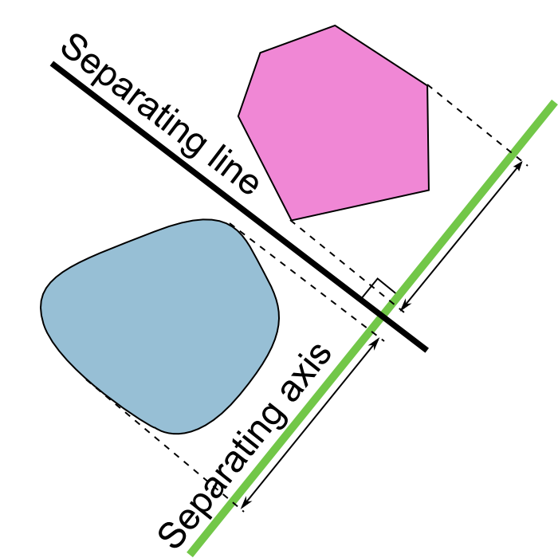

# Game Engine Architecture

## Physics / Collision

---------------------
[nikoladimitroff.github.io/Game-Engine-Architecture](http://nikoladimitroff.github.io/Game-Engine-Architecture)

Nikola Dimitroff
<a href="mailto:nikola@dimitroff.bg"><i class="fa fa-envelope-o"></i></a>
<a href="https://github.com/nikoladimitroff"><i class="fa fa-github"></i></a>
<a href="https://dimitroff.bg"><i class="fa fa-rss"></i></a>

Dimitar Trendafilov
<a href="mailto:dimitar@coherent-labs.com"><i class="fa fa-envelope-o"></i></a>
<a href="https://github.com/dimitarcl"><i class="fa fa-github"></i></a>

--- NEXT SLIDE ---

# Sanity check

We are recording, aren't we?


--- NEXT SLIDE ---

## Review

Explain `SLeafWidget`, `SCompoundWidget` and `SPanel`.

--- VERTICAL SLIDE ---

## Review

What happens when an input event is fired in Slate?

--- NEXT SLIDE ---

## Back to the roots (math)

Physics is awesome but you probably don't really need it.


--- VERTICAL SLIDE ---

Games must strive for enjoyment, not realism!

P.S. Check [VSauce3](https://www.youtube.com/watch?v=qe72eAZsA5c&list=PLiyjwVB09t5wWoCcxXhyhULK1bDTC6Wrq)
& [The Game Theorists](https://www.youtube.com/watch?v=RT7dZLiyX8E)

--- NEXT SLIDE ---

## Physics purpose

* Destruction
* Rag-dolls
* Machinery and vehicles
* Dangling items animations

--- VERTICAL SLIDE ---

## Physics complications

* Predictability
* Tuning
* Emergent behaviour
* Artist pressure
* Engine editor pressure

--- NEXT SLIDE ---

## Physics vs. Collision

* Collision detects contacts between game objects.
* Physics makes things move

--- NEXT SLIDE ---

## Middleware does wonders

* [Open Dynamics Engine](http://www.ode.org/)
* [Bullet](http://bulletphysics.org/wordpress/)
* PhysX (free for Linux / OS X / Android, see http://developer.nvidia.com)
* Havok Physics

--- NEXT SLIDE ---

## World separation

* Physics simulation / collision detection use specialized data structures
* It makes sense to separate the game world from the physics world
* Each game entity need only an identifier to the corresponding physics entity

```cpp
gameWorld->Update(dt);
physicsWorld->Update(dt);
for (auto& entity : gameEntities)
{
    entity.Position = physicsWorld->GetPositionFor(entity);
}
```

--- NEXT SLIDE ---

## Collision system tasks

* Detect collisions between objects
* Report collisions and relevant data
    - point of contact
    - separating vector
* Collision queries

--- VERTICAL SLIDE ---

## Collision primitives (aka collidables aka bounding volumes)

* Collision can be done per mesh but that's wasteful
* Use simple shapes / hierarchies of simple shapes
    * Spheres / Capsules
    * Boxes (AABB & OBB)
    * Tetrahedron
    * Convex Vs. concave
* Primitives can have transforms

--- VERTICAL SLIDE ---

### Spheres


--- VERTICAL SLIDE ---

### ...and capsules


--- VERTICAL SLIDE ---

### Boxes

Axis-Oriented Bounding Boxes (AABB) have their sides always aligned
to the world basis vectors. Must be recomputed after each rotation!


--- VERTICAL SLIDE ---

#### OBB

Oriented Bounding Boxes (OBB) require a matrix transformation to
be axis-aligned during collision checks; AABBs do so at creation time.

--- VERTICAL SLIDE ---

### Hierarchies

Standard primitive shapes are crude; full-blown meshes are expensive


--- VERTICAL SLIDE ---

### Convex Vs. concave

* No line segment between any two points goes outside of the shape
* No plane can divide the space into two half-spaces each of which
containing at least one point of the shape
* No angle is more than 180 deg


--- NEXT SLIDE ---

## Solving collisions
### Sphere Vs. sphere

Given $K_1(O_1, r_1), K_2(O_2, r_2)$, collision happens if

$$
|K_2 - K_1|^2 <= (r_1 + r_2)^2
$$

Important: notice the squared distance!

--- VERTICAL SLIDE ---

### Separating axis theorem

Let $A$ and $B$ be two disjoint convex sets in $R^n$. Then
there exists a nonzero vector $v$ such that the projection of
$A$ and $B$  on $v$ don't overlap.

--- VERTICAL SLIDE ---



--- VERTICAL SLIDE ---


--- VERTICAL SLIDE ---

### AABB Vs. AABB

Since AABBs are always axis-aligned, the separating axis may only be
one of the three basis vectors.

Given $B_1(min_1, max_1), B_2(min_2, max_2)$, collision happens if

$$
max\_{1} <= min\_{2\_x} \land max\_{2\_x} <= min\_{2\_x} \land \\\\
max\_{1} <= min\_{2\_y} \land max\_{2\_y} <= min\_{2\_y} \land \\\\
max\_{1} <= min\_{2\_z} \land max\_{2\_z} <= min\_{2\_z} \land \\\\
$$

What about oriented bounding boxes?

--- VERTICAL SLIDE ---

### Contact information

Assume that we need the point of contact $C$ between
a line $L$ and a sphere $S$:

$$
L: M = M_0 + p * \mu \\\\
S: |M - O| = r
$$

Then:

$$
|M_0 + p * \mu - O| = r
$$

Solve for $\mu$ and you are done!

--- VERTICAL SLIDE ---

#### Arbitrary convex shapes

The Gilbert–Johnson–Keerthi (GJK) algorithm

If two shapes intersect, their Minkowski difference
($\{a - b | a \in A, b \in B \}$) must contain the origin

--- VERTICAL SLIDE ---

```
function GJK(shape p, shape q, vector initial_axis):
   vector  A = Support(p, initial_axis) - Support(q, -initial_axis)
   simplex s = {A}
   vector  D = -A
   loop:
       A = Support(p, D) - Support(q, -D)
       if dot(A, D) < 0:
          reject
       s = s ∪ A
       s, D, contains_origin = NearestSimplex(s)
       if contains_origin:
          accept
```

* `Support(shape, direction) = max(dot(p, direction) for p in shape)`
    - the point of the shape, furthest away in that direction
* `NearestSimplex(shape)`
    - returns a new simplex shape that's closer to the origin

--- NEXT SLIDE ---

## Collision queries

* Ray casting
    - Line of sight
    - Pathfinding
    - IK
* Shape casting
    - Collision detection with small & fast objects
* Phantoms
* Closest-point

--- VERTICAL SLIDE ---

## Collision filtering

* Channels / layers
* Callbacks

--- VERTICAL SLIDE ---

### Performance optimizations

* Spatial partioning / hashing
    - [KD-trees](http://codepen.io/psychronautron/pen/xlbqe)
* Temporal coherency
* Phases
    - Broadphase, midphase, narrowphase

--- NEXT SLIDE ---

## Mechanics branches

* Classical Vs. Quantum Vs. Relativistic
* Newtonian Vs. Langrangian Vs. Hamiltonian
* Statics Vs. Kinematics Vs. Dynamics
* Rigid bodies Vs. Deformable bodies Vs. Fluids

--- VERTICAL SLIDE ---

## Newtonian rigid body dynamics simulation
### Before we start

* Fix the units to KMS (kilogram, meter, second)
* Linear and angular motion are indepedent and can be separately simulated

#### The center of mass

The point at which relative mass distribution is zero

$$
CM = \frac 1M \iiint\limits_{Q}\rho(\mathbf{r}) \mathbf{r} dV
$$

--- VERTICAL SLIDE ---

### Linear dynamics

Idealize the object to its center of mass

* Linear dynamics gives a solution to the function $\mathbf{S}(t)$
- the position at given time $t$
* Deriving the position gets us:
    - Velocity - $\mathbf{v}(t) = \frac {dS}{dt}$
        - Velocity is a vector quantity! Speed is a scalar!
    - Acceleration - $\mathbf{a}(t) = \frac {dv}{dt} = \frac {d^2S}{dt^2}$
* Another important quantity is the *linear momentum*
    - $\mathbf{p}(t) = m(t)\mathbf{v}(t)$
    - Usually mass is constant - $\mathbf{p}(t) = m\mathbf{v}(t)$

--- VERTICAL SLIDE ---

### Force

* Any interaction that will change the motion of an object.
* If multiple forces are applied, the net force is just the sum

$$
\mathbf{F} = \sum\_{i=1}^n \mathbf{F_i}
$$

* Netwon's second law

$$
\mathbf{F} = \frac {d\mathbf{p}(t)}{dt} = {dm\mathbf{v}(t)}{dt} \\\\
\mathbf{F} = m\mathbf{a}(t), \text{if} m = const
$$

--- VERTICAL SLIDE ---

### ODE fun

* Forces may depend on the current state of the object
(position, velocity, *not* acceleration)
* ...which means we get to solve ODEs
    - e.g. Hooke's law

$$
F(t, x(t)) = kx(t)
$$

* Rewrite the net force:

$$
\sum F(t, S(t), v(t)) = m\mathbf{a}(t)
$$

--- VERTICAL SLIDE ---

### The equation of motion

$$
\ddot{\mathbf{S}}(t) = \frac {1}{m} \sum \mathbf{F}(t, \mathbf{S}(t), \dot{\mathbf{S}}(t))
$$

Free fall as example:

$$
\ddot{y}(t) = g \\\\
\dot{y}(y) = gt + v_0 \\\\
y(t) = \frac {1}{2} gt^2 + v_0t + y_0
$$

--- VERTICAL SLIDE ---

### Numerical integration

* By definition, a derivative is the change over an infinitestimal quantity
* Thus, we can approximate the actual function with a linear interpolation

$$
\mathbf{a}(t) = \frac {\mathbf{F\_{net}(t)}} {m} \\\\
\mathbf{v}(t + \Delta t) = \mathbf{v}(t) + \mathbf{a}(t) \Delta t \\\\
\mathbf{S}(t) = \mathbf{S}(t) + \mathbf{v}(t) \Delta t
$$

Tadaaa, an implicit Euler integrator!

--- VERTICAL SLIDE ---

### Integrators

An integrator is an algorithm for...integrating!

Integrator properties:

* Convergence
* Order - check against the Taylor's series

$$
f(x) = \sum_{n=0}^{\infty} (\frac {f^{(n)}(a)} {n!})(x - a)^n
$$

* Stability - does it add or remove energy?

--- VERTICAL SLIDE ---

### Other integrators

* Explicit (forward) Euler, Semiexplicit Euler
* Verlet
* Runge-Kutta 4 (RK4)

--- NEXT SLIDE ---

## Angular dynamics

* Rotation - $\mathbf{\theta}$
* Angular speed - $\mathbf{\omega}$
* Angular acceleration - $\mathbf{\alpha}$
* Moment of inertia (inertia tensor) - $\mathbf{I}$

--- VERTICAL SLIDE ---

#### Torque

$$
\mathbf{N} = \mathbf{r} \times \mathbf{F}
$$

#### Angular momentum

Conservation FTW!

$$
\mathbf{L}(t) = \mathbf{I} \mathbf{\omega}(t) \\\\
\mathbf{N} = \frac {d\mathbf{L}(t)} {dt}
$$

--- NEXT SLIDE ---

## Collision response

Energy...must be...conserved!

$$
\mathbf{p}_1 + \mathbf{p}_2 = \mathbf{p'}_1 + \mathbf{p'}_2
$$

--- NEXT SLIDE ---

## Physics implementation / integration

Split game entities / bodies by driver:

* Fixed bodies
* Game-driven bodies
    - Limit physics effect
    - Infinite mass
    - Move with impulses
* Physics-driven bodies

--- VERTICAL SLIDE ---

### Implementing the simulation

```cpp
void PhysicsEngine::Step()
{
    const float TIME_STEP = 1 / 60.f;
    ApplyForces();
    SolveDynamics();
    SolveConstraints();
}

void PhysicsEngine::SetGravity(const Vector& gravity);
void RigidBody::ApplyForce(const Vector3& force);
void RigidBody::ApplyImpulse(const Vector3& impulse);
void RigidBody::ApplyTorque(const Vector3& torque);
```

--- VERTICAL SLIDE ---

### Integrating the simulation

```cpp
engine->UpdateGameDrivenBodies(dt);
physics->ApplyForces(dt);
physics->Step();
engine->UpdatePhysicsDrivenBodies(dt);
physics->CompleteCollisionQueries();
```

--- VERTICAL SLIDE ---

### Quality-of-life features

* Dampeners (Penalty forces)
* Simulation islands & sleeping

--- VERTICAL SLIDE ---

### Materials

* Like rendering materials but for physics
    * Is this thing elastic?
    * Do things slide over it?
    * Do things bounce?
    * Do things stick?
    * What's this object's density?

--- NEXT SLIDE ---

## Things we could not cover

* Constraints
* Fluids simulation
    - [A million dollar question](https://en.wikipedia.org/wiki/Navier%E2%80%93Stokes_equations)
* Deformable bodies
* Cloth & hair

--- NEXT SLIDE ---

<iframe width="560" height="315" src="https://www.youtube.com/embed/hmaHj6mpT0k" frameborder="0" allowfullscreen></iframe>

--- VERTICAL SLIDE ---

Questions?
