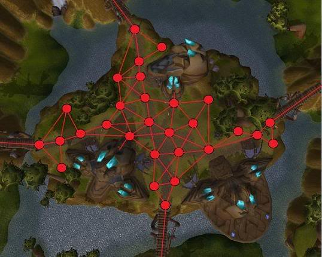
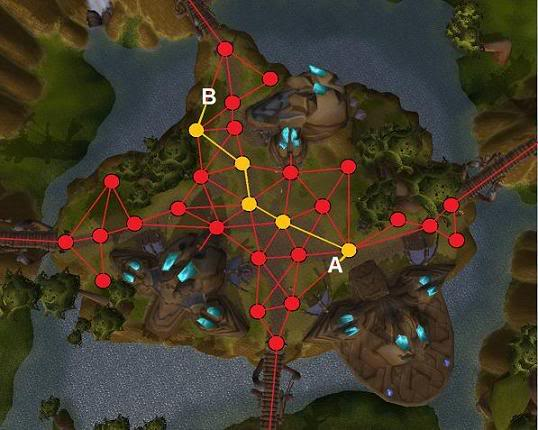
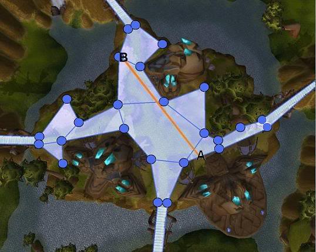
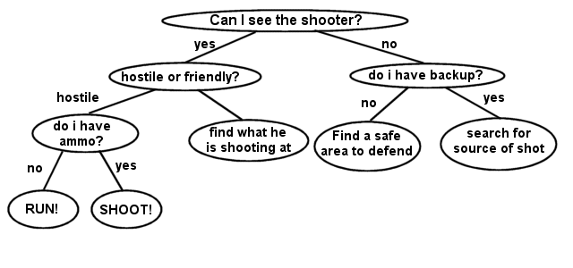

# Game Engine Architecture

## Artificial Intelligence

---------------------
[Course Index](http://nikoladimitroff.github.io/Game-Engine-Architecture)

<div class="authors-section">
<table>
<tbody>
    <tr>
        <td>
            Nikola Dimitroff
        </td>
        <td>
            <a target="_blank" href="https://dimitroff.bg"><i class="fa fa-rss"></i></a>
            <a target="_blank" href="mailto:nikola@dimitroff.bg"><i class="fa fa-envelope-o"></i></a>
            <a target="_blank" href="https://github.com/nikoladimitroff"><i class="fa fa-github"></i></a>
            <a target="_blank" href="https://twitter.com/nikoladimitroff"><i class="fa fa-twitter"></i></a>
        </td>
    </tr>
    <tr>
        <td>
            Alexander Angelov
        </td>
        <td>
            <a target="_blank" href="mailto:aleksandar.angelovv@gmail.com"><i class="fa fa-envelope-o"></i></a>
            <a target="_blank" href="https://github.com/Alekssasho"><i class="fa fa-github"></i></a>
            <a target="_blank" href="https://twitter.com/Alekssasho"><i class="fa fa-twitter"></i></a>
        </td>
    </tr>
    <tr>
        <td>
            Viktor Ketipov
        </td>
        <td>
            <a target="_blank" href="mailto:viktor@kipiinteractive.com"><i class="fa fa-envelope-o"></i></a>
            <a target="_blank" href="https://github.com/k1p1"><i class="fa fa-github"></i></a>
            <a target="_blank" href="https://twitter.com/xk1p1x"><i class="fa fa-twitter"></i></a></p>
        </td>
    </tr>
</tbody>
</table>
</div>

<div class="companies-section">
<a class="ubisoft-logo" href="https://ubisoft.com" target="_blank"></a>
<br>
<a class="kipi-logo" href="http://kipiinteractive.com" target="_blank"></a>
<br>
<a class="omeda-logo" href="https://omedastudios.com/" target="_blank"></a>
</div>

--- NEXT SLIDE ---

# Sanity check

We are recording, aren't we?


--- NEXT SLIDE ---

## Review

What's immediate UI and what's retained mode UI?

| UI mode | Description |
| --- | --- |
| Immediate | The UI exists only in the current frame, recreated every time, code-driven, static <!-- .element class="fragment" --> |
| Retained | The UI has state, used with a MV* pattern, data-driven, dynamic <!-- .element class="fragment" --> |

--- VERTICAL SLIDE ---

## Review

Name some algorithms for drawing text

* Rasterization <!-- .element class="fragment" -->
* SDF <!-- .element class="fragment" -->

--- VERTICAL SLIDE ---

## Review

What are l10n and i18n?

*localization* and *internalization*

--- NEXT SLIDE ---

## Enjoyment Vs. optimality

* Game AI != General-purpose AI
    - General AI - Graph theory + Logic + Statistics
    - Game AI - Simplified General AI algorithms + lots of scripting
* Game AI strives for ***believability & fun***, not optimality
* Some studios make no difference between gameplay and game AI teams.
<!-- .element class="fragment" -->

--- VERTICAL SLIDE ---

And oh, how fun it is

http://aigamedev.com/open/article/bugs-caught-on-tape/

--- NEXT SLIDE ---

## Problems Game AI solves

* Pathfinding / Steering
* Decision-making / Planning
* Procedural content generation
* Game difficulty

--- VERTICAL SLIDE ---

## Examples

* Your own character's path to destination
* That NPC that keeps bumping into the wall
* That goalkeeper that should anticipate your penalty kick
* The opposing Zerg forces in Starcraft

--- VERTICAL SLIDE ---

## Dictionary

* Agent - any actor capable of making decisions
* World - an abstraction over the game world containing
the state of environment, important to any (set of) agent

--- NEXT SLIDE ---

## General AI Architecture

* Usually split into multiple levels
* What should I do now?
  * *Ok, gotta go kill this bad guy*
* How do I kill this bad guy?
  * *Ok, gotta run to him and stab him to death*
* How do I execute running and stabbing?
  * *Ok, these are the animations I need to play*

--- VERTICAL SLIDE ---

We'll cover most of the core problems, in order of appearance.

--- NEXT SLIDE ---

## Pathfinding

* Representing the world
* Way-point graphs
    - Your usual graph
    - Connects points at which the character may stand

--- VERTICAL SLIDE ---

### The task at hand


--- VERTICAL SLIDE ---

### A waypoint graph



--- VERTICAL SLIDE ---

## Solving pathfinding

1. Apply any graph-searching algorithm
2. Find your destination
3. ???
4. Profit

--- VERTICAL SLIDE ---


--- VERTICAL SLIDE ---

Not all graph searching algorithms are born equal

* BFS - slow, memory intensive
* DFS - slow, memory efficient
* Djikstra - slow for single paths, good when you want multiple paths
* **A\* star** - <3

[Here's a visual comparison](https://qiao.github.io/PathFinding.js/visual/)

--- VERTICAL SLIDE ---

## A*

* Guided BFS
* The only viable choice (Djikstra's may be better
in some cases)
* Expand nodes based on distance AND a heuristic


--- VERTICAL SLIDE ---

* A *heuristic* is any function that gives an *estimate* on the distance
between nodes `p` and `q`

<!-- .element class="fragment" -->
* An *admissible* heuristic is a heuristic that **never overestimates** the actual distance

<!-- .element class="fragment" -->

--- VERTICAL SLIDE ---

* Define the *G Score* of node `n` as $G(n) = distance(start, n)$

<!-- .element class="fragment" -->
* Define the *H Score* of node `n` as $H(n) = heuristic(n, end)$

<!-- .element class="fragment" -->
* Define the *F Score* of node `n` as $F(n) = G(n) + H(n)$

<!-- .element class="fragment" -->
* A\* Star expands the nodes for which $F(n)$ is minimal

<!-- .element class="fragment" -->

--- VERTICAL SLIDE ---

If given an admissible heuristic, A\* always find the optimal solution in the minimal number
of steps required if one exists.

Some often used admissible heuristics are

* Straight-line distance
* Manhattan distance

--- VERTICAL SLIDE ---

```py
def AStar(start, goal, heuristic):
    visited = []
    frontier = [start]
    parents = empty_map()
    gScore = map_defaulting_to_infinity()
    gScore[start] = 0
    fScore = map_defaulting_to_infinity()
    fScore[start] = heuristic(start, goal)

    while frontier is not empty:
        result = updateSearchStructures(visited, ...)
        if result is success:
            return result
    return failure
```

--- VERTICAL SLIDE ---

```py
def update_search_structures():
    current = argmin(frontier, fScore)
    if current is goal
        return reconstruct_path(goal, parents)

    frontier.remove(current)
    visited.add(current)
    for neighbour in current.neighbours:
        expand_node(neightbour)
```

--- VERTICAL SLIDE ---

```py
def expand_node(node):
    if node is in visited
        continue
    currentGScore = gScore[current] + distance(current, node)
    if node is not in frontier
        frontier.add(node)
    else if currentGScore >= gScore[current]
        continue

    parents[node] = current
    gScore[node] = currentGScore
    fScore[node] = currentGScore + heuristic(node, goal)
```

--- VERTICAL SLIDE ---


--- VERTICAL SLIDE ---



--- VERTICAL SLIDE ---

## Variants

* Memory-bounded A*
* Hierarchial A*
    - Running a hundred A* on a huge level is not going to cut it

--- NEXT SLIDE ---

## Representing the world 2.0

Way-point graphs give low amount of information
and produce movement that look likes on rails.

#### Enter navigation meshes


--- VERTICAL SLIDE ---


--- VERTICAL SLIDE ---

### Nav meshes advantages

* No rails <!-- .element class="fragment" -->
* No zig-zags <!-- .element class="fragment" -->
* Works for all unit types <!-- .element class="fragment" -->
* Greatly improves performance <!-- .element class="fragment" -->
* Can do path computation (smoothing, simplification) <!-- .element class="fragment" -->
* Can be automatically generated <!-- .element class="fragment" -->
* ...while still being able to be manually edited <!-- .element class="fragment" -->
* All game engines use some form of a nav mesh <!-- .element class="fragment" -->

--- VERTICAL SLIDE ---

### Basic nav mesh searching

1. Run HPA* on each level of granularity
2. Simplify
    - if x -> y -> z and the path from x to z is clear,
    remove y from the path
3. Smooth
    - for each time the agent has to change direction
        - apply a Besier curve to smooth it

--- VERTICAL SLIDE ---



--- VERTICAL SLIDE ---

## [Recast & Detour](https://github.com/recastnavigation/recastnavigation)

You don't have to implement nav meshes and pathfinding by yourself!

--- NEXT SLIDE ---

## Obstacle avoidance

* Static obstacles are easy - mark them in the nav mesh!
* Dynamic obstacles problems
    - Two actors taking the same path
    - Actor getting stuck due to insufficient space
    - Destructible items' debris make the situation even better

--- VERTICAL SLIDE ---

<iframe width="560" height="315" src="https://www.youtube.com/embed/qiGhXWG-Q0Q" frameborder="0" allowfullscreen></iframe>

--- VERTICAL SLIDE ---

## Some dynamic avoidance solutions

* Include spatial information in A*
* Lock paths - whenever an actor starts moving
at a given path, block other actors from having it

--- VERTICAL SLIDE ---

## Some dynamic avoidance solutions

* Raycast & recompute - raycast ahead of the character and if
an obstacles is hit, recompute the current path at the local level.
* Synchronize paths - nearby actors don't compute
their paths independently; instead, a higher-level entity generates them
so that no two are the same

--- NEXT SLIDE ---

## Steering

* Steering algorithms are higher-level decision
about how to move
* They are often reused and converted into libraries
* Examples
    - seek
    - arrive
    - wander
    - flee
    - chase & evade
    - interpose
    - hide

--- VERTICAL SLIDE ---

```
function seek(agent, goal)
    agent.walkTowards(computePath(agent.position, goal))

function arrive(agent, goal)
    agent.decelerateTowards(computePath(agent.position, goal))

function chase(agent, enemy)
    seek(agent, predictEnemyPosition(enemy, timeDistance(agent, enemy))))
```

--- VERTICAL SLIDE ---

## Group behaviour / flocking


--- VERTICAL SLIDE ---

[Detailed Steering + flocking tutorial](https://natureofcode.com/book/chapter-6-autonomous-agents/)

--- NEXT SLIDE ---

## Decision-making


--- VERTICAL SLIDE ---

### Types of agents (as defined by general-purpose AI)

* Reflex agents
* Goal-based agents
* Utility-based agents

--- NEXT SLIDE ---

## Decision trees


--- VERTICAL SLIDE ---

## Decision trees

* The simplest form of decision-making algorithm
* Learnable
* Basically represent a series of IF-THEN checks
* Evaluated every N frames
* The leaf node that gets selected defines what the agent will do

--- VERTICAL SLIDE ---



--- VERTICAL SLIDE ---

## State machines

Looping decision trees


--- VERTICAL SLIDE ---

State machines are very powerful, yet it is really easy to miss cases

<video autoplay loop src="resources/17.ai/scripted_ai.mp4">
</video>

--- VERTICAL SLIDE ---

### State machines / Decision trees verdict

* **Deterministic**
* Easy to implement <!-- .element class="fragment" -->
* Easy to understand <!-- .element class="fragment" -->
* Easy to debug <!-- .element class="fragment" -->
* Quick to compute <!-- .element class="fragment" -->
* Limited in displayed behaviour <!-- .element class="fragment" -->
* Not very exciting <!-- .element class="fragment" -->
* Used in the majority of cases <!-- .element class="fragment" -->

--- VERTICAL SLIDE ---

P.S. A state machines is a graph. If that graph is a tree, the state machine is called a **Behavior tree**.

--- VERTICAL SLIDE ---

## Decision trees and state machines are learnable!

* Play a game N times
* Record good moves / sequences of moves
* Replay them with some probability

--- NEXT SLIDE ---

## Goal Oriented Action Planning (GOAP)

* Give the agent some goals to follow
* Structured in a hierarchy
* Often stored in libraries
* Promotes reusability

--- VERTICAL SLIDE ---

## Goals

* A *world state* is a set of values for variables in the world we care about
  * a shooter bot might care about his health, position and the player's health
  * a MOBA bot might care more about their lane's tower health
* A *goal* is a desirable world state

--- VERTICAL SLIDE ---

## Actions

* An *action* modifies the current world state to create a new one
* We say that actions *satisfy* goals or another's action preconditions

--- VERTICAL SLIDE ---

* Actions have *preconditions* that determine if the action is valid
  * *Do I have line of sight in order to shoot?*
* Actions have *effects* that change the world state
  * *Shooting will reduce the player's health by 20 and make noise*

--- VERTICAL SLIDE ---

#### Define goals through boolean conditions

```
Kill-Enemy-Goal
    Enemy.health == 0
Have-Weapon-Goal
    MainHand.equipment.type == EquipmentType::Weapon
```

--- VERTICAL SLIDE ---

#### Define actions as their preconditions and effects

```
Shoot-Action
    Preconditions
        MainHand.equipment.type == EquipmentType::RangedWeapon
        MainHand.equipment.Ammo > 0
        HaveLoS
    Effects
        Enemy.health -= 20
        MainHand.equipment.Ammo -= 1
```

--- VERTICAL SLIDE ---

With these definitions in place, the GOAP defines a graph between world states


--- VERTICAL SLIDE ---

Can you tell where I'm going with this?

Use A\* star again! <!-- .element class="fragment" -->


--- VERTICAL SLIDE ---

### GOAP verdict

* **Undeterministic** for practical purposes
* Easy to specify <!-- .element class="fragment" -->
* Easy to understand <!-- .element class="fragment" -->
* Creates interesting behaviour <!-- .element class="fragment" -->
* Moderately expensive performance <!-- .element class="fragment" -->
* Can completely destroy performance with long plans <!-- .element class="fragment" -->
* Hard to implement efficiently <!-- .element class="fragment" -->
* Semi-hard to debug (need to investigate why every step of the plan was picked) <!-- .element class="fragment" -->

--- NEXT SLIDE ---

## Utility-driven

* Define the *utility* of any world state as its *desireability*
  * Gaining 100 HP is better than 10 HP
* Instead of chasing goals, we can check which next world state is the best for us

--- VERTICAL SLIDE ---

```py
def decide(agent, world_state):
    best_utility = 0
    bestAction = null
    for action in agent.actions:
        future_world = project_action(world_state, action)
        future_utility = utility(future_world)
        if future_utility > best_utility:
            best_utility = utility
            best_action = action
```

--- VERTICAL SLIDE ---

Can be improved by looking further down in time:

```py
def decide(agent, world_state, time_steps_to_look_ahead):
    best_utility = 0
    best_action = null
    for action in agent.actions_in_state(world_state):
        future_world = world_state
        for i from 0 to time_steps_to_look_ahead:
            future_world = project_action(future_world, action)
            future_utility = utility(futureWorld)
        if future_utility > best_utility:
            best_utility = utility
            best_action = best_action
```

--- VERTICAL SLIDE ---

## Defining utility

* Usually a task left to designers


--- VERTICAL SLIDE ---

For a detailed look into utility-driven agents,
read [Dave Mark's Behavioural mathematics](https://www.amazon.com/Behavioral-Mathematics-Game-AI-Applied/dp/1584506849)

--- VERTICAL SLIDE ---

### Utility-driven agents verdict

* **Very Undeterministic**
* Semi-easy to specify <!-- .element class="fragment" -->
  * Multi-factor utilities need a lot of attention <!-- .element class="fragment" -->
* Easy to understand <!-- .element class="fragment" -->
* Creates interesting behaviour <!-- .element class="fragment" -->
* Moderately expensive performance <!-- .element class="fragment" -->
* Need tooling to be useful to designers <!-- .element class="fragment" -->
* Hard to debug (utility values might change radically) <!-- .element class="fragment" -->

--- NEXT SLIDE ---

## Some other terms you might hear in game AI

--- VERTICAL SLIDE ---

#### Blackboards

* Whether you use tree, state machines, GOAP or utilities, you often need to save state

<!-- .element class="fragment" -->
* A Blackboard is a basically a map Game designers can access

<!-- .element class="fragment" -->
* When an event happens, write something to the blackboard
    * E.g. position to walk to, enemy to look out for

<!-- .element class="fragment" -->
* When deciding what action to take, read the blackboard
    * E.g. if there's an enemy to look out for, go look for him.

<!-- .element class="fragment" -->

--- VERTICAL SLIDE ---

#### Game director / overseer

* A gameplay system that oversees a bunch of NPCs and synchronizes them
  * E.g. applies flocking behavior or distributes different NPCs to different tasks
* Its algorithms vary widely

--- VERTICAL SLIDE ---

#### Machine-learning applications / content generation

* Give the learner a list of good levels / creatures / items
* Have it generate more! Tadaaa, infinite content!
* [Ubisoft's talk at GDC2016](https://www.youtube.com/watch?v=Eim_0jCQW_g)
* [Witcher 3's Dialogue creation talk at GDC2016](https://www.youtube.com/watch?v=chf3REzAjgI)

--- NEXT SLIDE ---

### Summary

* Use a high-level decision maker like Decision trees, GOAP or Utility-driven agents
  * different high level algorithms might be combined

<!-- .element class="fragment" -->
* At the mid-level, implement what different actions do (e.g. seek vs steer vs wander)

<!-- .element class="fragment" -->
* At the low-level, drive the appropriate animations to execute the action

<!-- .element class="fragment" -->
* Use A\* and nav meshes for pathfinding

<!-- .element class="fragment" -->

--- NEXT SLIDE ---

Questions?


