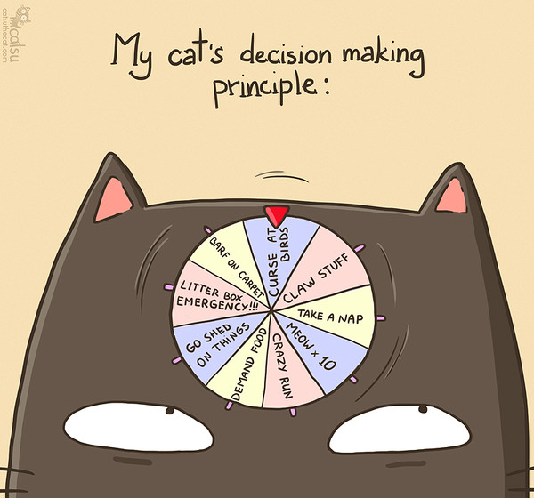
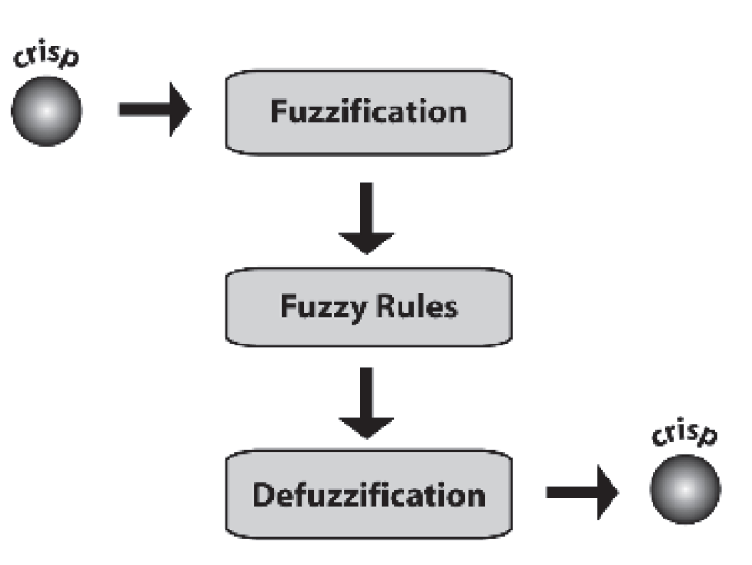
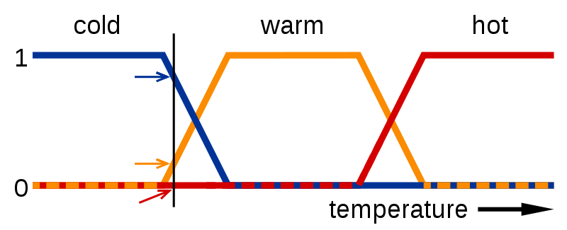

# Game Engine Architecture

## Artificial Intelligence

---------------------
[nikoladimitroff.github.io/Game-Engine-Architecture](http://nikoladimitroff.github.io/Game-Engine-Architecture)

Nikola Dimitroff
<a href="mailto:nikola@dimitroff.bg"><i class="fa fa-envelope-o"></i></a>
<a href="https://github.com/nikoladimitroff"><i class="fa fa-github"></i></a>
<a href="https://dimitroff.bg"><i class="fa fa-rss"></i></a>

Dimitar Trendafilov
<a href="mailto:dimitar@coherent-labs.com"><i class="fa fa-envelope-o"></i></a>
<a href="https://github.com/dimitarcl"><i class="fa fa-github"></i></a>

--- NEXT SLIDE ---

## Review

What are bounding volumes / collision primitives?

--- VERTICAL SLIDE ---

## Review

Describe the basic algorithm / equations
for computing the position of an object out of forces.

--- NEXT SLIDE ---

## Dictionary

* Agent - any actor capable of making decisions
* World - an abstraction over the game world containing
the state of environment, important to any (set of) agent

--- NEXT SLIDE ---

## Enjoyment Vs. optimality

* Game AI != General-purpose AI
    - General AI - Graph theory + Logic + Statistics
    - Game AI - Simplified General AI algorithms + lots of fine tuning
* Game AI strives for ***bealiavability***, not optimatility
* Some studios make no difference between gameplay and game AI teams.

--- NEXT SLIDE ---

## Problems Game AI solves

* Pathfinding / Steering
* Decision-making
* Planning
* Procedural content generation

--- NEXT SLIDE ---

## Examples

* Your own character's path to destination
* That NPC that keeps bumping into the wall
* That goalkeeper that should anticipate your penalty kick
* The opposing Zerg forces in Starcraft
* The game director in Left4Dead

--- NEXT SLIDE ---

## Pathfinding

* Representing the world
* Way-point graphs
    - Your usual graph
    - Connects points at which the character may stand

--- VERTICAL SLIDE ---

## Solving pathfinding

1. Apply any graph-searching algorithm
2. Find your destination
3. ???
4. Profit

--- VERTICAL SLIDE ---


--- VERTICAL SLIDE ---

## A*

* Guided BFS
* Expand nodes based on distance AND a heuristic
* Will always find the optimal solution in the minimal number
of steps required if one exists
    - if given an admissible heuristic
* An admissible heuristic never overestimates the actual distance
between two nodes
* The only viable choice (Djikstra's may be better
in some cases)

--- VERTICAL SLIDE ---

```cpp
function AStar(start, goal, heuristic)
    visited = []
    frontier = [start]
    parents = empty_map()
    gScore = map_defaulting_to_infinity()
    gScore[start] = 0
    fScore = map_defaulting_to_infinity()
    fScore[start] = heuristic(start, goal)
    
    while frontier is not empty
        updateSearchStructures(visited, ...)
    return failure
```

--- VERTICAL SLIDE ---

```cpp
function updateSearchStructures()
    current = argmin(frontier, fScore)
    if current is goal
        return reconstruct_path(goal, parents)

    frontier.remove(current)
    visited.add(current)
    foreach neighbour in current.neighbours
        if neighbour is in visited
            continue
        currentGScore = gScore[current] + distance(current, neighbour)
        if neighbour is not in frontier
            frontier.add(neighbour)
        else if currentGScore >= gScore[current]
            continue

        parents[neighbour] = current
        gScore[neighbour] = currentGScore
        fScore[neighbour] = currentGScore + heuristic(neighbour, goal)
```

--- VERTICAL SLIDE ---

![resources/19.ai/astar_progress_animation.gif]

--- VERTICAL SLIDE ---

## Variants

* Memory-bounded A*
* Hierarchial A*
    - Running a hundred A* on a huge level is not going to cut it

--- NEXT SLIDE ---

## Representing the world 2.0

Way-point graphs give low amount of information
and make movement look like on rails.

#### Enter navigation meshes

--- VERTICAL SLIDE ---


--- VERTICAL SLIDE ---

### Nav meshes advantages

* No rails
* No zig-zags
* Greatly improves performance
* Can do path-computation (smoothing, simplification)
* Can be automatically generated
* ...while still being able to be manually edited
* Not a single commercial engine uses anything but nav meshes

--- VERTICAL SLIDE ---

### Basic nav mesh searching

1. Run HPA* on each level of granularity
2. Remove unnecessary polygons from the path
    - if x -> y -> z and the path from x to z is clear,
    remove y from the path
3. Smooth
    - for each angle caused by a change of direction
        - apply a besier curve to smooth it

--- VERTICAL SLIDE ---

## [Recast & Detour](https://github.com/recastnavigation/recastnavigation)

You don't have to implement nav meshes and pathfinding by yourself!

--- NEXT SLIDE ---

## Obstacle avoidance

* Static obstacles are easy - mark them in the nav mesh!
* Dynamic obstacles problems
    - Two actors taking the same path
    - Actor getting stuck due to insufficient space
    - Destructible items' debris make the situation even better

--- VERTICAL SLIDE ---

<iframe width="560" height="315" src="https://www.youtube.com/embed/qiGhXWG-Q0Q" frameborder="0" allowfullscreen></iframe>

--- VERTICAL SLIDE ---

## Some dynamic avoidance solutions

* Include spatial information in A*
* Lock paths - whenever an actor starts moving
at a given path, block other actors from having it
* Raycast & recompute - raycast ahead of the character and if
an obstacles is hit, recompute the current path at the local level.
* Synchronize paths - nearby actors don't compute
their paths indepedently; instead, a higher-level entity generates them
so that no two are the same

--- NEXT SLIDE ---

## Steering

* Steering algorithms are higher-level decision
about how to move
* They are often reused and converted into libraries
* Examples
    - seek
    - arrive
    - wander
    - flee
    - chase & evade
    - interpose
    - hide

--- VERTICAL SLIDE ---

```
function seek(agent, goal)
    agent.walkTowards(computePath(agent.position, goal))

function arrive(agent, goal)
    agent.decelerateTowards(computePath(agent.position, goal))

function chase(agent, enemy)
    seek(agent, predictEnemyPosition(enemy, timeDistance(agent, enemy))))
```

--- NEXT SLIDE ---

## Decision-making



--- VERTICAL SLIDE ---

### Types of agents (as defined by general-purpose AI)

* Reflex agents
* Model-based agents
* Goal-based agents
* Utility-based agents

--- NEXT SLIDE ---

## Behaviour (decision) trees

* The simplest form of decision-making algorithm
* Learnable
* Readable - If X then Y


--- VERTICAL SLIDE ---


--- NEXT SLIDE ---

## Fuzzy logic

Fuzzy logic is a theory equivalent to probability theory but
with different semantics

* Object **X** is in set **A** with a degree of membership **p**
    - Compare to there's a **p** chance **X** is in **A**
* Fuzzy logic depends on the agent's beliefs
* That level 50 monster is dangerous
    - Dangerous is a fuzzy qualifier
    - Dangerous for lvl 10 != Dangerous for lvl 100
* Make a decision tree for the statement 'If the monster is dangerous, then move
far away and attack at range'

--- VERTICAL SLIDE ---



--- VERTICAL SLIDE ---

### Fuzzification

* *Crisp* sets are standard sets - something's either in or not
    - Crisp values are simply absolute values - he's 1.80m high
* *Fuzzy* sets attach a degree of membership to any object in the universe
* Fuzzification is the process of converting crisp values to fuzzy
* Usually done with predefined member functions
    - triangular
    - shoulder
    - trapezoid
    - bell

--- VERTICAL SLIDE ---



--- VERTICAL SLIDE ---

### Fuzzy set operation

$$
A \cup B = max(A, B) \\\\
A \cap B = min(A, B) \\\\
Very(A) = A^2 \\\\
Fairly(A) = \sqrt A
$$

```
if Dangerous(Monster) and FarAway(Distance) then Desirable(Attack)
if Dangerous(Monster) or Close(Distance) then Undesirable(Attack)
// is equivalent to
Desirable(Attack) = Min(Dangerous(Monster), FarAway(Distance))
Undesirable(Attack) = Max(Dangerous(Monster), FarAway(Distance))
```

--- VERTICAL SLIDE ---

### Defuzzification

* Compute all of the resultant sets
* Use one of the few magical methods to convert back to crisp value
* Applications:
    - Compute the desireability for each of several actions in order
    to decide which one to use
        - e.g. what's the best weapon to use now?
    - Fuzzify your behaviour tree

--- NEXT SLIDE ---

## Goal-driven

--- NEXT SLIDE ---

## Utility theory

```
function decide(agent)
    bestUtility = 0
    bestAction = null
    for action in agent.actions
        futureWorld = projectAction(currentWorld, action)
        futureUtility = utility(futureWorld)
        if futureUtility > bestUtility
            bestUtility = utility
            bestAction = action
```

## Utility theory
## Fuzzy logic
## Goal-oriented

--- NEXT SLIDE ---

## Group behaviour / flocking

--- NEXT SLIDE ---

## Machine-learning applications / content generation


--- NEXT SLIDE ---

Questions?
